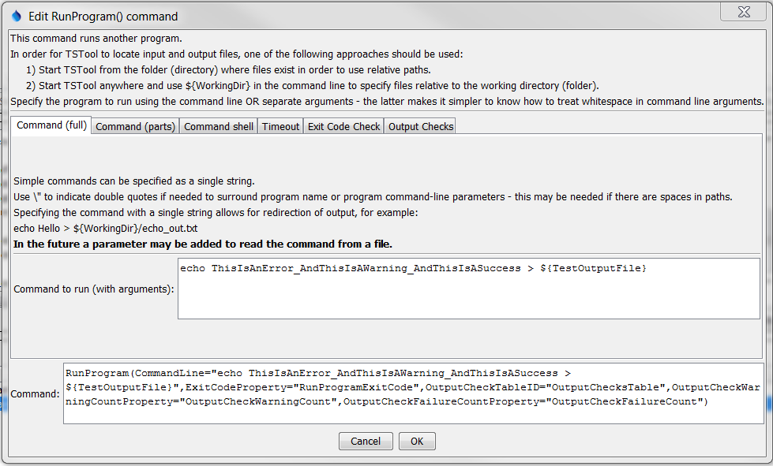
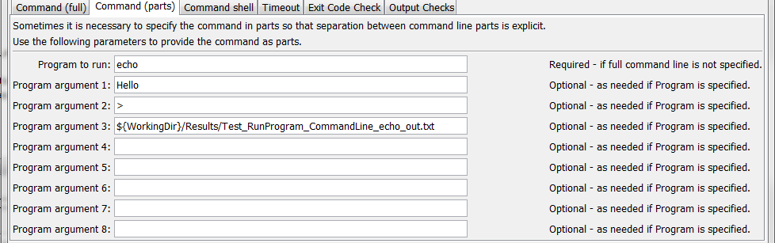
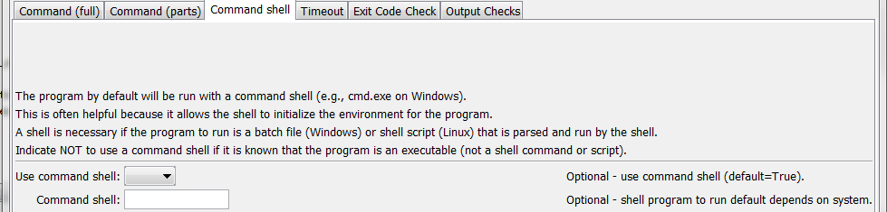
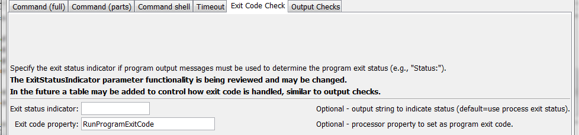
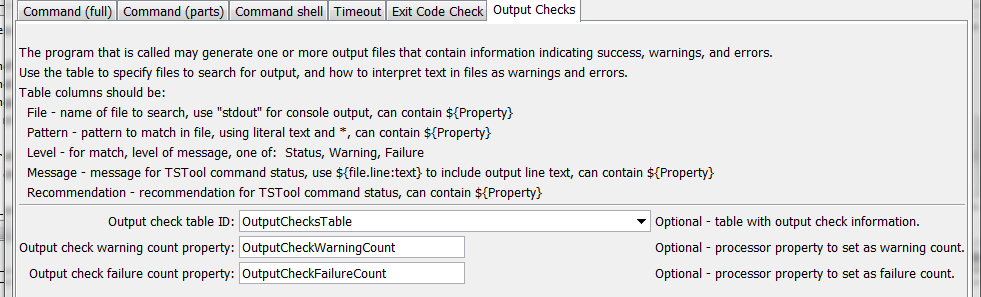
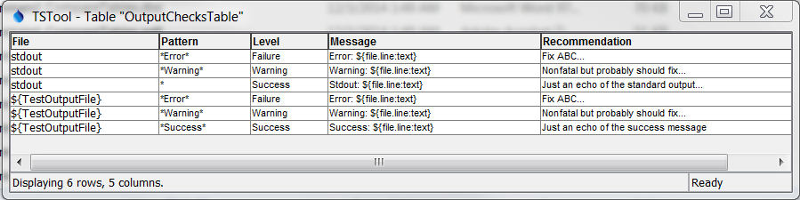
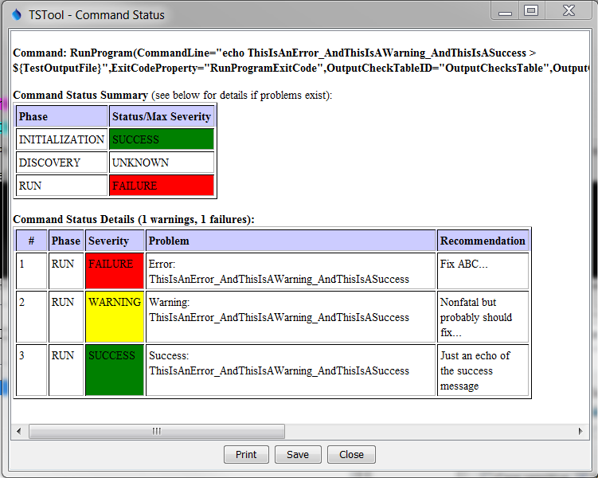

# TSTool / Command / RunProgram #

* [Overview](#overview)
* [Command Editor](#command-editor)
* [Command Syntax](#command-syntax)
* [Examples](#examples)
* [Troubleshooting](#troubleshooting)
* [See Also](#see-also)

-------------------------

## Overview ##

The `RunProgram` command runs an external program,
given the full command line or individual command line parts,
and waits until the program is finished before processing additional commands.
The TSTool command will indicate a failure if the exit status from the program being run is non-zero.
It is therefore possible to call an external program that reads
and/or writes recognized time series formats to perform processing that TSTool cannot.
One use of this command is to create a calibration environment where a model is run and
then the results are read and displayed using TSTool.
It is also useful to use TSTool’s testing features to implement quality control checks for other software tools.

TSTool internally maintains a working folder (directory) that is used to
convert relative paths to absolute paths to locate files.
The working folder is by default the location of the last command file that was opened.
The external program may assume that the working folder is the location from which
TSTool software was started (or the installation location if started from a menu).
Therefore, it may be necessary to run TSTool in batch mode from the directory where
the external software’s data files exist, use absolute paths to files, or use the `${WorkingDir}`
property in the command line.  Use `\”` in the command line or arguments to surround whitespace.
Some operating systems may have limitations on command line length.

## Command Editor ##

The following dialog is used to edit the command and illustrates the command syntax when specifying a full command line.



**<p style="text-align: center;">
`RunProgram` Command Editor when Specifying Command Line in Full (<a href="../RunProgram.png">see also the full-size image</a>)
</p>**

The following dialog is used to edit the command and illustrates the command syntax when specifying the command line in parts.



**<p style="text-align: center;">
`RunProgram` Command Editor when Specifying Command Line in Parts (<a href="../RunProgram_Parts.png">see also the full-size image</a>)
</p>**

The following dialog is used to edit the command and illustrates the command syntax when using a command shell.



**<p style="text-align: center;">
`RunProgram` Command Editor showing Command Shell Parameters (<a href="../RunProgram_Shell.png">see also the full-size image</a>)
</p>**

The following dialog is used to edit the command and illustrates the command syntax when specifying timeout parameters.


**<p style="text-align: center;">
`RunProgram` Command Editor showing Timeout Parameters (<a href="../RunProgram_Timeout.png">see also the full-size image</a>)
</p>**

The following dialog is used to edit the command and illustrates the command syntax when specifying exit code parameters.



**<p style="text-align: center;">
`RunProgram` Command Editor showing Exit Code Parameters (<a href="../RunProgram_ExitStatusIndicator.png">see also the full-size image</a>)
</p>**

The following dialog is used to edit the command and illustrates the command syntax when specifying output check parameters.



**<p style="text-align: center;">
`RunProgram` Command Editor showing Output Check Parameters (<a href="../RunProgram_OutputChecks.png">see also the full-size image</a>)
</p>**

## Command Syntax ##

The command syntax is as follows:

```text
RunProgram(Parameter="Value",...)
```
**<p style="text-align: center;">
Command Parameters
</p>**

| **Parameter**&nbsp;&nbsp;&nbsp;&nbsp;&nbsp;&nbsp;&nbsp;&nbsp;&nbsp;&nbsp;&nbsp;&nbsp;&nbsp;&nbsp;&nbsp;&nbsp;&nbsp;&nbsp;&nbsp;&nbsp;&nbsp;&nbsp;&nbsp;&nbsp;&nbsp;&nbsp; | **Description** | **Default**&nbsp;&nbsp;&nbsp;&nbsp;&nbsp;&nbsp;&nbsp;&nbsp;&nbsp;&nbsp; |
| --------------|-----------------|----------------- |
| `CommandLine` | The full program command line, with arguments.  If the program executable is found in the `PATH` environment variable, then only the program name needs to be specified.  Otherwise, specify an absolute path to the program or run the program from a command shell in the same directory where TSTool is started.  The command string can contain redirection and pipe characters.<br><br>The `${WorkingDir}` property can be used in the command line to indicate the working directory (command file location) when specifying file names.  Other `${Property}` names can also be used. For Windows, it may be necessary to place a `\”` at the start and end of the command line, if a full command line is specified.| Must be specified if the `Program` parameter is not specified.<br><br>The `Program` parameter will be used if both are specified. |
| `Program` | The name of the program to run.  Program arguments are specified using the `ProgramArg#` parameter(s).  See the `CommandLine` parameter for more information about parameter formatting and locating the executable.  Can specify with `${Property}`. | Must be specified if the `CommandLine` parameter is not specified.|
| `ProgramArg1,`<br>`ProgramArg2,`<br>etc. | Command line arguments used with `Program`.  If necessary, use `${WorkingDir}` to specify the working directory to locate files.  Can specify with `${Property}`. | No arguments will be used with `Program`.|
| `UseCommandShell` | If specified as `True`, the program will be run using a command shell.  A command shell is needed if the program is a script (batch file), a shell command, or uses `>`, `|`, etc. | `False`. |
| `CommandShell` | The command shell program to run for example on Windows:  `cmd /c`.  Make sure that the shell is specified with an option to exit when the program completes (such as `/c`); otherwise, the process will hang.  Can specify with `${Property}`. | Determine automatically based on operating system.|
| `Timeout` | The timeout in seconds – if the program has not yet returned, the process will be ended.  Zero indicates no timeout.  **This behavior varies and needs to be enhanced**.|No timeout.|
| `ExitStatusIndicator` | This parameter may be phased out.  Instead, use The `OutputCheckTableID` with a file of stdout and/or `ExitCodeProperty`.  By default, the program exit status is determined from the process that is run.  Normally `0` means success and non-zero indicates an error.  However, the program may not exit with a non-zero exit status when an error occurs.  If the program instead uses an output string like `STOP 3` to indicate the status, use this parameter to indicate the leading string, which is followed by the exit status (e.g., `STOP`).|Determine the exit status from the process exit value.|
| `ExitCodeProperty` | Name of the processor property to set as the exit code from the program being run.  Can specify with `${Property}`. | Property is not set.|
| `OutputCheckTableID` | Table identifier for table containing output check patterns.  Output file content can be scanned for patterns to detect success, warning, and errors.  See the example file below for syntax of the table.  Can specify with `${Property}`. | Output is not checked.|
| `OutputCheckWarningCountProperty` | Name of the processor property to set as the count of warning messages generated from the output table checks.  Can specify with `${Property}`. | Property is not set.|
| `OutputCheckFailureCountProperty` | Name of the processor property to set as the count of failure messages generated from the output table checks.  Can specify with `${Property}`. | Property is not set.|

## Examples ##

* See the [automated tests](https://github.com/OpenCDSS/cdss-app-tstool-test/tree/master/test/regression/commands/general/RunProgram).

The following figure illustrates the output check table specified by the `OutputCheckTableID` parameter.  



**<p style="text-align: center;">
Example Output Check Table (<a href="../RunProgram_OutputCheckTable.png">see also the full-size image</a>)
</p>**

The table columns are described below.  The column names must be adhered to.

**<p style="text-align: center;">
Output Check Table Column Descriptions
</p>**

| **Parameter**&nbsp;&nbsp;&nbsp;&nbsp;&nbsp;&nbsp;&nbsp;&nbsp;&nbsp;&nbsp;&nbsp;&nbsp;&nbsp;&nbsp;&nbsp;&nbsp;&nbsp;&nbsp;&nbsp;&nbsp;&nbsp;&nbsp;&nbsp;&nbsp;&nbsp;&nbsp; | **Description** |
| --------------|-----------------|
| `File` | Name of the file to check or stdout to check standard output (console) output.  Use `${WorkingDir}` to specify the location of the working directory (folder for command file).  Can use the `${Property}` notation. |
| `Pattern` | The pattern to search for in the file.  Can use `*` for wildcard.  Searches are case-insensitive.  Can use the `${Property}` notation. |
| `Level` | The message level to use in TSTool command status messages:<br><ul><li>`Success` – use to echo messages to TSTool</li><li>`Warning` – will generate yellow warning indicators in TSTool</li><li>`Failure` – will generate red failure indicators in TSTool</li></ul> |
| `Message` | The message to include in TSTool command status messages, generally the cause of the issue.  Can use the `${Property}` notation.  The following special properties are recognized:<br><ul><li>`${file.line:text}` – substitute entire file line</li><li>`${file.line:number}` – substitute output file line number</ul><li>`${file:path}` – substitute full path for output file</li></ul> |
| `Recommendation` | A recommendation to fix the problem, as shown in TSTool command status messages.  Can use the `${Property}` notation.|

The following is an example that exercises the output check table:

```
# Test running an external program using a full command line with other defaults
# - use a command shell internally to run and determine the exit status from the
#   process exit value.
# - output to a file and check output using table of patterns
StartLog(LogFile="Results/Test_RunProgram_CommandLine_echo_OutputCheckTable.TSTool.log")
ReadTableFromDelimitedFile(TableID="OutputChecksTable",InputFile="Data\output-checks1.csv")
SetProperty(PropertyName="TestOutputFile",PropertyType=String,PropertyValue="${WorkingDir}/Results/Test_RunProgram_CommandLine_echo_OutputCheckTable_out.txt")
# Generate the output
RunProgram(CommandLine="echo ThisIsAnError_AndThisIsAWarning_AndThisIsASuccess > ${TestOutputFile}",ExitCodeProperty="RunProgramExitCode",OutputCheckTableID="OutputChecksTable",OutputCheckWarningCountProperty="OutputCheckWarningCount",OutputCheckFailureCountProperty="OutputCheckFailureCount")
If(Name="RunProgramWarningCheck",Condition="${OutputCheckWarningCount} > 0")
Message(Message="${RunProgramWarningCheck} warnings detected - might need to fix!",CommandStatus=WARNING)
EndIf(Name="RunProgramWarningCheck")
If(Name="RunProgramFailureCheck",Condition="${OutputCheckFailureCount} > 0")
Message(Message="${RunProgramFailureCheck} failures detected - definitely need to fix!",CommandStatus=FAILURE)
EndIf(Name="RunProgramFailureCheck")
WriteCheckFile(OutputFile="Results/Test_RunProgram_CommandLine_echo_OutputCheckTable_out.csv")
```

The status messages for the `RunProgram` command from the above example are similar to the following.



**<p style="text-align: center;">
Example Command Status Messages (<a href="../RunProgram_OutputCheckTable_Status.png">see also the full-size image</a>)
</p>**

## Troubleshooting ##

## See Also ##

* [`RunCommands`](../RunCommands/RunCommands.md) command
