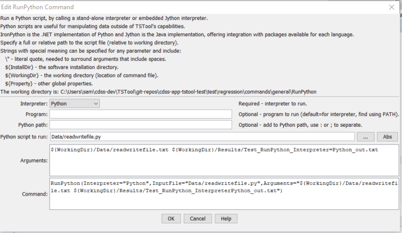

# TSTool / Command / RunPython #

* [Overview](#overview)
* [Command Editor](#command-editor)
* [Command Syntax](#command-syntax)
* [Examples](#examples)
* [Troubleshooting](#troubleshooting)
* [See Also](#see-also)

-------------------------

## Overview ##

**This command needs to be updated for Python 3.**

The `RunPython` command runs a Python script, waiting until execution is finished before processing additional commands.
Python is a powerful scripting language that is widely used ([see https://www.python.org](https://www.python.org)).
This command allows Python scripts to be run using a variety of Python interpreters, as shown in the following table.
It is assumed that Python is installed in the standard directory for the distribution.
New versions of Python will reside in similar locations to those shown below.

**<p style="text-align: center;">
`RunPython` Supported Python Interpreters
</p>**

| **Intepreter**&nbsp;&nbsp;&nbsp;&nbsp;&nbsp;&nbsp;&nbsp;&nbsp;&nbsp;&nbsp;&nbsp;&nbsp;&nbsp;&nbsp;&nbsp;&nbsp;&nbsp;&nbsp;&nbsp;&nbsp;&nbsp;&nbsp;&nbsp;&nbsp;&nbsp;&nbsp; | **Language, Program Name (Example Install Home)** | **Comments**&nbsp;&nbsp;&nbsp;&nbsp;&nbsp;&nbsp;&nbsp;&nbsp;&nbsp;&nbsp; |
| --------------|-----------------|----------------- |
|IronPython ([https://ironpython.net](https://ironpython.net))|.NET, ipy (`C:\Program Files\IronPython 2.6`)|Useful for integrating with .NET applications, in particular to manipulate Microsoft Office software data files.  Can use .NET assembly code (but this code in a Python script is only recognized by IronPython).  Integration can occur within a running .NET application (essentially extending the functionality of the .NET application).  Version 2.6 requires .NET 2.0.  Version 2.6.1 requires .NET 4.0.|
|Jython ([https://www.jython.org](https://www.jython.org))|Java, jython (`C:\jython2.5.1`)|Useful for integrating with Java applications, such as TSTool.  Can use Java code (but this code in a Python script is only recognized by Jython).|
|Jython embedded ([https://www.jython.org](https://www.jython.org))|Java (`C:\jython2.5.1`, but must use the installer option to create a JAR file in order to embed – this is the file that is distributed with TSTool).|Useful for integrating with Java applications, such as TSTool.  Can use Java code (but this code in a Python script is only recognized by Jython).  Integration can occur within a running Java application (essentially extending the functionality of the Java application).|
|Python ([https://www.python.org](https://www.python.org))|C, python. On Windows, this can be run using the `py` launcher, which is in the `PATH`. |The original Python interpreter, which defines the Python language specification.|

Python implementations have similar file organization, with the main executable
(or batch file) residing in the main install folder.
Core functionality is typically completely handled within the interpreter
code and/or Python code included in the `Lib` folder under the main installation folder.
Extended capabilities such as third-party add-ons are made available as module
libraries that are installed in the `Lib\site-packages` folder.
These folders are typically automatically included in the Python path and will be
found when import statements are used in Python scripts.
The folder for the main Python script that is run to start an execution is also
typically included in the Python path by the interpreter at runtime.
If any additional Python modules needed to be found,
they can be added to the Python path at runtime (see the `PythonPath` command parameter below).

If the embedded Jython is used, then there may be no reliance on any other
software if the core Python capabilities can be used.
However, if third-party packages are used, it may be best to install them with
the Jython distribution (e.g., in `Lib\site-packages`) so that the packages can
be used for independent testing prior to use in the embedded interpreter.
For example, perform a typical Jython install (e.g., into `C:\Jython2.5.1`),
install the third-party packages into this location (using the installer for
the package or directly copying into the Lib\site-packages folder),
and then specify the `PythonPath=C:\Jython2.5.1\Lib\site-packages`) command parameter.

If a non-embedded approach is used, then IronPython, Jython,
or Python must be installed on the computer for the appropriate Interpreter command parameter value.
The interpreter program will be found if the installation folder is defined in the `PATH` environment variable,
or use the `Program` command parameter to specify the full path to the interpreter program to run.
The script is then run by running the following (see full parameter descriptions below):

```
Program InputFile Arguments
```

## Command Editor ##

The following dialog is used to edit the command and illustrates the command syntax.

**<p style="text-align: center;">

</p>**

**<p style="text-align: center;">
`RunPython` Command Editor when Specifying Command Line in Full (<a href="../RunPython.png">see also the full-size image</a>)
</p>**

## Command Syntax ##

The command syntax is as follows:

```text
RunPython(Parameter="Value",...)
```
**<p style="text-align: center;">
Command Parameters
</p>**

| **Parameter**&nbsp;&nbsp;&nbsp;&nbsp;&nbsp;&nbsp;&nbsp;&nbsp;&nbsp;&nbsp;&nbsp;&nbsp;&nbsp;&nbsp;&nbsp;&nbsp;&nbsp;&nbsp;&nbsp;&nbsp;&nbsp;&nbsp;&nbsp;&nbsp;&nbsp;&nbsp; | **Description** | **Default**&nbsp;&nbsp;&nbsp;&nbsp;&nbsp;&nbsp;&nbsp;&nbsp;&nbsp;&nbsp;&nbsp;&nbsp;&nbsp;&nbsp;&nbsp;&nbsp;&nbsp;&nbsp;&nbsp;&nbsp;&nbsp;&nbsp;&nbsp;&nbsp;&nbsp; |
| --------------|-----------------|----------------- |
|`Interpreter`<br>**required**|The Python interpreter to run, one of:<ul><li>`IronPython`</li><li>`Jython`</li><li>`JythonEmbedded`</li><li>`Python`</li></ul><br>Global properties can be used with the `${Property}` syntax.|None – must be specified.|
|`Program`|The Python interpreter program to run.  Specify as a full path to the installed program, or only the program name (in which case the path to the program must be included in the `PATH` environment variable).  Can be specified using `${Property}` syntax. For Windows, the `py` program is typically installed in `C:\Windows` and will always be in the path, whereas user installs are in `C:\Users\user\AppData\Local\Programs\Python\PythonNNN` and may not be in the `PATH`. |Determined based on the `Interpreter` parameter:<ul><li>`IronPython`:  ipy</li><li>`Jython`:  jython</li><li>`Python`:  python</li></ul>|
|`PythonPath`|Additional locations for modules, to be added to the Python path.  Specify paths separated by `;` or `:`.  For embedded Jython, the `sys.path` is updated prior to running the script.  For non-embedded interpreters, the `JYTHONPATH` environment variable is updated for the interpreter, which results in `sys.path` being updated.  Can be specified using `${Property}` syntax.|None – the core Python capabilities are available.|
|`InputFile`<br>**required**|The Python script to run, specified as an absolute path or relative to the command file.  See the Arguments parameter for information about using properties to specify the location.  Can be specified using `${Property}` syntax.|None – must be specified.|
|`Arguments`|Arguments to pass to the script, such as the names of files to process.  Use the `${WorkingDir}` property to specify the location of the command file.  Use `${InstallDir}` for the TSTool install folder.  Use `\”` to surround arguments that include spaces.  Separate arguments by a space.  Can be specified using `${Property}` syntax.|None – arguments are optional.|


## Examples ##

* See the [automated tests](https://github.com/OpenCDSS/cdss-app-tstool-test/tree/master/test/commands/RunPython).

The following command example illustrates how to run a Python script.

```
RunPython(InputFile="Data/readwritefile.py",
Interpreter="JythonEmbedded",Arguments="${WorkingDir}/Data/readwritefile.txt ${WorkingDir}/Results/Test_RunPython_Interpreter=JythonEmbedded_out.txt")
```
The corresponding Python script is as follows and has been tested with Python 2.7:

```
#
# Test command for running Python script from TSTool
#
import sys
import os
print("start of script")
print('os.getcwd()="' + os.getcwd() + '"')
infile = None
outfile = None
if ( len(sys.argv) < 3 ):
    print("Error.  Expecting input file name as first command line argument, output file name as second.")
    sys.exit(1)
else:
    infile = sys.argv[1]
    outfile = sys.argv[2]
    print('Input file to process is "' + infile + '"')
    print('Output file to create is "' + outfile + '"')

inf=open(infile,'r')
outf=open(outfile,'w')
for line in inf:
    outf.write("out: " + line)
inf.close()
outf.close()
print("end of script")
```

The data file is as follows:

```
Line 1 (first line)
Line 2
Line 3
Line 4
Line 5 (last line)
```

The output file is as follows:

```
out: Line 1 (first line)
out: Line 2
out: Line 3
out: Line 4
out: Line 5 (last line)
```

The following example illustrates the use of double quotes to surround Python script command-line arguments, to ensure that spaces and equal sign characters are properly handled:

```
# Retrieve the MEI (ENSO) index
WebGet(URI="https://www.esrl.noaa.gov/psd/data/correlation/mei.data",LocalFile="mei.data")
# Convert the MEI data file to a CSV file that can be read by TSTool
RunPython(Interpreter="Python",InputFile="mei2csv.py",Arguments="\"InputFile=${WorkingDir}/mei.data\"
```
## Troubleshooting ##

## See Also ##

* [`RunCommands`](../RunCommands/RunCommands.md) command
* [`RunProgram`](../RunProgram/RunProgram.md) command
* [`RunR`](../RunR/RunR.md) command
