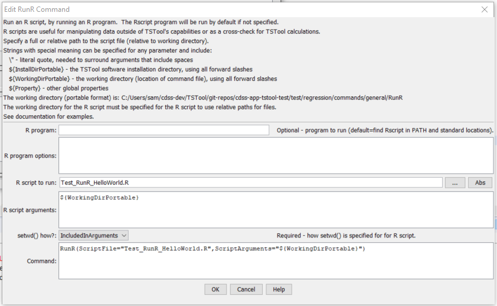

# TSTool / Command / RunR #

* [Overview](#overview)
* [Command Editor](#command-editor)
* [Command Syntax](#command-syntax)
* [Examples](#examples)
* [Troubleshooting](#troubleshooting)
* [See Also](#see-also)

-------------------------

## Overview ##

The `RunR` command runs an R script, waiting until execution is finished before processing additional commands.
R is a powerful analysis program with scripting language that is widely used for data analysis, statistics,
and data visualization.
R can be used independently and can be integrated with TSTool workflows (command files) with the `RunR` command.
See also:

* [R website](https://www.r-project.org/) - core R product, with command line and user interface
	+ [Rscript documentation](https://www.rdocumentation.org/packages/utils/versions/3.6.1/topics/Rscript) - the
	`Rscript` program is used by TSTool by default to run `R` scripts
* [RStudio website](https://rstudio.com) - integrated development environment that enhances core `R` product
	+ `RStudio` requires that a compatible version of `R` is installed.

The `Rscript` program is the recommended way to run `R` in batch mode and is the approach taken by TSTool.
The `RunR` TSTool command creates a command line similar to the following,
where each item corresponds to a `RunR` command parameter:

```
RProgram ROptions ScriptFile ScriptArguments
```

The command line consist of the following information:

* `R` program (see `RProgram` command parameter):
	+ The folder containing `R` executable programs may or may not have been added to the `PATH`
	environment variable during `R` software installation or subsequent modification of the `PATH`
	+ If specified as an absolute path, the full path is used
	+ If not specified, `Rscript` (`Rscript.exe` on Windows) is used by default 
	+ If an absolute path is not specified for the program, the program to run (either specified as
	program name or the default `Rscript` is located by:
		- Search for the program name in folders indicated in the `PATH` to make sure it will be found.
		This allows more robust error messages to be shown.
		- Search for for the program name in typical software installation locations (only for Windows).
		Currently the following path is checked:  `C:\Program Files\R\*\bin\x64\Rprogram`,
		where `*` will match a folder like `R-3.6.1` and `Rprogram` is as specified
		by the `RProgram` command parameter or default `Rscript.exe`.
* `R` program options:
	+ Command line options for the `RProgram` that is being run, for example `--verbose`.
* `R` script:
	+ The name of the `R` script file to run.  This is typically specified using a path relative
	to the TSTool command file.  TSTool will convert to an absolute path.
	See the discussion about working directory below.
* `R` script arguments:
	+ Provide arguments to the `R` script, which controls the script's execution.

### `R` Working Directory ###

`R` scripts are often run using the `R` or `RStudio` user interface.
In this case, the working directory is automatically set to the location of the `R` script
that is opened in the UI, or result of `setwd()` function in the script.
When running an `R` script in batch mode by running `Rscript` ,
the working directory is assumed to be the current
working directory; therefore, the user will open a command prompt window and run
`Rscript` from that location.

When running an `R` script from TSTool, TSTool must provide to the called `R` script
the working directory in order for the script to be able to locate input and output files.
The working directory for TSTool is initially the TSTool software installation folder and
later is set to the folder of the command file that is opened/saved in TSTool.
Specifying the working directory to `R` from TSTool is done using relative paths
to the TSTool command file so that the script is portable between computers.
The following discusses how TSTool can pass working directory information the `R` program.

The `Rscript` program can be run in two modes:

1. Execute `R` commands with command line:  `Rscript -e expr`.  This can be used, for example,
by TSTool to pass the working directory to the script using `-e expr "setwd(\"TSTool-working-dir\")`.
Unfortunately, a script file cannot ALSO be passed in this mode and therefore
a script would need to be converted to a form that runs as a command line expression.
This has not been implemented.
2. Exceute `R` script with command line:  `Rscript file`.
In this case, the `R` script can use the `setwd()` command to indicate the working directory,
but by default will not know the value of the working directory (current directory is not
reliable when run from a graphical user interface such as TSTool).

Unfortunately, the `Rscript` program does not allow both `-e expr` and `file` run modes on the
same command line, which would allow setting the working directory with `-e "setwd(\"TSTool-working-dir\")"` to be
recognized by the script being run.  Therefore, if relative paths are to be used for working directory for
portability, the following approach is taken:

1. Implement in the script logic to read the working directory from the script's command line.
See the **Examples** section for example code to do this.
2. Use the `ScriptArguments=${WorkingDirPortable}` parameter in the TSTool `RunR` command.
This ensures that a path like `C:\somefolder1\somefolder2` is passed to the script as `C/somefolder1/somefolder2`.
This is required because `R` does not handle single backslash characters in paths.

### Handling Quotes ###

The TSTool `RunR` command may need to be enhanced further to handle complex command lines,
in particular where quoted arguments are used by the script.
It is recommened to avoid situations where quoted input is necessary,
such as paths with spaces.
To test quoted input, try running the `Rscript` command line in a command prompt (terminal)
window to make sure it works.  Then run via TSTool and review the TSTool log file to confirm behavior.

## Command Editor ##

The following dialog is used to edit the command and illustrates the command syntax.

**<p style="text-align: center;">

</p>**

**<p style="text-align: center;">
`RunR` Command Editor (<a href="../RunR.png">see also the full-size image</a>)
</p>**

## Command Syntax ##

The command syntax is as follows:

```text
RunR(Parameter="Value",...)
```
**<p style="text-align: center;">
Command Parameters
</p>**

| **Parameter**&nbsp;&nbsp;&nbsp;&nbsp;&nbsp;&nbsp;&nbsp;&nbsp;&nbsp;&nbsp;&nbsp;&nbsp;&nbsp;&nbsp;&nbsp;&nbsp;&nbsp;&nbsp;&nbsp;&nbsp;&nbsp;&nbsp;&nbsp;&nbsp;&nbsp;&nbsp; | **Description** | **Default**&nbsp;&nbsp;&nbsp;&nbsp;&nbsp;&nbsp;&nbsp;&nbsp;&nbsp;&nbsp;&nbsp;&nbsp;&nbsp;&nbsp;&nbsp;&nbsp;&nbsp;&nbsp;&nbsp;&nbsp;&nbsp;&nbsp;&nbsp;&nbsp;&nbsp; |
| --------------|-----------------|----------------- |
|`RProgram`<br>|The name of the `R` program to run as abolute path or program name, can be specified with `${Property}` syntax.|`Rscript`, found in `PATH` environment variable folder or in standard installation location folder. |
|`ROptions`|Commaand line options to pass to `RProgram`, separated by spaces.  Can be specified using `${Property}` syntax.|No options will be used.|
|`ScriptFile`<br>**required**|`R` script to run.  Can be specified using `${Property}` syntax.|None - must be specified.|
|`ScriptArguments`|Arguments to pass to the script, such as the names of files to process.  Use the `${WorkingDirPortable}` property to specify the location of the TSTool command file.  Use `\”` to surround arguments that include spaces.  Separate arguments by a space.  Can be specified using `${Property}` syntax.||

## Examples ##

* See the [automated tests](https://github.com/OpenCDSS/cdss-app-tstool-test/tree/master/test/regression/commands/general/RunR).
* See an example of specifying the working directory:
	+ [TSTool command file](https://github.com/OpenCDSS/cdss-app-tstool-test/blob/master/test/regression/commands/general/RunR/Test_RunR_HelloWorld.TSTool)
	+ [R script](https://github.com/OpenCDSS/cdss-app-tstool-test/blob/master/test/regression/commands/general/RunR/Test_RunR_HelloWorld.R)

## Troubleshooting ##

## See Also ##

* [`RunCommands`](../RunCommands/RunCommands.md) command
* [`RunProgram`](../RunProgram/RunProgram.md) command
* [`RunPython`](../RunPython/RunPython.md) command
