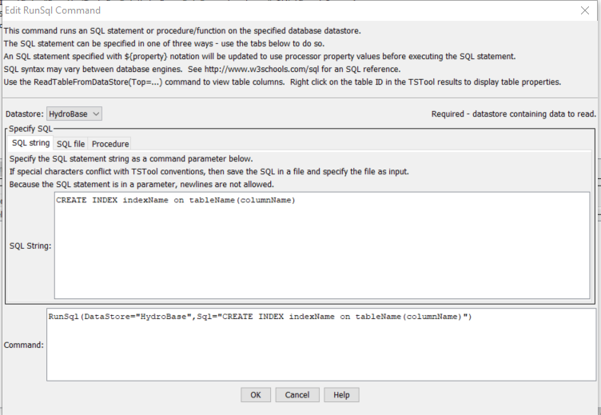
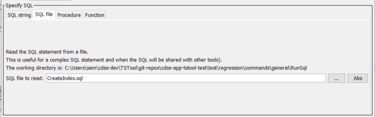
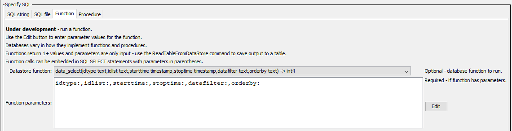
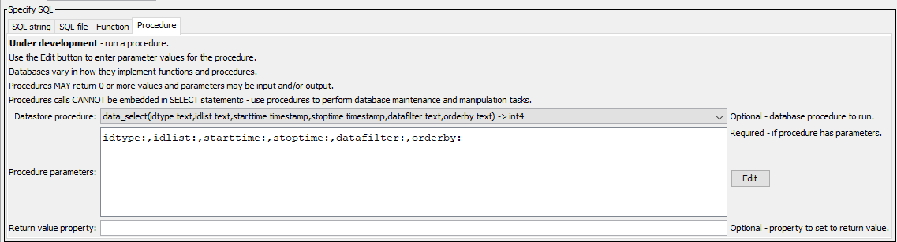

# TSTool / Command / RunSql #

* [Overview](#overview)
    + [Limitations](#limitations)
* [Command Editor](#command-editor)
* [Command Syntax](#command-syntax)
* [Examples](#examples)
* [Troubleshooting](#troubleshooting)
* [See Also](#see-also)

-------------------------

## Overview ##

The `RunSql` command executes a Structured Query Language (SQL) statement
or runs a function or procedure for the specified database datastore.
This command is useful when a database task needs to be automated in sequence with other TSTool commands.
This command cannot be used with web service datastores because the
underlying software relies on a database to execute the SQL statement.

If database datastore support is not provided by a built-in TSTool datastore,
a generic database datastore can be used (see the
[Generic Database DataStore appendix](../../datastore-ref/GenericDatabase/GenericDatabase.md)).
A datastore plugin may also be available for a database,
in which case the plugin software can be developed and maintained separate from the main TSTool software.

See also the
[`ReadTableFromDataStore`](../ReadTableFromDataStore/ReadTableFromDataStore.md),
[`WriteTableToDataStore`](../WriteTableToDataStore/WriteTableToDataStore.md),
and other commands specific to datastores.

The SQL statement can be specified in the following ways:

* Specify a SQL statement as a command parameter:
	+ SQL must be valid for the database (syntax may vary based on database software).
	+ Use `${Property}` notation to insert processor property values set with
	[`SetProperty`](../SetProperty/SetProperty.md), other commands, or TSTool command line parameter.
	+ SQL syntax is not checked for validity and therefore error messages
	from the database need to be diagnosed based on database software messages.
	+ Comments in SQL can be specified using
	[`/* */`](../CommentBlockStart/CommentBlockStart.md) notation for 1+ line comments or `--` (double dash) for single line comments.
	The comments are removed before executing the query if comments are not supported by the database software.
	+ Newlines can be used to format SQL by using `Enter` when editing SQL and
	are shown as `\n` in the SQL parameter.
* Specify an SQL select statement in a file:
	+ Similar to the above option; however, the SQL statement is read from a file.
	+ Useful if the SQL statement is complex or is used by other tools.
* Specify a function to run:
	+ **This functionality is under development - functions can typically be called in `SELECT` statements.**
	+ Available functions are listed using function signature with parameter types and return value.
	+ Function parameters, if required, are specified with `ProcedureParameters` parameter.
* Specify a procedure to run:
	+ **This functionality is under development.**
	+ Available procedures are listed using procedure signature with parameter types and return value.
	+ Procedure parameters, if required, are specified with `ProcedureParameters` parameter.
	+ Procedure return status, if available, can be saved as a property with `ProcedureReturnProperty` parameter.

General constraints on executing the SQL statement are as follows:

* The tables, views, functions, and procedures must be readable.
* Any SQL statement can be run; consequently, suitable authentication and permissions
should be in place to protect against unintended changes to the database.
For example, use a service account with appropriate permissions.
* SQL syntax varies between database software so care should be take to use standard SQL if possible,
if the commands will be run on different databases.
* Results from the statement currently are not displayed,
although errors will be shown and added to the log file.
Use the [`ReadTableFromDataStore`](../ReadTableFromDataStore/ReadTableFromDataStore.md)
command to process statements that return a result set.

### Limitations ###

The ability to run functions and procedures is under development.
Functions and procedures can be overloaded in some databases,
meaning that the same function name has different parameters.
Consequently, to select a function or procedure to run,
it is necessary to select a function's unique signature,
which includes the parameter names and types.

**The ability to run functions and procedures will be fully enabled in the future.**
Many databases allow functions to be called in `SELECT` statements.

## Command Editor ##

The following dialog is used to edit the command and illustrates the syntax for the command, in this case creating a database index.

**<p style="text-align: center;">

</p>**

**<p style="text-align: center;">
`RunSql` Command Editor (<a href="../RunSql.png">see also the full-size image</a>)
</p>**

The following dialog is used to edit the command and illustrates the syntax for the command when using a file to specify the SQL statement.

**<p style="text-align: center;">

</p>**

**<p style="text-align: center;">
`RunSql` Command Editor when Specifying the SQL Statement Using a File (<a href="../RunSql_File.png">see also the full-size image</a>)
</p>**

The following dialog is used to edit the command and illustrates the syntax for the command when running a function.
The ***Edit*** dialog will automatically populate the list of parameters if the database metadata provides such information.

**<p style="text-align: center;">

</p>**

**<p style="text-align: center;">
`RunSql` Command Editor when Specifying a Function to Run (<a href="../RunSql_Function.png">see also the full-size image</a>)
</p>**

The following dialog is used to edit the command and illustrates the syntax for the command when running a stored procedure.
The ***Edit*** dialog will automatically populate the list of parameters if the database metadata provides such information.

**<p style="text-align: center;">

</p>**

**<p style="text-align: center;">
`RunSql` Command Editor when Specifying a Stored Procedure to Run (<a href="../RunSql_Procedure.png">see also the full-size image</a>)
</p>**

## Command Syntax ##

The command syntax is as follows:

```text
RunSql(Parameter="Value",...)
```
**<p style="text-align: center;">
Command Parameters
</p>**

|**Query Method**|**Parameter**&nbsp;&nbsp;&nbsp;&nbsp;&nbsp;&nbsp;&nbsp;&nbsp;&nbsp;&nbsp;&nbsp;&nbsp;&nbsp;&nbsp;&nbsp;&nbsp;&nbsp;&nbsp;&nbsp;&nbsp;&nbsp;&nbsp;&nbsp;&nbsp;&nbsp;&nbsp;&nbsp;&nbsp;&nbsp;&nbsp;&nbsp;|**Description**|**Default**&nbsp;&nbsp;&nbsp;&nbsp;&nbsp;&nbsp;&nbsp;&nbsp;&nbsp;&nbsp;&nbsp;&nbsp;&nbsp;&nbsp;&nbsp;&nbsp;&nbsp;&nbsp;&nbsp;&nbsp;&nbsp;&nbsp;&nbsp;&nbsp;&nbsp;&nbsp;&nbsp;|
|--|--|--|--|
| All | `DataStore`<br>**required**|The name of a database datastore.|None – must be specified.|
|***SQL String*** | `Sql`|The SQL statement text that will be executed, optionally using `${Property}` notation to insert processor property values.  If specified, do not specify `SqlFile`, `DatabaseFunction`, or `DataStoreProcedure`.|None.|
|***SQL File*** | `SqlFile`|The name of the file containing an SQL statement to execute, optionally using `${Property}` notation in the SQL file contents to insert processor property values.  If specified, do not specify `Sql`, `DatabaseFunction`, or `DataStoreProcedure`.|None.|
|***Function*** | `DataStoreFunction`|The name of the database function to run, as full signature if metadata are available.  If specified, do not specify `Sql`, `SqlFile`, or `DatabaseProcedure`.|None.|
| |`FunctionParameters`|Parameters for function, in order that is required.  Use the ***Edit*** button to see the list of parameters and their type.||
|***Procedure*** | `DataStoreProcedure`|The name of the database procedure to run.  If specified, do not specify `Sql`, `SqlFile`, or `DatabaseFunction`.|None.|
| |`ProcedureParameters`|Parameters for procedure, in order that is required.  Use the ***Edit*** button to see the list of parameters and their type.||
| |`ProcedureReturnProperty`|Property name for procedure return value.||

## Examples ##

See the [automated tests](https://github.com/OpenCDSS/cdss-app-tstool-test/tree/master/test/commands/RunSql).

## Troubleshooting ##

* SQL statements that do not run can often be tested with database utility software that is provided with a database,
for example `psql` program for PostgreSQL.
* Attempting to specify an SQL statement as a parameter can be difficult when characters such as quotes
interfere with TSTool command syntax.  In this case, use a file for SQL.

## See Also ##

* [`CloseDataStore`](../CloseDataStore/CloseDataStore.md) command
* [`OpenDataStore`](../OpenDataStore/OpenDataStore.md) command
* [`ReadTableFromDataStore`](../ReadTableFromDataStore/ReadTableFromDataStore.md) command
* [`SetProperty`](../SetProperty/SetProperty.md) command
* [`WriteTableToDataStore`](../WriteTableToDataStore/WriteTableToDataStore.md) command
