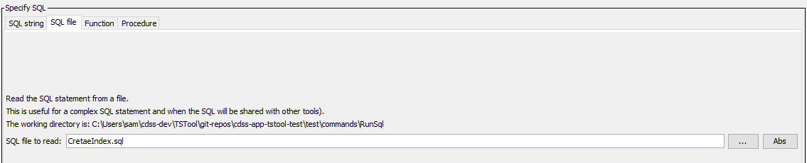

# TSTool / Command / RunSql #

* [Overview](#overview)
* [Command Editor](#command-editor)
* [Command Syntax](#command-syntax)
* [Examples](#examples)
* [Troubleshooting](#troubleshooting)
* [See Also](#see-also)

-------------------------

## Overview ##

The `RunSql` command executes a Structured Query Language (SQL) statement or procedure/function on the specified database datastore.
This command cannot be used with web service datastores because the
underlying software relies on a database to execute the SQL statement.
If database datastore support is not specifically provided by TSTool,
a generic database datastore can be used (see the
[Generic Database DataStore appendix](../../datastore-ref/GenericDatabase/GenericDatabase.md)).
For example, use a generic database datastore to configure a connection to a Microsoft Access database.
See also the
[`ReadTableFromDataStore`](../ReadTableFromDataStore/ReadTableFromDataStore.md),
[`WriteTableToDataStore`](../WriteTableToDataStore/WriteTableToDataStore.md),
and other commands specific to datastores.
This command is useful when a database task needs to be automated in sequence with other TSTool commands.
The SQL statement can be specified in the following ways:

* Specify a SQL statement as a command parameter:
	+ SQL must be valid for the database (syntax may vary based on database software).
	+ Use `${Property}` notation to insert processor property values set with
	[`SetProperty`](../SetProperty/SetProperty.md).
	+ SQL syntax is not checked for validity and therefore error messages
	from the database need to be diagnosed based on familiarity with the database.
	+ Comments in SQL can be specified using
	[`/* */`](../CommentBlockStart/CommentBlockStart.md) notation or `--` (double dash) for end of line comments.
	These comments are removed by TSTool for Microsoft Access because Access does not support comments in SQL statements.
* Specify an SQL select statement in a file:
	+ Similar to the above option; however, the SQL statement is read from a file.
	+ Useful if the SQL statement is also used by other tools.
* Specify a procedure to run:
	+ Available procedures are listed and can be selected
	+ Procedure parameters, if required, are specified with `ProcedureParameters` parameter.
	+ Procedure return status, if available, can be saved as a property with `ProcedureReturnProperty` parameter.

General constraints on executing the statement are as follows:

* The table, views, and procedures being queried must be readable
(some databases restrict direct access to data and require using stored procedures).
* Any SQL statement can be run; consequently, suitable authentication and permissions
should be in place to protect against unintended changes to the database
* SQL syntax varies between database software so care should be take to use standard SQL if possible.
* Results from the statement currently are not displayed,
although errors will be shown and added to the log file.
Use the [`ReadTableFromDataStore`](../ReadTableFromDataStore/ReadTableFromDataStore.md)
command to process statements that return a result set.

## Command Editor ##

The following dialog is used to edit the command and illustrates the syntax for the command, in this case creating a database index.

**<p style="text-align: center;">

</p>**

**<p style="text-align: center;">
`RunSql` Command Editor (<a href="../RunSql.png">see also the full-size image</a>)
</p>**

The following dialog is used to edit the command and illustrates the syntax for the command when using a file to specify the SQL statement.

**<p style="text-align: center;">

</p>**

**<p style="text-align: center;">
`RunSql` Command Editor when Specifying the SQL Statement Using a File (<a href="../RunSql_File.png">see also the full-size image</a>)
</p>**

The following dialog is used to edit the command and illustrates the syntax for the command when running a stored procedure.

**<p style="text-align: center;">

</p>**

**<p style="text-align: center;">
`RunSql` Command Editor when Specifying a Stored Procedure to Run (<a href="../RunSql_Procedure.png">see also the full-size image</a>)
</p>**

## Command Syntax ##

The command syntax is as follows:

```text
RunSql(Parameter="Value",...)
```
**<p style="text-align: center;">
Command Parameters
</p>**

|**Parameter**&nbsp;&nbsp;&nbsp;&nbsp;&nbsp;&nbsp;&nbsp;&nbsp;&nbsp;&nbsp;&nbsp;&nbsp;&nbsp;&nbsp;&nbsp;&nbsp;&nbsp;&nbsp;&nbsp;&nbsp;&nbsp;&nbsp;&nbsp;&nbsp;&nbsp;&nbsp;&nbsp;&nbsp;&nbsp;&nbsp;&nbsp;|**Description**|**Default**&nbsp;&nbsp;&nbsp;&nbsp;&nbsp;&nbsp;&nbsp;&nbsp;&nbsp;&nbsp;&nbsp;&nbsp;&nbsp;&nbsp;&nbsp;&nbsp;&nbsp;&nbsp;&nbsp;&nbsp;&nbsp;&nbsp;&nbsp;&nbsp;&nbsp;&nbsp;&nbsp;|
|--------------|-----------------|-----------------|
|`DataStore`<br>**required**|The name of a database datastore.|None – must be specified.|
|`Sql`|The SQL statement text that will be executed, optionally using `${Property}` notation to insert processor property values.  If specified, do not specify `SqlFile` or `DataStoreProcedure`.|None.|
|`SqlFile`|The name of the file containing an SQL statement to execute, optionally using `${Property}` notation in the SQL file contents to insert processor property values.  If specified, do not specify `Sql` or `DataStoreProcedure`.|None.|
|`DataStoreProcedure`|The name of the database procedure to run.  If specified, do not specify `Sql` or `SqlFile`.|None.|
|`ProcedureParameters`|Parameters for procedure/function, in order that is required.  Use the ***Edit*** button to see the list of parameters and their type.||
|`ProcedureReturnProperty`|Property name for procedure return value.||

## Examples ##

See the [automated tests](https://github.com/OpenCDSS/cdss-app-tstool-test/tree/master/test/regression/commands/general/RunSql).

## Troubleshooting ##

## See Also ##

* [`ReadTableFromDataStore`](../ReadTableFromDataStore/ReadTableFromDataStore.md) command
* [`SetProperty`](../SetProperty/SetProperty.md) command
* [`WriteTableToDataStore`](../WriteTableToDataStore/WriteTableToDataStore.md) command
