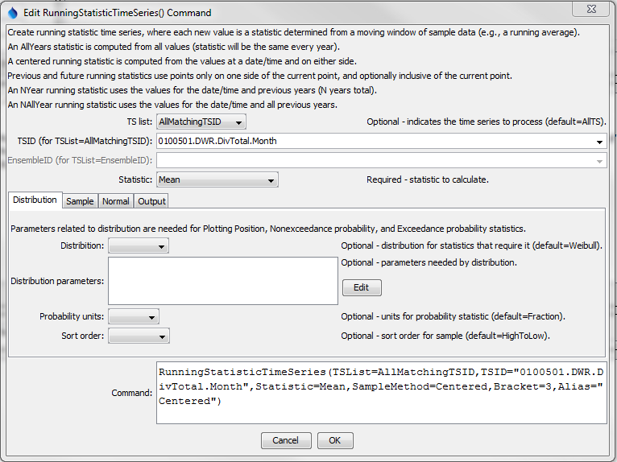
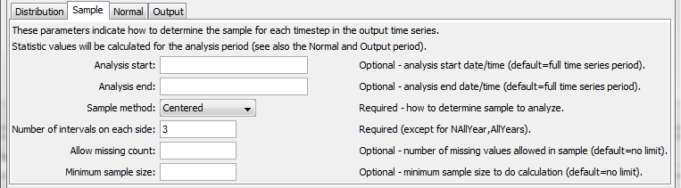
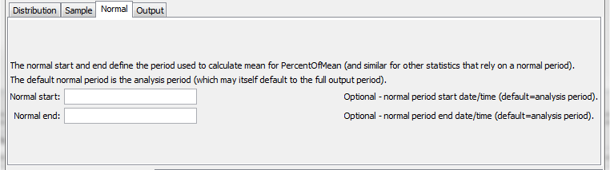
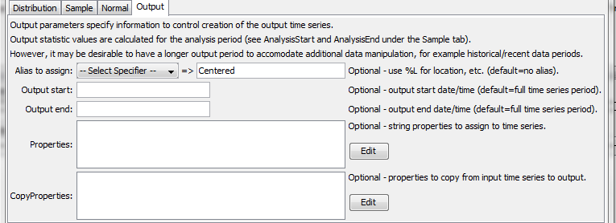
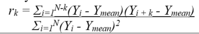
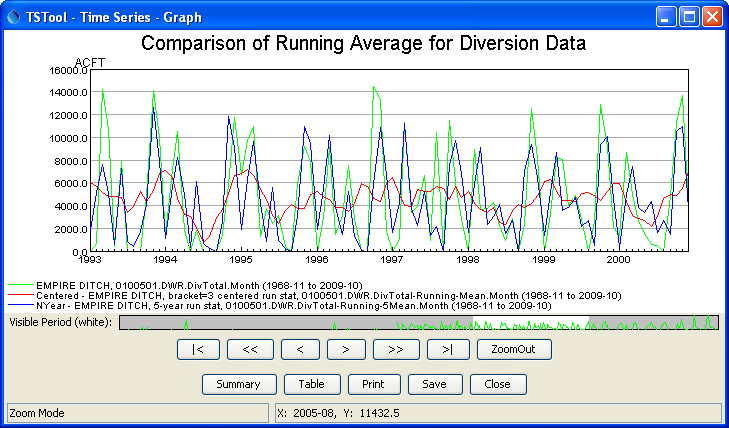

# TSTool / Command / RunningStatisticTimeSeries #

*   [Overview](#overview)
*   [Command Editor](#command-editor)
*   [Command Syntax](#command-syntax)
*   [Examples](#examples)
*   [Troubleshooting](#troubleshooting)
*   [See Also](#see-also)

-------------------------

## Overview ##

The `RunningStatisticTimeSeries` command uses a sample of values from a
time series to compute a running statistic, resulting in new time series.

See also the [Statistic Examples](../../examples/examples.md#statistic-examples) for a list of commands that calculate statistics.

The main purposes of the `RunningStatisticTimeSeries` command are:

1.  Compute a running statistic around a moving point, in order to smooth the time series,
    for example to focus on underlying short-term forcings rather than variability or noise
2.  Compute a statistic by using values from the historical period,
    for example to illustrate how a daily value compares to historical values for the same day of year
3.  Compute a statistic by comparing a value to a statistic computed
    for a “normal” period, such as a standard 30-year climate period

The sample is computed relative to a date/time in the time series and consequently
the resulting statistic may vary at each date/time in the time series.
The resulting time series will have a time series identifier (TSID)
that is the same as the original, with `-Running-` and the statistic appended to the
data type (an alias can be assigned to customize the identifier that is used for processing).
There are several approaches to determining the sample for the running
statistic (as specified by the `SampleMethod` command parameter):

*   The centered running statistic (`SampleMethod=Centered`) requires that the number
    intervals on each site of a point be specified (e.g., specifying `1` will use 3 values at each point):  `x--O--x`
*   The previous/future running statistics (`SampleMethod=Future`, `FutureInclusive`, `Previous`, `PreviousInclusive`)
    require that the number of intervals prior to or after the current point be specified.
*   The N-year running statistic (`SampleMethod=NYear`) is computed by processing the current year and
    N - 1 values from previous years, for a specific date.
    A resulting value is produced only if N non-missing values are available.
    Currently N-year running statistic values for Feb 29 for daily or finer data will always
    be missing because a sufficient number of values will not be found – an option may be added
    in the future to allow Feb 29 values to be computed based on fewer than N values.
*   A special case of the N-year running statistic (`SampleMethod=NAllYear`)
    is to use all previous years’ and the current value.
*   Use `SampleMethod=AllYears` to use data from the full analysis period.
    In this case some statistics may have the same value for the full period.
    This sample method is used with `NormalStart` and `NormalEnd` and `PercentOf*`
    statistics to indicate how values compare to a normal period.

Statistics may be calculated directly from the sample or may be derived from an additional calculation.
For example, the Mean statistic is computed by computing the mean of the values in the sample,
and is assigned as the output time series value for the date/time that defines the sample.
However, the `PercentOfMean` statistic is computed first by computing the `Mean` statistic and
then dividing the original time series value by the mean, for each date/time in the time series.
Derived statistics could be computed for many statistics but are provided only for cases that have common use.

Some statistics require the specification require that a distribution be specified.
These statistics include `ExceedanceProbability`, `NonexceedanceProbability`, and `PlottingPosition`.
See the **Statistics Summary** table for more information.
The distributions are specified using the `Distribution`, `DistributionParameters`,
and `ProbabilityUnits` parameters.  The see **Distribution Summary** table below.

The `SortOrder` parameter is used for the Rank statistic and may in the
future be used for statistics that use a distribution.
Currently, the above statistics that use a distribution always sort
data so that the largest data value is in rank position 1.
The `Rank` statistic can be calculated as a simple statistic and will consider the `SortOrder` parameter.

## Command Editor ##

The command is available in the following TSTool menu:

*   ***Commands / Create Time Series***

The following dialog is used to edit the command and illustrates the centered running average command syntax.
In this case the distribution does not need to be specified.
Refer to the sequence of figures to see input fields for all parameters.

**<p style="text-align: center;">

</p>**

**<p style="text-align: center;">
`RunningStatisticTimeSeries` Command Editor for Distribution Parameters (<a href="../RunningStatisticTimeSeries.png">see also the full-size image</a>)
</p>**

The following dialog is used to edit the command and illustrates the centered running average command syntax.

**<p style="text-align: center;">

</p>**

**<p style="text-align: center;">
`RunningStatisticTimeSeries` Command Editor for Centered Running Average (<a href="../RunningStatisticTimeSeries-Centered-Sample.png">see also the full-size image</a>)
</p>**

**<p style="text-align: center;">

</p>**

**<p style="text-align: center;">
`RunningStatisticTimeSeries` Command Editor for Normal Period Parameters (<a href="../RunningStatisticTimeSeries-Normal.png">see also the full-size image</a>)
</p>**

**<p style="text-align: center;">

</p>**

**<p style="text-align: center;">
`RunningStatisticTimeSeries` Command Editor for Output Parameters (<a href="../RunningStatisticTimeSeries-Output.png">see also the full-size image</a>)
</p>**

## Command Syntax ##

The command syntax is as follows:

```text
RunningStatisticTimeSeries(Parameter="Value",...)
```
**<p style="text-align: center;">
Command Parameters
</p>**

|**Parameter**&nbsp;&nbsp;&nbsp;&nbsp;&nbsp;&nbsp;&nbsp;&nbsp;&nbsp;&nbsp;&nbsp;&nbsp;&nbsp;&nbsp;&nbsp;&nbsp;&nbsp;&nbsp;&nbsp;&nbsp;&nbsp;&nbsp;&nbsp;&nbsp;&nbsp;&nbsp;&nbsp;&nbsp;&nbsp;|**Description**|**Default**&nbsp;&nbsp;&nbsp;&nbsp;&nbsp;&nbsp;&nbsp;&nbsp;&nbsp;&nbsp;&nbsp;&nbsp;&nbsp;&nbsp;&nbsp;&nbsp;&nbsp;&nbsp;&nbsp;&nbsp;&nbsp;&nbsp;&nbsp;&nbsp;&nbsp;&nbsp;&nbsp;|
|--------------|-----------------|-----------------|
| `TSList` | Indicates the list of time series to be processed, one of:<ul><li> `AllMatchingTSID` – all time series that match the TSID (single TSID or TSID with wildcards)</li><li> `AllTS` – all time series generated before the command</li><li> `EnsembleID` – all time series in the ensemble</li><li> `FirstMatchingTSID` – the first time series that matches the TSID (single TSID or TSID with wildcards)</li><li> `LastMatchingTSID` – the last time series that matches the TSID (single TSID or TSID with wildcards)</li><li> `SelectedTS` – the time series selected with the [`SelectTimeSeries`](../SelectTimeSeries/SelectTimeSeries.md) command | `AllTS` |
| `TSID` | The time series identifier or alias for the time series to be processed, using the `*` wildcard character to match multiple time series.  Can be specified with processor `${Property}`. | Required if `TSList=*TSID`. |
| `EnsembleID` | The ensemble to be processed, if processing an ensemble.  Can be specified with processor `${Property}`. | Required if `TSList= EnsembleID`. |
| `Statistic` | The statistic to compute for each point in the created time series.  See the **Statistics Summary** below.  Some statistics require additional input, as noted in the table. | None – must be specified. |
| `Distribution` | Indicates the distribution, needed for certain statistics (see **Statistics Summary** table below for indication or statistics that need distribution information).  See the **Distribution Summary** table below for information about distributions. | |
| `DistributionParameters` | Additional parameters needed to specify a distribution.  See the **Distribution Summary** table below. | |
| `ProbabilityUnits` | Units to use for calculated probability statistics:<ul><li>`Fraction`</li><li>`Percent` or `%`</li></ul> | `Fraction` (0 – 1). |
| `SortOrder` | Order to sort the sample, used with exceedance probability, plotting position and rank:<ul><li>`LowToHigh` – rank 1 in plotting position is smallest value</li><li>`HighToLow` – rank 1 in plotting position is largest value | `HighToLow` for `ExceedanceProbability`, `NonexceedanceProbability`, and `PlottingPosition`. |
| `AnalysisStart` | Start of period to analyze.  A value will be computed at each time step in the analysis period.  Can be specified with processor `${Property}`. | Analyze the full (output) period. |
| `AnalysisEnd` | End of period to analyze.  Can be specified with processor `${Property}`. | Analyze the full period. |
| `SampleMethod` | The method used to determine the data sample for each statistic calculation, one of the following, where `X` indicates include the current value and `O` indicates exclude the current value):<ul><li>`AllYears` – the sample is taken from all the years in the period (one value per year), appropriate for `PercentOfMean` and similar statistics.  See also `NormalStart` and `NormalEnd`.</li><li>`Centered` – N (bracket) values on each side of a date/time and the center value (`Bracket=1` uses `x--X--x`)</li><li>`Future` – average the next N (bracket) values but do not include the current value (`Bracket=3` uses `O--x--x--x`)</li><li>`FutureInclusive` – average the next N (bracket) values and also include the current value (`Bracket=1` uses `X--x`)</li><li>`NYear` – values for the current year and (N – 1) preceding years, for the same date/time in each year</li><li>`NAllYear` – values for the current year and all preceding years, for the same date/time in each year (missing values are handled)</li><li>`Previous` – the previous N (bracket) values but do not include the current value (`Bracket=3` uses `x--x--x--O`)</li><li>`PreviousInclusive` – the previous N (bracket) values and also include the current value (`Bracket=1` uses `x--X`)</li></ul><br>If a sample method such as `NAllYear` is desired, but including previous, current, and future values, then the [NewStatisticTimeSeries](../NewStatisticTimeSeries/NewStatisticTimeSeries.md) command can be used. | None – must be specified. |
| `Bracket` | For centered `SampleMethod`, the bracket is the number of points on each side of the current point (therefore a value of 1 will average 3 data values).  For future and previous `SampleMethod`, the bracket is the number of previous or future values.  For N-year `SampleMethod`, the bracket is the total number of years to process, including the current year. The bracket is not used with sample method `NAllYear` and `AllYears`. | None – must be specified. |
| `AllowMissingCount` | The number of values allowed to be missing in the sample and still compute the statistic.  Care should be taken to specify a value that is relatively small for the sample size. | `0` – no missing values are allowed in the sample |
| `MinimumSampleSize` | The minimum sample size is checked with `SampleMethod=AllYears` and `SampleMethod=NAllYear` because Bracket and `AllowMissingCount` do not control the sample size. | `1` |
| `NormalStart` | Start of normal period.  The normal period is used to compute an intermediate statistic such as Mean, which is then used in the final statistic (e.g., `Statistic=PercentOfMean`).  The normal period is used for the initial calculation and the analysis period specified by `AnalysisStart` and `AnalysisEnd` are is used for the final calculation.  Can be specified with processor `${Property}`. | Analyze the full (output) period. |
| `NormalEnd` | End of normal period.  Can be specified with processor `${Property}`. | Analyze the full period. |
| `Alias` | The alias to assign to the time series, as a literal string or using the special formatting characters listed by the command editor.  The alias is a short identifier used by other commands to locate time series for processing, as an alternative to the time series identifier (TSID).  Can be specified with processor `${Property}`. | None – must be specified. |
| `OutputStart` | Start of the output period, use to size the output time series.  Can be specified with processor `${Property}`. | Input time series start. |
| `OutputEnd` | End of normal period.  Can be specified with processor `${Property}`. | Input time series end. |
| `Properties` | String properties to be assigned to the time series using syntax `PropertyName1:Value1, PropertyName2:Value2`<br>Use the syntax `%L` to specify standard time series properties as per alias specification and `${ts:Property}` for user-assigned properties.  The properties will be taken from the input time series. |
| `CopyProperties` | Properties to copy from the input time series to the output time series using syntax `PropertyName1:NewPropertyName1, PropertyName2:NewPropertyName2`<br>The new property name can be specified as `*` to keep the old name or specify a new property name. |

The following table lists available statistics.

**<p style="text-align: center;">
Statistic Summary
</p>**

|**Statistic**&nbsp;&nbsp;&nbsp;&nbsp;&nbsp;&nbsp;&nbsp;&nbsp;&nbsp;&nbsp;&nbsp;&nbsp;&nbsp;&nbsp;&nbsp;&nbsp;&nbsp;&nbsp;&nbsp;&nbsp;&nbsp;&nbsp;&nbsp;&nbsp;&nbsp;&nbsp;&nbsp;&nbsp;&nbsp;&nbsp;&nbsp;&nbsp;&nbsp;&nbsp;&nbsp;&nbsp;&nbsp;|**Description**|**Needed Input**&nbsp;&nbsp;&nbsp;&nbsp;&nbsp;&nbsp;&nbsp;&nbsp;&nbsp;&nbsp;&nbsp;&nbsp;&nbsp;&nbsp;&nbsp;&nbsp;&nbsp;&nbsp;&nbsp;&nbsp;&nbsp;&nbsp;&nbsp;&nbsp;&nbsp;&nbsp;&nbsp;&nbsp;&nbsp;&nbsp;&nbsp;&nbsp;&nbsp;&nbsp;&nbsp;|
|--------------|-----------------|-----------------|
| `ExceedanceProbability` | The probability that the value will be exceeded, best-suited for the `N*` sample methods  (see discussion below about how statistic is computed). | Requires distribution parameters. |
| `Change` | Change in magnitude from first to last value: `(last - first)`. | |
| `ChangeAbs` | Change in magnitude from first to last value, absolute value: `abs(last - first)`. | |
| `ChangeFraction` | Change in magnitude from first to last value, as fraction 0.0 to 1.0: `(last - first)/first`. | |
| `ChangeFractionAbs` | Change in magnitude from first to last value, as fraction 0.0 to 1.0, absolute value: `abs((last - first)/first)`. | |
| `ChangePercent` | Change in magnitude from first to last value, as percent 0.0 to 100.0: `100*(last - first)/first`. | |
| `ChangePercentAbs` | Change in magnitude from first to last value, as percent 0.0 to 100.0, absolute value: `abs(100*(last - first)/first)`. | |
| `GeometricMean` | Geometric mean value. | |
| `Lag-1AutoCorrelation` | The autocorrelation between values and the those that follow in the next time step, given by:<br>  |
| `Max` | Maximum value. | |
| `Mean` | Arithmetic mean of values. | |
| `Median` | Median value. | |
| `Min` | Minimum value. | |
| `NewMax` | New minimum value, only used with `SampleMethod=NAllYear`. | Can only be used with time series having day or month interval. |
| `NewMin` | New minimum value, only used with `SampleMethod=NAllYear`. | Can only be used with time series having day or month interval. |
| `NonexceedanceProbability` | The probability that the value will not be exceeded, `1-ExceedanceProbability`, best-suited for the `N*` sample methods (see discussion below about how statistics are computed). | Requires distribution parameters. |
| `PercentOfMax` | Percent of the `Max` statistic output. | |
| `PercentOfMean` | Percent of the `Mean` statistic output. | |
| `PercentOfMedian` | Percent of the `Median` statistic output. | |
| `PercentOfMin` | Percent of the `Min` statistic output. | |
| `PlottingPosition` | Plotting position for distribution (see `ExceedanceProbability` calculation explanation in **Statistic Computation Details** table. | Requires distribution parameters. |
| `Rank` | Rank order, based on `SortOrder` command parameter.  Duplicate values are each assigned a rank that is the average of the ranks for the duplicate values.  This is necessary because selecting one of the ranks would be arbitrary.  A new command parameter may be added to allow control of this behavior. | |
| `Skew` | Skew coefficient, as follows:<br> <br> where `s` = standard deviation. | |
| `StdDev` | Sample standard deviation. | |
| `Total` | Sum of values. | |
| `Variance` | Sample variance. | |

The following table provides additional information about how some statistics are computed.

**<p style="text-align: center;">
Statistic Computation Details
</p>**

|**Statistic**&nbsp;&nbsp;&nbsp;&nbsp;&nbsp;&nbsp;&nbsp;&nbsp;&nbsp;&nbsp;&nbsp;&nbsp;&nbsp;&nbsp;&nbsp;&nbsp;&nbsp;&nbsp;&nbsp;&nbsp;&nbsp;&nbsp;&nbsp;&nbsp;&nbsp;&nbsp;&nbsp;&nbsp;&nbsp;&nbsp;&nbsp;&nbsp;&nbsp;&nbsp;&nbsp;&nbsp;&nbsp;&nbsp;&nbsp;|**Computation Details**|
|--------------|-----------------|
| `ExceedanceProbability`, `PlottingPosition` | <ol><li>Rank the values in the sample from highest to lowest. The largest value in the sample will be in position 1.  Duplicate values are retained in the sample.</li><li>Search the list of ranked values:<ol><li>If the value being examined exactly matches a value in the sample:</li><ol><li>The matched value has a position *i* (where the largest value is in position *i=1*).</li><li>The exceedance probability is calculated based on the distribution:</li><ul><li>Weibull:  *i/(n + 1)*, where *n* is the sample size.</li><li>Gringorten:  *(i – a)/(n + 1 -2a)*, where the coefficient a is provided with the `DistributionParameters` command parameter.  A value of `.4` is often used for hydrology data.</li></ol><li>If the value is outside any values in the sample (e.g., for `Future` and `Previous` sample methods where the sample array does not include the current value), then the exceedance value is not calculated and warnings are generated.  In this case a different sample method should be used.</li><li>If the value does not exactly match a value in the sample (e.g., for `Future` and `Previous` sample methods where the sample array does not include the current value):<ol><li>	Find the ranked values that bound the value.</li><li>The exceedance probability for each bounding value is calculated as *i/(n + 1)*, where *i* is the list position (1 for the largest value) and *n* is the sample size.</li><li>The exceedance probability for the specific value is interpolated from the bounding values.   Note that the exceedance probability is not recomputed by adding the value to the sample.  If this is desired, use the `FutureInclusive` or `PreviousInclusive` sample methods.</li></ol></li></ol></li></ol><br>Duplicate values are handled by using the first value found in the sequence of duplicates.  This may be refined in the future similar to the `Rank` statisic behavior. |
| `NonexceedanceProbability` | `1 – ExceedanceProbability` (see notes above for `ExceedanceProbability`) |

**<p style="text-align: center;">
Distribution Summary
</p>**

|**Distribution**&nbsp;&nbsp;&nbsp;&nbsp;&nbsp;&nbsp;&nbsp;&nbsp;&nbsp;&nbsp;&nbsp;&nbsp;&nbsp;&nbsp;&nbsp;&nbsp;&nbsp;&nbsp;&nbsp;&nbsp;&nbsp;&nbsp;&nbsp;&nbsp;&nbsp;|**Description**|
|--------------|-----------------|
| `Gringorten` | The Gringorten distribution uses plotting positions for exceedance probability: *(i – a)/(n + 1 – 2a)* where i is the rank position for data sorted from large to small (largest value is rank 1) an a is a coefficient.  Specify the coefficient using the `DistributionParameters` command parameter with `a:aValue`. |
| `Weibull` | The Weibull distribution uses plotting positions for exceedance probability:  *i/(n + 1)* where i is the rank position for data sorted from large to small (largest value is rank 1).  No additional parameters are needed for the distribution. |

## Examples ##

See the [automated tests](https://github.com/OpenCDSS/cdss-app-tstool-test/tree/master/test/commands/RunningStatisticTimeSeries).

A sample command file to convert State of Colorado HydroBase diversion time series to running averages is as follows:

```
# SetInputPeriod(InputStart="1993-01",InputEnd="2000-12")
# 0100501 - EMPIRE DITCH
0100501.DWR.DivTotal.Month~HydroBase
RunningStatisticTimeSeries(TSList=AllMatchingTSID,TSID="0100501.DWR.DivTotal.Month",Statistic=Mean,SampleMethod=Centered,Bracket=3,Alias="Centered")
RunningStatisticTimeSeries(TSList=AllMatchingTSID,TSID="0100501.DWR.DivTotal.Month",Statistic=Mean,SampleMethod=NYear,Bracket=5,Alias="NYear")
ProcessTSProduct(TSProductFile="Test_RunningStatisticTimeSeries_Example.tsp")
```

The resulting graph is as follows:

**<p style="text-align: center;">

</p>**

**<p style="text-align: center;">
Results from `RunningStatisticTimeSeries` Commands (<a href="../RunningStatisticTimeSeries-graph.png">see also the full-size image</a>)
</p>**

## Troubleshooting ##

See the main [TSTool Troubleshooting](../../troubleshooting/troubleshooting.md) documentation.

## See Also ##

*   [Statistic Examples](../../examples/examples.md#statistic-examples)
*   [`NewStatisticMonthTimeSeries`](../NewStatisticMonthTimeSeries/NewStatisticMonthTimeSeries.md) command
*   [`NewStatisticTimeSeries`](../NewStatisticTimeSeries/NewStatisticTimeSeries.md) command
*   [`NewStatisticYearTS`](../NewStatisticYearTS/NewStatisticYearTS.md) command
