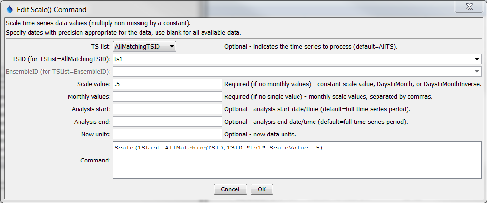

# TSTool / Command / Scale #

*   [Overview](#overview)
*   [Command Editor](#command-editor)
*   [Command Syntax](#command-syntax)
*   [Examples](#examples)
*   [Troubleshooting](#troubleshooting)
*   [See Also](#see-also)

-------------------------

## Overview ##

The `Scale` command scales each non-missing value in the specified time series.
The value to use for scaling can be specified as a constant,
monthly values, or special values that indicate to scale by the number of days in the month.

## Command Editor ##

The command is available in the following TSTool menu:

*   ***Commands / Manipulate Time Series***

The following dialog is used to edit the command and illustrates the syntax of the command.

**<p style="text-align: center;">

</p>**

**<p style="text-align: center;">
`Scale` Command Editor (<a href="../Scale.png">see also the full-size image</a>)
</p>**

## Command Syntax ##

The command syntax is as follows:

```text
Scale(Parameter="Value",...)
```
**<p style="text-align: center;">
Command Parameters
</p>**

|**Parameter**&nbsp;&nbsp;&nbsp;&nbsp;&nbsp;&nbsp;&nbsp;&nbsp;&nbsp;&nbsp;&nbsp;|**Description**|**Default**&nbsp;&nbsp;&nbsp;&nbsp;&nbsp;&nbsp;&nbsp;&nbsp;&nbsp;&nbsp;&nbsp;&nbsp;&nbsp;&nbsp;&nbsp;&nbsp;&nbsp;&nbsp;&nbsp;&nbsp;&nbsp;&nbsp;&nbsp;&nbsp;&nbsp;&nbsp;&nbsp;|
|--------------|-----------------|-----------------|
|`TSList`|Indicates the list of time series to be processed, one of:<br><ul><li>`AllMatchingTSID` – all time series that match the TSID (single TSID or TSID with wildcards) will be processed.</li><li>`AllTS` – all time series before the command.</li><li>`EnsembleID` – all time series in the ensemble will be processed (see the EnsembleID parameter).</li><li>`FirstMatchingTSID` – the first time series that matches the TSID (single TSID or TSID with wildcards) will be processed.</li><li>`LastMatchingTSID` – the last time series that matches the TSID (single TSID or TSID with wildcards) will be processed.</li><li>`SelectedTS` – the time series are those selected with the [`SelectTimeSeries`](../SelectTimeSeries/SelectTimeSeries.md) command.</li></ul> | `AllTS` |
|`TSID`|The time series identifier or alias for the time series to be processed, using the `*` wildcard character to match multiple time series.  Can be specified using `${Property}`.|Required if `TSList=*TSID`|
|`EnsembleID`|The ensemble to be processed, if processing an ensemble. Can be specified using `${Property}`.|Required if `TSList=*EnsembleID`|
|`ScaleValue`|One of the following:<ul><li>The numerical value to scale to the time series.</li><li>`DaysInMonth` to indicate a scale of the number of days in the month.</li><li>`DaysInMonthInverse` to indicate a scale of the inverse of the number of days in the month.|</li></ul><br>Can be specified with processor `${Property}`.|None – must be specified.|
|`MonthValues`|Monthly scale values, the fist being for January.  Can be specified using processor `${Property}`.	Use ScaleValue.|
|`AnalysisStart`|The date/time to start analyzing data.  Can be specified using processor `${Property}`.|Full period is analyzed.|
|`AnalysisEnd`|The date/time to end analyzing data.  Can be specified using processor `${Property}`.|Full period is analyzed.|
|`NewUnits`|New data units for the resulting time series.  Can be specified using processor `${Property}`.|Do not change the units.|

## Examples ##

See the [automated tests](https://github.com/OpenCDSS/cdss-app-tstool-test/tree/master/test/commands/Scale).

The following example scales a precipitation time series from the [State of Colorado’s HydroBase database](../../datastore-ref/CO-HydroBase/CO-HydroBase.md)
by a factor of `3.5`:

```text
# 1458 - CENTER 4 SSW
1458.NOAA.Precip.Month~HydroBase
Scale(TSList=AllMatchingTSID,TSID="1458.NOAA.Precip.Month",ScaleValue=3.5)
```

The following example scales a monthly streamflow time series with
units of ACFT (volume per month) in order to convert the data to average
CFS flow values (note that two scale commands are required because the
`DaysInMonthInverse` value cannot currently be combined with a numerical value in one command).
See also the [`ConvertDataUnits`](../ConvertDataUnits/ConvertDataUnits.md)
command for simple units conversions.

```
# 06754000 - SOUTH PLATTE RIVER NEAR KERSEY
06754000.DWR.Streamflow.Month~HydroBase
Scale(TSList=AllMatchingTSID,TSID="06754000.DWR.Streamflow.Month",ScaleValue=.5042)
Scale(TSList=AllMatchingTSID,TSID="06754000.DWR.Streamflow.Month",ScaleValue=DaysInMonthInverse,NewUnits="CFS")
06754000.DWR.Streamflow.Month~HydroBase
```
## Troubleshooting ##

## See Also ##

*   [`ConvertDataUnits`](../ConvertDataUnits/ConvertDataUnits.md) command
*   [`SelectTimeSeries`](../SelectTimeSeries/SelectTimeSeries.md) command
