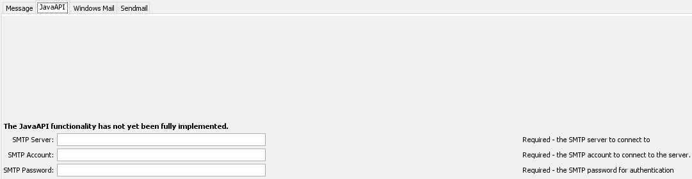

# TSTool / Command / SendEmailMessage #

* [Overview](#overview)
* [Command Editor](#command-editor)
* [Command Syntax](#command-syntax)
* [SMTP Passwords](#smtp-passwords)
* [Common SMTP Servers](#common-smtp-servers)
* [Examples](#examples)
* [Troubleshooting](#troubleshooting)
* [See Also](#see-also)

-------------------------

## Overview ##

**This command is under development. Do not use in production.**

The `SendEmailMessage` command sends an email message. There are three proposed methods for doing so:

  * The built-in JavaAPI - TSTool will utilize the Java Mail package to send a message.
  * Windows Mail - **Not yet implemented** - TSTool will separately use the Microsoft Windows Mail application
  to send a message.
  * Sendmail - **Not yet implemented** - TSTool will separately use the Sendmail internetwork routing facility
  to send a message.

There are currently four main tabs as a part of the `SendEmailMessage` command. The Message tab, where the main
email message is constructed. 

## Command Editor ##

The following dialog is used to edit the command and illustrates the syntax for the command.


<p style="text-align: center;">
<b>SendEmailMessage</b> Command Editor for Message Parameters (<a href="../SendEmailMessage.png">see also the full-size image</a>)
</p>



<p style="text-align: center;">
<b>SendEmailMessage</b> Command Editor for JavaAPI Parameters (<a href="../SendEmailMessageJavaAPI.png">see also the full-size image</a>)
</p>

## Command Syntax ##

The command syntax is as follows:

```text
SendEmailMessage(Parameter="Value",...)
```
<p style="text-align: center;">
<b>Message Command Parameters</b>
</p>

| **Parameter**&nbsp;&nbsp;&nbsp;&nbsp;&nbsp;&nbsp;&nbsp;&nbsp;&nbsp;&nbsp;&nbsp; | **Description** | **Default** |
|---------------|-----------------|-----------------|
| `Mail Program`<br>**required** | Method to be used for sending email:<br><ul><li>`JavaAPI` - Use the Java email package</li><li>`Sendmail` - Use the Sendmail email routing facility. **Not yet implemented**</li><li>`WindowsMail` - Use Windows Mail. **Not yet implemented**</li></ul> | `JavaAPI` |
|`From`<br>**required** | From email address, can be specified with `${Property}` | None - must be specified. |
| `To`<br>**required** | To email address, can be specified with `${Property}`. **Multiple To addresses will be supported in the future** | None - must be specified. |
| `CC` | One or more Carbon Copy recipients, separated by a comma. | None - must be specified. |
| `BCC` | One or more Blind Carbon Copy recipients, separated by a comma. | None - must be specified. |
| `Subject` | Email subject. | None - must be specified. |
| `Message` | Email message to send. | Required if `Message file` is not given. |
| `Message file` | Email message to send from a file. | Required if `Message` is not given. **Not yet implemented** |
| `Attachment file(s)` | File to be added to email message. **Multiple files will be supported in the future** | None - must be specified. |
| `If not found?` | Action if input file is not found. | `Warn` |

<hr>
<p style="text-align: center;">
<b>JavaAPI Command Parameters</b>
</p>

| **Parameter**&nbsp;&nbsp;&nbsp;&nbsp;&nbsp;&nbsp;&nbsp;&nbsp;&nbsp;&nbsp;&nbsp; | **Description** | **Default** |
| ----- | ----- | ----- |
| `SMTP Server`<br>**required** | The SMTP server to connect to. | None - must be specified. |
| `SMTP Account`<br>**required** | The SMTP account ID to connect to the server. **Not yet implemented** | None - must be specified. |
| `SMTP Password`<br>**required** | The SMTP account password for authentication. **NOTE:** See the [SMTP Passwords](#smtp-passwords) section for more information on how passwords are handled. | None - must be specified. |

## SMTP Passwords ##

Password security and protection is a high priority when using TSTool. Sending an email using an SMTP server requires
authentication in the form of a user account ID and password. For example, to send an email from a Gmail account, the
account's username and password is needed by TSTool to send. To help protect user credentials, as of now the
`SendEmailMessage` command will not do anything with a user-entered account ID. Instead, TSTool will use the internal
**.smtp.cfg** file, which can be signified to use by entering `smtp.cfg` in the `SMTPPassword` text area. SMTP Password
will take the actual password in future updates of the `SendEmailMessage` Command, but for now, this field **must** be
`smtp.cfg`. This file is similar to
the PostgreSQL
[.pgpass](https://www.postgresql.org/docs/current/libpq-pgpass.html) file, which will contain `<userName>:<userPassword>`
and will be located in the user's AppData file. Even though the file will store the username and password in plain text,
the security of both the AppData and the user's Windows account will be utilized. 

The script file **create-smtp-cfg.sh** in the scripts/ folder will create the file needed by the command. To run and create
the **.smtp.cfg**, open a terminal and change directories to the scripts/ folder and use the command `./create-smtp-cfg.sh
<username> <password>`. This will create the **.smtp.cfg** file and can now be used by TSTool. **NOTE:** Some passwords
contain special characters, which the terminal interprets as separately from the password, even if the password
is surrounded by quotes. See [Troubleshooting](#troubleshooting) for more help.

In TSTool, after message creation has taken place under the `Message` tab, an example using the JavaAPI and sending an
email through the Gmail SMTP server would look like this.


**NOTE:** Google has a feature called app-specific passwords. It is a 16-digit passcode that gives apps access to the
Google account, so that the main password won't need to be used. It can only be used with account that have 2-Step
Verification. Both the use of the app-specific password (and therefore 2-Step Verification) is highly recommended for
another layer of security. Visit the [Google Account Help](https://support.google.com/accounts/answer/185833?hl=en)
page for steps to create and use the passwords.

## Common SMTP Servers ##

The following are common and/or popular SMTP servers for outgoing messages.

| Provider | Server name |
| ----- | ----- |
| `Googlemail - Gmail` | `smtp.gmail.com` |
| `Outlook.com` | `smtp.live.com` |
| `Office365.com` | `smtp.office365.com` |
| `Yahoo Mail` | `smtp.mail.yahoo.com` |
| `AOL.com` | `smtp.aol.com` |
| `AT&T` | `smtp.att.yahoo.com` |
| `Hotmail` | `smtp.live.com` |
| `Comcast` | `smtp.comcast.net` |
| `Verizon` | `outgoing.verizon.net` |
| `Mail.com` | `smtp.mail.com` |

## Examples ##

See the [automated tests](https://github.com/OpenCDSS/cdss-app-tstool-test/tree/master/test/regression/commands/general/SendEmailMessage).

## Troubleshooting ##

### Escaped Characters ###

When running a script with special characters given as an argument, the shell will see them as special and will attempt
to execute each one apart from the password. Below is a list of characters that might need to be escaped. More characters
will be added as necessary if more are found in the future.

| Character | Unicode | Name |
| ----- | ----- | ----- |
| `	| U+0060 (Grave Accent)	| Backtick
| ~	| U+007E | Tilde
| !	| U+0021 | Exclamation mark
| #	| U+0023 Number sign | Hash
| $	| U+0024 | Dollar sign
| &	| U+0026 | Ampersand
| *	| U+002A | Asterisk
| (	| U+0028 | Left Parenthesis
| )	| U+0029 | Right Parenthesis
|   | U+0009 | Tab (⇥)
| {	| U+007B Left Curly Bracket | Left brace
| [	| U+005B | Left Square Bracket
| \|	| U+007C Vertical Line | Vertical bar
| \	| U+005C | Reverse Solidus | Backslash
| ;	| U+003B | Semicolon
| '	| U+0027 Apostrophe | Single quote
| "	| U+0022 Quotation Mark | Double quote
| ↩	| U+000A Line Feed | Newline
| <	| U+003C | Less than
| >	| U+003E | Greater than
| ?	| U+003F | Question mark
|   | U+0020 | Space
## See Also ##

* [`Message`](../Message/Message.md) command
