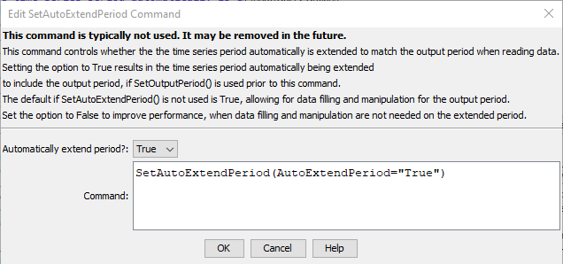

# TSTool / Command / SetAutoExtendPeriod #

* [Overview](#overview)
* [Command Editor](#command-editor)
* [Command Syntax](#command-syntax)
* [Examples](#examples)
* [Troubleshooting](#troubleshooting)
* [See Also](#see-also)

-------------------------

## Overview ##

By default, the time series period is extended to include the output period, if specified,
when a time series is read.
See also the [`SetOutputPeriod`](../SetOutputPeriod/SetOutputPeriod.md) command.
If the extended period subsequently contains missing data, it can be filled with other commands.
The `SetAutoExtendPeriod` command can be used to change this
setting if it is not desirable (e.g., for performance reasons).

## Command Editor ##

The following dialog is used to edit the command and illustrates the syntax of the command.



**<p style="text-align: center;">
`SetAutoExtendPeriod` Command Editor (<a href="../SetAutoExtendPeriod.png">see also the full-size image</a>)
</p>**

## Command Syntax ##

The command syntax is as follows:

```text
SetAutoExtendPeriod(Parameter="Value",...)
```
**<p style="text-align: center;">
Command Parameters
</p>**

|**Parameter**&nbsp;&nbsp;&nbsp;&nbsp;&nbsp;&nbsp;&nbsp;&nbsp;&nbsp;&nbsp;&nbsp;|**Description**|**Default**&nbsp;&nbsp;&nbsp;&nbsp;&nbsp;&nbsp;&nbsp;&nbsp;&nbsp;&nbsp;&nbsp;&nbsp;&nbsp;&nbsp;&nbsp;&nbsp;&nbsp;&nbsp;&nbsp;&nbsp;&nbsp;&nbsp;&nbsp;&nbsp;&nbsp;&nbsp;&nbsp;|
|--------------|-----------------|-----------------|
|`AutoExtendPeriod`|Indicate whether the period of time series should automatically be extended to the output period when time series are read, `True` or `False`.|None – must be specified.|The default is `True` if this command is not used.|

## Examples ##

See the [automated tests](https://github.com/OpenCDSS/cdss-app-tstool-test/tree/master/test/regression/commands/general/SetAutoExtendPeriod).

## Troubleshooting ##

## See Also ##

* [`SetOutputPeriod`](../SetOutputPeriod/SetOutputPeriod.md) command
