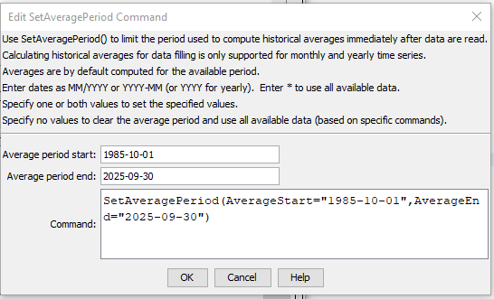

# Learn TSTool / Command / SetAveragePeriod #

* [Overview](#overview)
* [Command Editor](#command-editor)
* [Command Syntax](#command-syntax)
* [Examples](#examples)
* [Troubleshooting](#troubleshooting)
* [See Also](#see-also)

-------------------------

## Overview ##

The `SetAveragePeriod` command sets
the period that is used to compute historic averages used with the
[`FillHistMonthAverage`](../FillHistMonthAverage/FillHistMonthAverage) and
[`FillHistYearAverage`](../FillHistYearAverage/FillHistYearAverage) commands.
If the averaging period is not specified, the available period is used.
Use a `SetAveragePeriod` command if a subset of the data should be used to compute averages.

**Commands that are concerned with this issue also typically provide a parameter.
Setting a global default with this command can make it more difficult to understand processing.**

## Command Editor ##

The following dialog is used to edit the command and illustrates the syntax of the command.
<a href="../SetAveragePeriod.png">See also the full-size image.</a>



**<p style="text-align: center;">
`SetAveragePeriod` Command Editor
</p>**

## Command Syntax ##

The command syntax is as follows:

```text
SetAveragePeriod(Parameter="Value",...)
```
**<p style="text-align: center;">
Command Parameters
</p>**

|**Parameter**&nbsp;&nbsp;&nbsp;&nbsp;&nbsp;&nbsp;&nbsp;&nbsp;&nbsp;&nbsp;&nbsp;|**Description**|**Default**&nbsp;&nbsp;&nbsp;&nbsp;&nbsp;&nbsp;&nbsp;&nbsp;&nbsp;&nbsp;&nbsp;&nbsp;&nbsp;&nbsp;&nbsp;&nbsp;&nbsp;&nbsp;&nbsp;&nbsp;&nbsp;&nbsp;&nbsp;&nbsp;&nbsp;&nbsp;&nbsp;|
|--------------|-----------------|-----------------|
[`AverageStart`<br>**required**|The date for the start of the averaging period.  The precision of the date should agree with that of time series to be processed, and is limited to monthly and yearly precision.|None – must be specified.|
[`AverageEnd`<br>**required**|The date for the end of the averaging period.  The precision of the date should agree with that of time series to be processed, and is limited to monthly and yearly precision.|None – must be specified.|

## Examples ##

See the [automated tests](https://github.com/OpenWaterFoundation/cdss-app-tstool-test/tree/master/test/regression/commands/general/SetAveragePeriod).

## Troubleshooting ##

## See Also ##

* [`FillHistMonthAverage`](../FillHistMonthAverage/FillHistMonthAverage) command
* [`FillHistYearAverage`](../FillHistYearAverage/FillHistYearAverage) command
