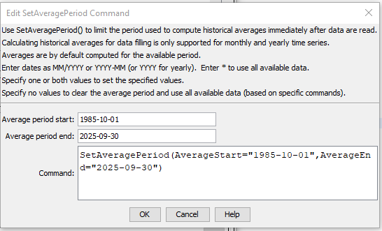

# TSTool / Command / SetAveragePeriod #

*   [Overview](#overview)
*   [Command Editor](#command-editor)
*   [Command Syntax](#command-syntax)
*   [Examples](#examples)
*   [Troubleshooting](#troubleshooting)
*   [See Also](#see-also)

-------------------------

## Overview ##

The `SetAveragePeriod` command sets
the period that is used to compute historic averages used with the
[`FillHistMonthAverage`](../FillHistMonthAverage/FillHistMonthAverage.md) and
[`FillHistYearAverage`](../FillHistYearAverage/FillHistYearAverage.md) commands.
If the averaging period is not specified, the available period is used.
Use a `SetAveragePeriod` command if a subset of the data should be used to compute averages.

**Commands that are concerned with this issue also typically provide parameter(s) to control.
Setting a global default with this command can make it more difficult to understand processing.**

*   If one or both parameters are provided, only the specified parameter is set
    (a single unspecified parameter does not cause the other property to be unset).
*   If the command is called with no parameters, both `AverageStart` and `AverageEnd` properties are set to null and defaults will be used for commands that follow.
*   Use a combination of commands to set/unset start and end, as needed.

## Command Editor ##

The command is available in the following TSTool menu:

*   ***Commands / Fill Time Series Missing Data***

The following dialog is used to edit the command and illustrates the syntax of the command.

**<p style="text-align: center;">

</p>**

**<p style="text-align: center;">
`SetAveragePeriod` Command Editor (<a href="../SetAveragePeriod.png">see full-size image</a>)
</p>**

## Command Syntax ##

The command syntax is as follows:

```text
SetAveragePeriod(Parameter="Value",...)
```
**<p style="text-align: center;">
Command Parameters
</p>**

|**Parameter**&nbsp;&nbsp;&nbsp;&nbsp;&nbsp;&nbsp;&nbsp;&nbsp;&nbsp;&nbsp;&nbsp;|**Description**|**Default**&nbsp;&nbsp;&nbsp;&nbsp;&nbsp;&nbsp;&nbsp;&nbsp;&nbsp;&nbsp;&nbsp;&nbsp;&nbsp;&nbsp;&nbsp;&nbsp;&nbsp;&nbsp;&nbsp;&nbsp;&nbsp;&nbsp;&nbsp;&nbsp;&nbsp;&nbsp;&nbsp;|
|--------------|-----------------|-----------------|
[`AverageStart`|The date for the start of the averaging period.  The precision of the date should agree with that of time series to be processed, and is limited to monthly and yearly precision.|None – must be specified.| If not specified:<ul><li>if `AverageEnd` is not specified, clear the `AverageStart` property</li><li>if `AverageEnd` is specified, only `AverageEnd` will be changed</li></ul> |
[`AverageEnd`|The date for the end of the averaging period.  The precision of the date should agree with that of time series to be processed, and is limited to monthly and yearly precision.|None – must be specified.|  If not specified:<ul><li>if `AverageStart` is not specified, clear the `AverageEnd` property</li><li>if `AverageStart` is specified, only `AverageStart` will be changed</li></ul> |

## Examples ##

See the [automated tests](https://github.com/OpenCDSS/cdss-app-tstool-test/tree/master/test/commands/SetAveragePeriod).

## Troubleshooting ##

See the main [TSTool Troubleshooting](../../troubleshooting/troubleshooting.md) documentation.

## See Also ##

*   [`FillHistMonthAverage`](../FillHistMonthAverage/FillHistMonthAverage.md) command
*   [`FillHistYearAverage`](../FillHistYearAverage/FillHistYearAverage.md) command
