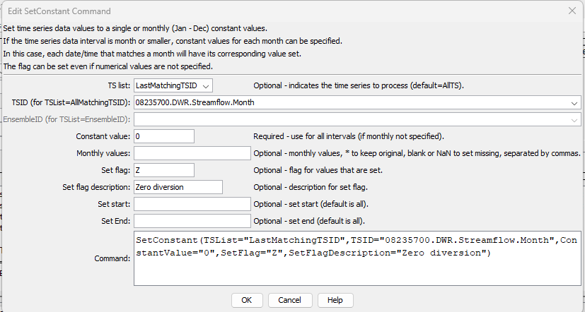

# TSTool / Command / SetConstant #

*   [Overview](#overview)
*   [Command Editor](#command-editor)
*   [Command Syntax](#command-syntax)
*   [Examples](#examples)
*   [Troubleshooting](#troubleshooting)
*   [See Also](#see-also)

-------------------------

## Overview ##

The `SetConstant` command sets the values of a time series to a single or monthly constant values.

## Command Editor ##

The command is available in the following TSTool menu:

*   ***Commands / Set Time Series Contents***

The following dialog is used to edit the command and illustrates the syntax of the command.

**<p style="text-align: center;">

</p>**

**<p style="text-align: center;">
`SetConstant` Command Editor (<a href="../SetConstant.png">see also the full-size image</a>)
</p>**

## Command Syntax ##

The command syntax is as follows:

```text
SetConstant(Parameter="Value",...)
```
**<p style="text-align: center;">
Command Parameters
</p>**

|**Parameter**&nbsp;&nbsp;&nbsp;&nbsp;&nbsp;&nbsp;&nbsp;&nbsp;&nbsp;&nbsp;&nbsp;|**Description**|**Default**&nbsp;&nbsp;&nbsp;&nbsp;&nbsp;&nbsp;&nbsp;&nbsp;&nbsp;&nbsp;&nbsp;&nbsp;&nbsp;&nbsp;&nbsp;&nbsp;&nbsp;&nbsp;&nbsp;&nbsp;&nbsp;&nbsp;&nbsp;&nbsp;&nbsp;&nbsp;&nbsp;|
|--------------|-----------------|-----------------|
|`TSList`|Indicates the list of time series to be processed, one of:<br><ul><li>`AllMatchingTSID` – all time series that match the TSID (single TSID or TSID with wildcards) will be processed.</li><li>`AllTS` – all time series before the command.</li><li>`EnsembleID` – all time series in the ensemble will be processed (see the EnsembleID parameter).</li><li>`FirstMatchingTSID` – the first time series that matches the TSID (single TSID or TSID with wildcards) will be processed.</li><li>`LastMatchingTSID` – the last time series that matches the TSID (single TSID or TSID with wildcards) will be processed.</li><li>`SelectedTS` – the time series are those selected with the [`SelectTimeSeries`](../SelectTimeSeries/SelectTimeSeries.md) command.</li></ul> | `AllTS` |
|`TSID`|The time series identifier or alias for the time series to be processed, using the `*` wildcard character to match multiple time series.  Can be specified using `${Property}`.|Required if `TSList=*TSID`|
|`EnsembleID`|The ensemble to be processed, if processing an ensemble. Can be specified using `${Property}`.|Required if `TSList=*EnsembleID`|
|`ConstantValue`|The constant value to use as the data value.|None – must be specified, or specify monthly values.|
|`MonthValues`|Monthly values to use as the data values.  Twelve values for January – December must be specified, separated by commas.  `*` indicates to keep the original value.  Blank or `NaN` indicates to set the value to missing.  If the time series data interval is less than monthly, each date/time will be set for a specific month.|None – must be specified, or specify a constant value.|
|`SetStart`|The starting date/time for the data set.  Can set using processor `${Property}`.|Set data for the full period.|
|`SetEnd`|The ending date/time for the data set.  Can set using processor `${Property}`.|Set data for the full period.|

## Examples ##

See the [automated tests](https://github.com/OpenCDSS/cdss-app-tstool-test/tree/master/test/commands/SetConstant).

A sample command file to process a time series from the [State of Colorado’s HydroBase database](../../datastore-ref/CO-HydroBase/CO-HydroBase.md)
is as follows (only the early period is set to zero):

```text
# 08235700 - ALAMOSA RIVER BELOW CASTLEMAN GULCH NEAR JASPER
08235700.DWR.Streamflow.Month~HydroBase
SetConstant(TSList=AllMatchingTSID,TSID="08235700.DWR.Streamflow.Month",ConstantValue=0,SetEnd="1950-01")
```

## Troubleshooting ##

## See Also ##

* [`AddConstant`](../AddConstant/AddConstant.md) command
* [`FillConstant`](../FillConstant/FillConstant.md) command
* [`SelectTimeSeries`](../SelectTimeSeries/SelectTimeSeries.md) command
