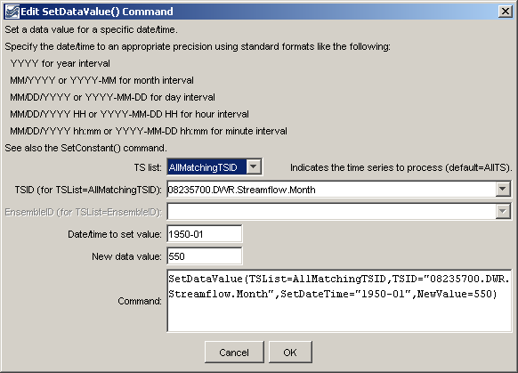

# Learn TSTool / Command / SetDataValue #

* [Overview](#overview)
* [Command Editor](#command-editor)
* [Command Syntax](#command-syntax)
* [Examples](#examples)
* [Troubleshooting](#troubleshooting)
* [See Also](#see-also)

-------------------------

## Overview ##

The `SetDataValue` command sets a single data value in a time series.
Consequently, it can be used to condition a value for subsequent filling (e.g., with
[`FillRepeat`](../FillRepeat/FillRepeat)) or to "hard-code" data that may not be available in files or databases.
It is good practice to insert comments when editing data to explain the edits.
See also the [`SetConstant`](../SetConstant/SetConstant) command.

## Command Editor ##

The following dialog is used to edit the command and illustrates the syntax of the command.
<a href="../SetDataValue.png">See also the full-size image.</a>



**<p style="text-align: center;">
`SetDataValue` Command Editor
</p>**

## Command Syntax ##

The command syntax is as follows:

```text
SetDataValue(Parameter="Value",...)
```
**<p style="text-align: center;">
Command Parameters
</p>**

|**Parameter**&nbsp;&nbsp;&nbsp;&nbsp;&nbsp;&nbsp;&nbsp;&nbsp;&nbsp;&nbsp;&nbsp;|**Description**|**Default**&nbsp;&nbsp;&nbsp;&nbsp;&nbsp;&nbsp;&nbsp;&nbsp;&nbsp;&nbsp;&nbsp;&nbsp;&nbsp;&nbsp;&nbsp;&nbsp;&nbsp;&nbsp;&nbsp;&nbsp;&nbsp;&nbsp;&nbsp;&nbsp;&nbsp;&nbsp;&nbsp;|
|--------------|-----------------|-----------------|
|`TSList`|Indicates the list of time series to be processed, one of:<br><ul><li>`AllMatchingTSID` – all time series that match the TSID (single TSID or TSID with wildcards) will be processed.</li><li>`AllTS` – all time series before the command.</li><li>`EnsembleID` – all time series in the ensemble will be processed (see the EnsembleID parameter).</li><li>`FirstMatchingTSID` – the first time series that matches the TSID (single TSID or TSID with wildcards) will be processed.</li><li>`LastMatchingTSID` – the last time series that matches the TSID (single TSID or TSID with wildcards) will be processed.</li><li>`SelectedTS` – the time series are those selected with the [`SelectTimeSeries`](../SelectTimeSeries/SelectTimeSeries) command.</li></ul> | `AllTS` |
|`TSID`|The time series identifier or alias for the time series to be processed, using the `*` wildcard character to match multiple time series.  Can be specified using `${Property}`.|Required if `TSList=*TSID`|
|`EnsembleID`|The ensemble to be processed, if processing an ensemble. Can be specified using `${Property}`.|Required if `TSList=*EnsembleID`|
|`SetDateTime`<br>**required**|The date/time at which the data value should be set.  Specify the date/time precision according to the time series that is being manipulated.|None – must be specified.|
|`NewValue`<br>**required**|The new data value.|None – must be specified.|

## Examples ##

See the [automated tests](https://github.com/OpenWaterFoundation/cdss-app-tstool-test/tree/master/test/regression/commands/general/SetDataValue).

A sample command file to process data from the [State of Colorado’s HydroBase database](../../datastore-ref/CO-HydroBase/CO-HydroBase)
is as follows:

```text
# 08235700 - ALAMOSA RIVER BELOW CASTLEMAN GULCH NEAR JASPER
08235700.DWR.Streamflow.Month~HydroBase
SetDataValue(TSList=AllMatchingTSID,TSID=”08235700.DWR.Streamflow.Month”,SetDateTime=”1950-01”,NewValue=550)
```

## Troubleshooting ##

## See Also ##

* [`FillRepeat`](../FillRepeat/FillRepeat) command
* [`SelectTimeSeries`](../SelectTimeSeries/SelectTimeSeries) command
* [`SetConstant`](../SetConstant/SetConstant) command
