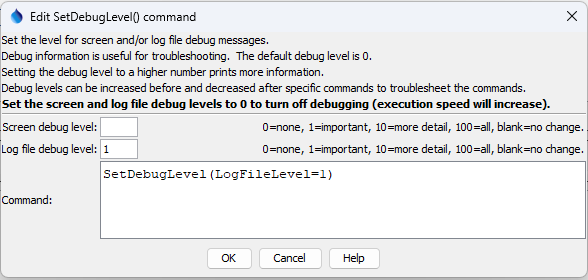

# TSTool / Command / SetDebugLevel #

* [Overview](#overview)
* [Command Editor](#command-editor)
* [Command Syntax](#command-syntax)
* [Examples](#examples)
* [Troubleshooting](#troubleshooting)
* [See Also](#see-also)

-------------------------

## Overview ##

The `SetDebugLevel` command sets the debug levels for screen and log file diagnostic messages.
This command can be used multiple times with different debug level (e.g., to isolate a problem).
Currently the debug level applies to all components.
In the future logging control may be grouped by component.
Levels are not completely consistent but the following guidelines can be followed:

* `0` = no messages
* `1` = important messages generated in applications
* `2` = important messages generated in commands
* `3+` = messages generated in commands that may explain other problems
* `10+` = messages in processing code that may still be useful to end users
* `30+` = low-level messages, for example generated while reading from files or databases

## Command Editor ##

The following dialog is used to edit the command and illustrates the command syntax.
<a href="../SetDebugLevel.png">See also the full-size image.</a>



**<p style="text-align: center;">
`SetDebugLevel` Command Editor Showing Conditions Test
</p>**

## Command Syntax ##

The command syntax is as follows:

```text
SetDebugLevel(Parameter="Value",...)
```
**<p style="text-align: center;">
Command Parameters
</p>**

| **Parameter**&nbsp;&nbsp;&nbsp;&nbsp;&nbsp;&nbsp;&nbsp;&nbsp;&nbsp;&nbsp;&nbsp;&nbsp;&nbsp;&nbsp;&nbsp;&nbsp;&nbsp;&nbsp;&nbsp;&nbsp;&nbsp;&nbsp;&nbsp;&nbsp;&nbsp;&nbsp; | **Description** | **Default**&nbsp;&nbsp;&nbsp;&nbsp;&nbsp;&nbsp;&nbsp;&nbsp;&nbsp;&nbsp; |
| --------------|-----------------|----------------- |
|`ScreenLevel`|The debug level for the screen (0+).|Keep previous setting.|
|`LogFileLevel`|The debug level for the log file (0+).|Keep previous setting.|

## Examples ##

See the [automated tests](https://github.com/OpenWaterFoundation/cdss-app-tstool-test/tree/master/test/regression/commands/general/SetDebugLevel).

## Troubleshooting ##

## See Also ##

* [`SetWarningLevel`](../SetWarningLevel/SetWarningLevel) command
* [`StartLog`](../StartLog/StartLog) command
