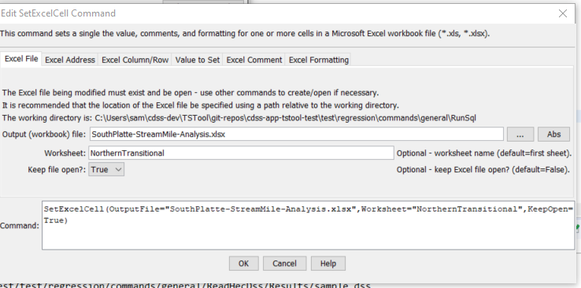
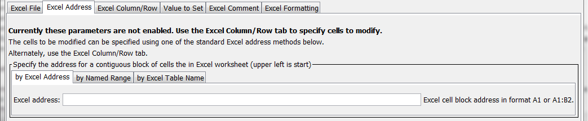
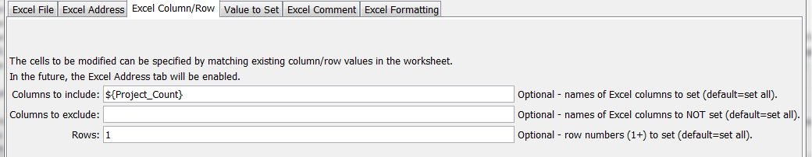
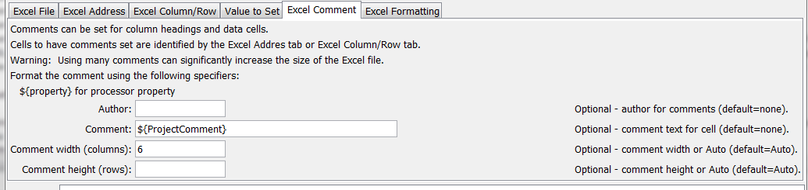
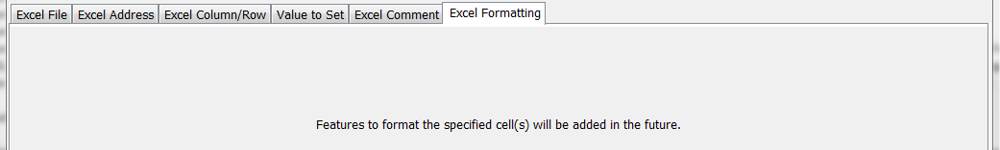

# TSTool / Command / SetExcelCell #

* [Overview](#overview)
* [Command Editor](#command-editor)
* [Command Syntax](#command-syntax)
* [Examples](#examples)
* [Troubleshooting](#troubleshooting)
* [See Also](#see-also)

-------------------------

## Overview ##

**This command is under development and has limited functionality.
It has initially been implemented to set cell comments.
Features to set data values and format cells will be added in the future.**

The `SetExcelCell` command sets a data value, comments,
and formatting for one or more cells in a Microsoft Excel workbook.
The workbook exist and be open from previous commands.
Unlike other commands that process a list of time series or a table,
this command is intended for finer resolution control of modifying an Excel workbook.

## Command Editor ##

The following dialog is used to edit the command and illustrates the syntax of the command for Excel file parameters.



**<p style="text-align: center;">
`SetExcelCell` Command Editor for Excel File Parameters (<a href="../SetExcelCell_File.png">see also the full-size image</a>)
</p>**

The following dialog is used to edit the command and illustrates the syntax of the command for Excel address parameters.



**<p style="text-align: center;">
`SetExcelCell` Command Editor for Excel Address Parameters (<a href="../SetExcelCell_Address.png">see also the full-size image</a>)
</p>**

The following dialog is used to edit the command and illustrates the syntax of the command for Excel address parameters.



**<p style="text-align: center;">
`SetExcelCell` Command Editor for Excel Column/Row Parameters (<a href="../SetExcelCell_ColumnRow.png">see also the full-size image</a>)
</p>**

The following dialog is used to edit the command and illustrates the syntax of the command for Excel data values parameters.


**<p style="text-align: center;">
`SetExcelCell` Command Editor for Excel Data Value Parameters (<a href="../SetExcelCell_Value.png">see also the full-size image</a>)
</p>**

The following dialog is used to edit the command and illustrates the syntax of the command for Excel comment parameters.



**<p style="text-align: center;">
`SetExcelCell` Command Editor for Excel Comment Parameters (<a href="../SetExcelCell_Comment.png">see also the full-size image</a>)
</p>**

The following dialog is used to edit the command and illustrates the syntax of the command for Excel formatting parameters.



**<p style="text-align: center;">
`SetExcelCell` Command Editor for Excel Formatting Parameters (<a href="../SetExcelCell_Formatting.png">see also the full-size image</a>)
</p>**

## Command Syntax ##

The command syntax is as follows:

```text
SetExcelCell(Parameter="Value",...)
```
**<p style="text-align: center;">
Command Parameters
</p>**

|**Parameter**&nbsp;&nbsp;&nbsp;&nbsp;&nbsp;&nbsp;&nbsp;&nbsp;&nbsp;&nbsp;&nbsp;&nbsp;&nbsp;&nbsp;&nbsp;&nbsp;|**Description**|**Default**&nbsp;&nbsp;&nbsp;&nbsp;&nbsp;&nbsp;&nbsp;&nbsp;&nbsp;&nbsp;&nbsp;&nbsp;&nbsp;&nbsp;&nbsp;&nbsp;&nbsp;&nbsp;&nbsp;&nbsp;&nbsp;&nbsp;&nbsp;&nbsp;&nbsp;&nbsp;&nbsp;|
|--------------|-----------------|-----------------|
|`OutputFile`<br>**required**|The name of the Excel workbook file (`*.xls` or `*.xlsx`) to modify, as an absolute path or relative to the command file location.  The workbook must exist and be open from a previous command.|None – must be specified.|
|`Worksheet`|The name of the worksheet in the workbook to modify.|Write to the first worksheet.|
|`KeepOpen`|Indicate whether to keep the Excel file open (`True`) or close after creating (`False`).  Keeping the file open will increase performance because later commands will not need to reread the workbook.  Make sure to close the file in the last Excel command.|`False`|
|`ExcelAddress`|Indicates the block of cells to write, using Excel address notation (e.g., `A1:D10`).|Must specify address using one of available address parameters.|
|`ExcelNamedRange`|Indicates the block of cells to write, using an Excel named range.|Must specify address using one of available address parameters.|
|`ExcelTableName`|Indicates the block of cells to write, using an Excel named range.|Must specify address using one of available address parameters.|
|`IncludeColumns`|Names of columns to include when matching cells, separated by commas.  Processor `${Property}` can be used to specify the parameter.|Include all cells unless subset is somehow specified.|
|`ExcludeColumns`|Names of columns to exclude when matching cells, separated by commas.  Processor `${Property}` can be used to specify the parameter.|Include all cells unless subset is somehow specified.|
|`Rows`|Row numbers to include, separated by commas.|Include all cells unless subset is somehow specified.|
|`Value`|Data value to set.|
|`PropertyName`|Name of processor property that provides the data value.||
|`Author`|Author to use when setting comment.||
|`Comment`|Comment to set.  Processor `${Property}` can be used to specify the parameter.  Newline characters in the comment indicate line breaks.||
|`CommentWidth`|The width of the comment block in columns.|`6`|
|`CommentRows`|The height of the comment block in rows.|Number of lines in the comment.|

## Examples ##

See the [automated tests](https://github.com/OpenCDSS/cdss-app-tstool-test/tree/master/test/regression/commands/general/SetExcelCell).

## Troubleshooting ##

## See Also ##

* [`NewExcelWorkbook`](../NewExcelWorkbook/NewExcelWorkbook.md) command
