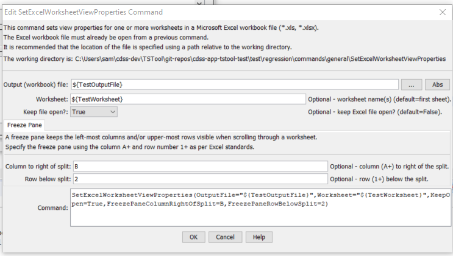

# TSTool / Command / SetExcelWorksheetViewProperties #

* [Overview](#overview)
* [Command Editor](#command-editor)
* [Command Syntax](#command-syntax)
* [Examples](#examples)
* [Troubleshooting](#troubleshooting)
* [See Also](#see-also)

-------------------------

## Overview ##

The `SetExcelWorksheetViewProperties` command sets view properties associated with an Excel worksheet,
for example to facilitate automated creation of Excel workbooks.
Additional properties will be added in the future.
Currently the command can set the following properties:

* Freeze pane for rows and columns

TSTool uses the [Apache POI software](http://poi.apache.org) to read/write the Excel file
and consequently functionality is constrained by the features of that software package.

## Command Editor ##

The following dialog is used to edit the command and illustrates the syntax of the command.



**<p style="text-align: center;">
`SetExcelWorksheetViewProperties` Command Editor (<a href="../SetExcelWorksheetViewProperties.png">see also the full-size image</a>)
</p>**

## Command Syntax ##

The command syntax is as follows:

```text
SetExcelWorksheetViewProperties(Parameter="Value",...)
```
**<p style="text-align: center;">
Command Parameters
</p>**

|**Parameter**&nbsp;&nbsp;&nbsp;&nbsp;&nbsp;&nbsp;&nbsp;&nbsp;&nbsp;&nbsp;&nbsp;&nbsp;&nbsp;&nbsp;&nbsp;&nbsp;&nbsp;&nbsp;&nbsp;&nbsp;&nbsp;&nbsp;&nbsp;&nbsp;&nbsp;&nbsp;&nbsp;&nbsp;&nbsp;&nbsp;&nbsp;&nbsp;&nbsp;&nbsp;&nbsp;&nbsp;&nbsp;&nbsp;&nbsp;&nbsp;&nbsp;&nbsp;&nbsp;|**Description**|**Default**&nbsp;&nbsp;&nbsp;&nbsp;&nbsp;&nbsp;&nbsp;&nbsp;&nbsp;&nbsp;&nbsp;&nbsp;&nbsp;&nbsp;&nbsp;&nbsp;&nbsp;&nbsp;&nbsp;&nbsp;&nbsp;&nbsp;&nbsp;&nbsp;&nbsp;&nbsp;&nbsp;|
|--------------|-----------------|-----------------|
|`OutputFile`<br>**required**|The name of the Excel workbook file (`*.xls` or `*.xlsx`) to write, as an absolute path or relative to the command file location.  The Excel file must have been opened with a previous command.  Can be specified with `${Property}`.|None – must be specified.|
|`Worksheet`|The name of the worksheet in the workbook to set view properties.  Can be specified with `${Property}`.  Multiple worksheets can be specified by separating the names with commas.  Worksheet names can be specified with `*` wildcard to match multiple worksheets.|If not specified, set properties for the first worksheet.|
|`KeepOpen`|Indicate whether to keep the Excel file open (`True`) or close after creating (`False`).  Keeping the file open will increase performance because later commands will not need to reread the workbook.|`False`|
|`FreezePaneColumnRightOfSplit`|The column to the right of the freeze pane split, using notation B, etc. (specifying A will have no effect).|Columns will not be frozen.|
|`FreezePaneRowBelowSplit`|The row below the freeze pane split, specified as row number `2`+ (specifying `1` will have no effect).|Rows will not be frozen.|

## Examples ##

See the [automated tests](https://github.com/OpenCDSS/cdss-app-tstool-test/tree/master/test/regression/commands/general/SetExcelWorksheetViewProperties).

## Troubleshooting ##

## See Also ##

* [`NewExcelWorkbook`](../NewExcelWorkbook/NewExcelWorkbook.md) command
* [`ReadExcelWorkbook`](../ReadExcelWorkbook/ReadExcelWorkbook.md) command
