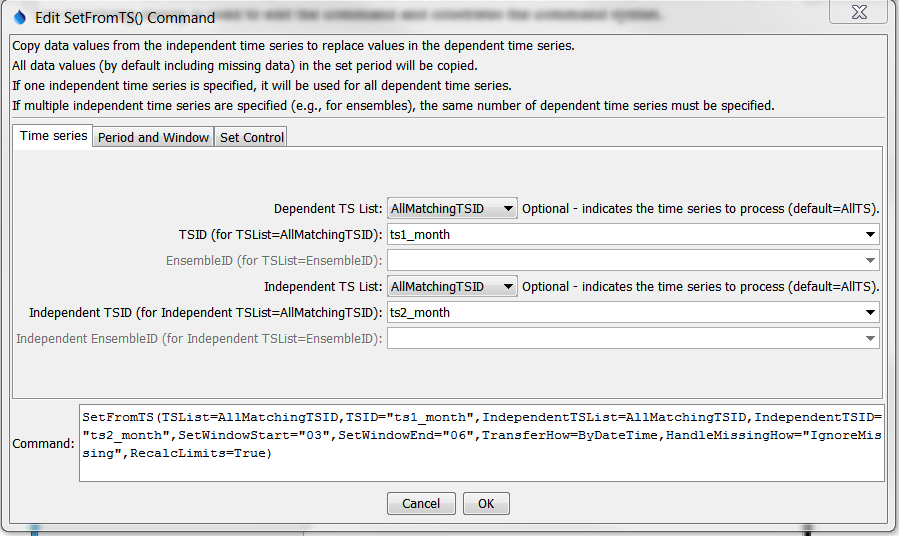
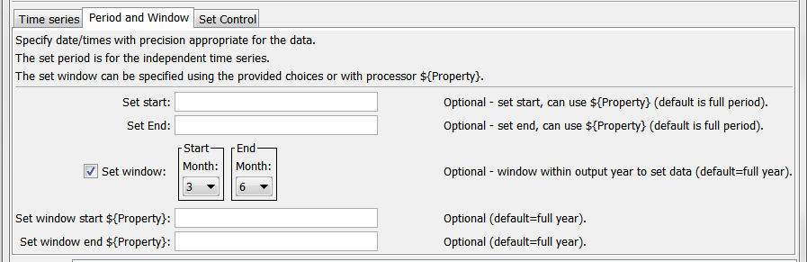
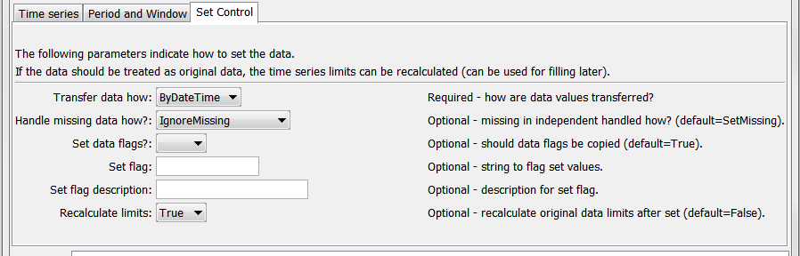

# Learn TSTool / Command / SetFromTS #

* [Overview](#overview)
* [Command Editor](#command-editor)
* [Command Syntax](#command-syntax)
* [Examples](#examples)
* [Troubleshooting](#troubleshooting)
* [See Also](#see-also)

-------------------------

## Overview ##

The `SetFromTS` command sets data in a dependent time series by transferring values
from an independent time series.
A period and window within the year can be specified to limit the period that is processed.
See also the [`FillFromTS`](../FillFromTS/FillFromTS) command,
which will transfer values only when the dependent time series has missing data.
Only data values are transferred – time series properties will not be modified.
If multiple time series or an ensemble is being processed,
the number of independent time series must be one or the same number as the time series being filled.
	
It is also possible to use this command to transfer data between time series that have different intervals.
If the independent time series has a smaller interval,
then `SetWindowStart` and `SetWindowEnd` parameters should be used to specify a window to
transfer – the first value in the window will be transferred.
For example, when transferring all the January values from a monthly
time series to a year-interval dependent time series,
specify the window start and end as `01`.
If the transfer is from longer interval to smaller,
then the values from the independent time series will be used multiple times
for the dependent time series (e.g., annual value used for each month).

## Command Editor ##

The following dialog is used to edit the command and illustrates the syntax of the command.
<a href="../SetFromTS.png">See also the full-size image.</a>



**<p style="text-align: center;">
`SetFromTS` Command Editor
</p>**

The following dialog is used to edit the command and illustrates the syntax of the
command for analysis window and period parameters.
<a href="../SetFromTS_Period.png">See also the full-size image.</a>



**<p style="text-align: center;">
`SetFromTS` Command Editor for Period and Window Parameters
</p>**

The following dialog is used to edit the command and illustrates the syntax of the command for control parameters.
<a href="../SetFromTS_Control.png">See also the full-size image.</a>



**<p style="text-align: center;">
`SetFromTS` Command Editor for Set Control Parameters
</p>**

## Command Syntax ##

The command syntax is as follows:

```text
SetFromTS(Parameter="Value",...)
```
**<p style="text-align: center;">
Command Parameters
</p>**

|**Parameter**&nbsp;&nbsp;&nbsp;&nbsp;&nbsp;&nbsp;&nbsp;&nbsp;&nbsp;&nbsp;&nbsp;&nbsp;&nbsp;&nbsp;&nbsp;&nbsp;&nbsp;&nbsp;&nbsp;&nbsp;&nbsp;&nbsp;&nbsp;&nbsp;&nbsp;&nbsp;&nbsp;|**Description**|**Default**&nbsp;&nbsp;&nbsp;&nbsp;&nbsp;&nbsp;&nbsp;&nbsp;&nbsp;&nbsp;&nbsp;&nbsp;&nbsp;&nbsp;&nbsp;&nbsp;&nbsp;&nbsp;&nbsp;&nbsp;&nbsp;&nbsp;&nbsp;&nbsp;&nbsp;&nbsp;&nbsp;&nbsp;&nbsp;&nbsp;&nbsp;&nbsp;&nbsp;&nbsp;&nbsp;|
|--------------|-----------------|-----------------|
|`TSList`|Indicates the list of time series to be processed, one of:<br><ul><li>`AllMatchingTSID` – all time series that match the TSID (single TSID or TSID with wildcards) will be processed.</li><li>`AllTS` – all time series before the command.</li><li>`EnsembleID` – all time series in the ensemble will be processed (see the EnsembleID parameter).</li><li>`FirstMatchingTSID` – the first time series that matches the TSID (single TSID or TSID with wildcards) will be processed.</li><li>`LastMatchingTSID` – the last time series that matches the TSID (single TSID or TSID with wildcards) will be processed.</li><li>`SelectedTS` – the time series are those selected with the [`SelectTimeSeries`](../SelectTimeSeries/SelectTimeSeries) command.</li></ul> | `AllTS` |
|`TSID`|The time series identifier or alias for the time series to be processed, using the `*` wildcard character to match multiple time series.  Can be specified using `${Property}`.|Required if `TSList=*TSID`|
|`EnsembleID`|The ensemble to be processed, if processing an ensemble. Can be specified using `${Property}`.|Required if `TSList=*EnsembleID`|
|`IndependentTSList`|Indicates how to determine the list of independent time series (see the explanation of `TSList`).|`AllTS`|
|`IndependentTSID`|The time series identifier or alias for the independent time series (see the explanation of `TSID`).  Can be specified with processor `${Property}`.|Required when a `IndependentTSList=*TSID`|
|`IndependentEnsembleID`|The ensemble identifier for the independent time series (see the explanation of `EnsembleID`).  Can be specified with processor `${Property}`.|Required when `IndependentTSList=EnsembleID`|
|`SetStart`|The date/time to start setting data.  Can be specified with processor `${Property}`.|Full period.|
|`SetEnd`|The date/time to end setting data.  Can be specified with processor `${Property}`.|Full period.|
|`SetWindowStart`|The date/time (without year) indicating the start of the window within a year to set values in the output (dependent) time series.  For example:<ul><li>`mm` – for monthly time series</li><li>`mm-dd` – for daily time series</li><li>`mm-dd-hh` – for hourly data</li><ul><br>If specified using processor `${Property}`, the processor property will override date/time selections.|Full year.|
|`SetWindowEnd`|The date/time (without year) indicating the end of the window within a year to set values in the output (dependent) time series.  If specified using processor `${Property}`, the processor property will override date/time selections.|Full year.|
|`TransferHow`|Indicates how to transfer data:<ul><li>`ByDateTime` – a date/time in one time series will be lined up with the other time series.</li><li> `Sequentially` – data from the independent will be transferred sequentially, even if the date/time does not align (used when transferring continuous data over Feb 28/29, without gaps).|None – must be specified.|
|`HandleMissingHow`|Indicates how to handle missing data in the independent time series:<ul><li>`IgnoreMissing` – missing values in the independent time series WILL NOT be transferred to the dependent time series.</li><li>`SetMissing` – missing values in the independent time series WILL be transferred to the dependent time series.</li><li>`SetOnlyMissingValues` – only the missing values in the independent time series will be transferred, useful when a separate time series has been used to insert additional missing values.|`SetMissing`|
|`SetDataFlags`|Indicates if data flags should also be transferred from the independent time series to the dependent time series.|`True`|
|`SetFlag`|String that should be used for the data flag for values that are set (overrides `SetDataFlags`).|No flag is set.|
|`SetFlagDesc`|Description that should used for the `SetFlag` value.|Auto-generated.|
|`RecalcLimits`|Available only for monthly time series.  Indicate whether the original data limits for the time series should be recalculated after the setting the time series values.  Setting to `True` is appropriate if the independent time series provides observations consistent with the original data.|`False` (only the values in the initial time series will be used for historical data).|

## Examples ##

See the [automated tests](https://github.com/OpenWaterFoundation/cdss-app-tstool-test/tree/master/test/regression/commands/general/SetFromTS).

A sample command file to process data from the [State of Colorado’s HydroBase database](../../datastore-ref/CO-HydroBase/CO-HydroBase) is as follows:

```text
# 08241000 - TRINCHERA CREEK ABOVE MOUNTAIN HOME RESERVOIR
08241000.DWR.Streamflow.Month~HydroBase
# 08240500 - TRINCHERA CREEK ABOVE TURNER'S RANCH
08240500.DWR.Streamflow.Month~HydroBase
SetFromTS(TSList=AllMatchingTSID,TSID="08241000.DWR.Streamflow.Month",IndependentTSList=AllMatchingTSID,IndependentTSID="08240500.DWR.Streamflow.Month",TransferHow=ByDateTime)
```

## Troubleshooting ##

## See Also ##

* [`SelectTimeSeries`](../SelectTimeSeries/SelectTimeSeries) command
* [`FillFromTS`](../FillFromTS/FillFromTS) command
