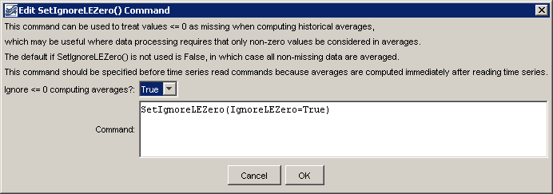

# Learn TSTool / Command / SetIgnoreLEZero #

* [Overview](#overview)
* [Command Editor](#command-editor)
* [Command Syntax](#command-syntax)
* [Examples](#examples)
* [Troubleshooting](#troubleshooting)
* [See Also](#see-also)

-------------------------

## Overview ##

The `SetIgnoreLEZero` command sets the global property that indicates whether
the computation of historical averages for time series
should ignore values less than or equal to zero.
By default, all values (other than the missing data placeholder) are used to compute averages.
This command is useful when it is appropriate to ignore zero and negative values in averages,
for example in cases where zero is assigned as an observation but may influence averages inappropriately.

**Commands that are concerned with this issue also typically provide a parameter.
Setting a global default with this command can make it more difficult to understand processing.**

## Command Editor ##

The following dialog is used to edit the command and illustrates the syntax of the command.
<a href="../SetIgnoreLEZero.png">See also the full-size image.</a>



**<p style="text-align: center;">
`SetIgnoreLEZero` Command Editor
</p>**

## Command Syntax ##

The command syntax is as follows:

```text
SetIgnoreLEZero(Parameter="Value",...)
```
**<p style="text-align: center;">
Command Parameters
</p>**

|**Parameter**&nbsp;&nbsp;&nbsp;&nbsp;&nbsp;&nbsp;&nbsp;&nbsp;&nbsp;&nbsp;&nbsp;|**Description**|**Default**&nbsp;&nbsp;&nbsp;&nbsp;&nbsp;&nbsp;&nbsp;&nbsp;&nbsp;&nbsp;&nbsp;&nbsp;&nbsp;&nbsp;&nbsp;&nbsp;&nbsp;&nbsp;&nbsp;&nbsp;&nbsp;&nbsp;&nbsp;&nbsp;&nbsp;&nbsp;&nbsp;|
|--------------|-----------------|-----------------|
|`IgnoreLEZero`|Indicates whether the computation of historical averages should ignore values less than or equal to zero, `True` or `False`.|If this command is not used, the default is `False`.|

## Examples ##

See the [automated tests](https://github.com/OpenWaterFoundation/cdss-app-tstool-test/tree/master/test/regression/commands/general/SetIgnoreLEZero).

## Troubleshooting ##

## See Also ##

* [`FillHistMonthAverage`](../FillHistMonthAverage/FillHistMonthAverage) command
