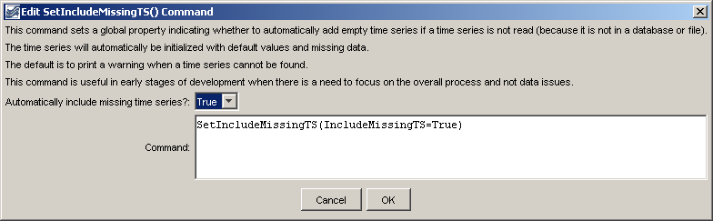

# Learn TSTool / Command / SetIncludeMissingTS #

* [Overview](#overview)
* [Command Editor](#command-editor)
* [Command Syntax](#command-syntax)
* [Examples](#examples)
* [Troubleshooting](#troubleshooting)
* [See Also](#see-also)

-------------------------

## Overview ##

The `SetIncludeMissingTS` command sets the global property that indicates
whether time series that cannot be found should automatically be
added as a time series with missing data.
By default, time series that cannot be found generate a warning.
This command is useful when processing large amounts of data,
to guarantee a placeholder time series even if time series are not found.
For example, use the command in the early stages of work to evaluate
command sequence logic without addressing every data issue,
and then remove the command when focusing on data.

## Command Editor ##

The following dialog is used to edit the command and illustrates the syntax of the command.
<a href="../SetIncludeMissingTS.png">See also the full-size image.</a>



**<p style="text-align: center;">
`SetIncludeMissingTS` Command Editor
</p>**

## Command Syntax ##

The command syntax is as follows:

```text
SetIncludeMissingTS(Parameter="Value",...)
```
**<p style="text-align: center;">
Command Parameters
</p>**

|**Parameter**&nbsp;&nbsp;&nbsp;&nbsp;&nbsp;&nbsp;&nbsp;&nbsp;&nbsp;&nbsp;&nbsp;&nbsp;&nbsp;&nbsp;&nbsp;&nbsp;&nbsp;|**Description**|**Default**&nbsp;&nbsp;&nbsp;&nbsp;&nbsp;&nbsp;&nbsp;&nbsp;&nbsp;&nbsp;&nbsp;&nbsp;&nbsp;&nbsp;&nbsp;&nbsp;&nbsp;&nbsp;&nbsp;&nbsp;&nbsp;&nbsp;&nbsp;&nbsp;&nbsp;&nbsp;&nbsp;|
|--------------|-----------------|-----------------|
|`IncludeMissingTS`|Indicates whether time series that are not found with read commands should automatically be added with missing data.|If this command is not used, the default is `False`.|

## Examples ##

See the [automated tests](https://github.com/OpenWaterFoundation/cdss-app-tstool-test/tree/master/test/regression/commands/general/SetIncludeMissingTS).

## Troubleshooting ##

## See Also ##

