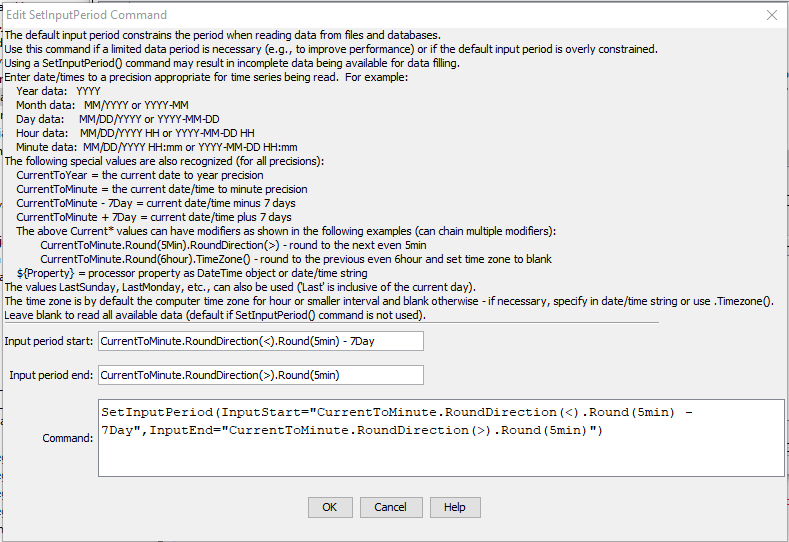

# TSTool / Command / SetInputPeriod #

*   [Overview](#overview)
*   [Command Editor](#command-editor)
*   [Command Syntax](#command-syntax)
*   [Examples](#examples)
*   [Troubleshooting](#troubleshooting)
*   [See Also](#see-also)

-------------------------

## Overview ##

The `SetInputPeriod` command sets the period used for reading time series data from files and datastores.
The default in most cases is to read/query all available data so that all data are available for analysis and data filling.
However, a shorter period may be desirable to increase performance (e.g., when processing real-time data)
or to force matching a historical period.
It may be necessary to set the input period if the default for a datastore is very short.
See also the [`SetOutputPeriod`](../SetOutputPeriod/SetOutputPeriod.md) command.

## Command Editor ##

The following dialog is used to edit this command and illustrates the syntax of the command.

**<p style="text-align: center;">

</p>**

**<p style="text-align: center;">
`SetInputPeriod` Command Editor (<a href="../SetInputPeriod.png">see also the full-size image</a>)
</p>**

## Command Syntax ##

The command syntax is as follows:

```text
SetInputPeriod(Parameter="Value",...)
```
**<p style="text-align: center;">
Command Parameters
</p>**

| **Parameter**&nbsp;&nbsp;&nbsp;&nbsp;&nbsp;&nbsp;&nbsp;&nbsp;&nbsp;&nbsp;&nbsp;&nbsp;&nbsp;&nbsp;&nbsp;&nbsp; | **Description** | **Default**&nbsp;&nbsp;&nbsp;&nbsp;&nbsp;&nbsp;&nbsp;&nbsp;&nbsp;&nbsp;&nbsp;&nbsp;&nbsp;&nbsp;&nbsp; |
| --------------|-----------------|----------------- |
|`InputStart`<br>**required**|The date/time to start reading/querying time series data, one of:<ul><li>A date/time string (see dialog above for examples).</li><li>`CurrentToYear`, `CurrentToMonth`, `CurrentToDay`, `CurrentToHour`, `CurrentToMinute`, indicating the current date/time to the specified precision.</li><li>A `Current*` value +- an interval, for example: `CurrentToMinute - 7Day`.  See modifiers in following table.</li><li>A processor property indicated with `${Property}`|None – must be specified.|
|`InputEnd`<br>**required**|The date/time to end reading/querying time series data.  See the description for `InputStart`.|None – must be specified.|

The `CurrentToYear` and other special date/time values can be followed by modifiers,
which can be chained together in any order.
For example, the following will adjust the current time rounded to 5 minutes into the future and set the time zone to blank:

```
CurrentToMinute.Round(5min).RoundDirection(>).TimeZone()
```

**<p style="text-align: center;">
CurrentTo* Modifiers
</p>**

| **Modifier**&nbsp;&nbsp;&nbsp;&nbsp;&nbsp;&nbsp;&nbsp;&nbsp;&nbsp;&nbsp;&nbsp;&nbsp;&nbsp;&nbsp;&nbsp;&nbsp;&nbsp;&nbsp;&nbsp;&nbsp;&nbsp;&nbsp;&nbsp;&nbsp;&nbsp;&nbsp;&nbsp;&nbsp;&nbsp;&nbsp;&nbsp; | **Description** |
|-----------------------|-----------------|
|`Round(interval)`|Round the current date/time to the specified interval (e.g., `5min`, `6hour`). No rounding occurs if the current date/time exactly matches the requested rounding interval. The default is to round back but see the `RoundDirection()` modifier.|
|`RoundToDayOfWeek(Day)`|Round the current date/time to the specified day of the week (`Monday`, `Tuesday`, `Wednesday`, `Thursday`, `Friday`, `Saturday`, or `Sunday`). The day is rounded and the month and year are adjusted accordingly. No rounding occurs if the current date/time matches the requested day of the week.  The default is to round back but see the `RoundDirection()` modifier.|
|`RoundDirection(<)`<br>`RoundDirection(>)`|Indicate which way the `Round()` modifier should round the date/time, one of:<ul><li>`<` - round to the nearest past even interval</li><li>`>` - round to the nearest future even interval</li></ul> |
|`TimeZone(tzToSet)`|Set the time zone for the date/time to the specified time zone string.  This does not shift the time value.  It simply assigns the time zone string.  Blank (no value) can be used to set the time zone to blank.  Note that other commands may handle time zone in a specific way, for example when reading and writing data.|

## Examples ##

See the [automated tests](https://github.com/OpenCDSS/cdss-app-tstool-test/tree/master/test/commands/SetInputPeriod).

## Troubleshooting ##

## See Also ##

* [`SetOutputPeriod`](../SetOutputPeriod/SetOutputPeriod.md) command
* [`SetOutputYearType`](../SetOutputYearType/SetOutputYearType.md) command
