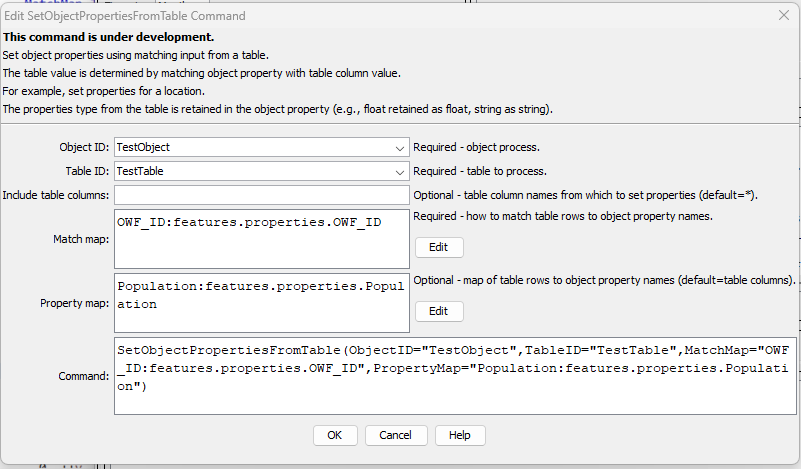

# TSTool / Command / SetObjectPropertiesFromTable #

*   [Overview](#overview)
*   [Command Editor](#command-editor)
*   [Command Syntax](#command-syntax)
*   [Examples](#examples)
    +   [Adding Properties to a GeoJSON File](#adding-properties-to-a-geojson-file)
*   [Troubleshooting](#troubleshooting)
*   [See Also](#see-also)

-------------------------

## Overview ##

The `SetObjectPropertiesFromTable` command sets object properties using values in a table.
This is useful, for example, when additional data are available for locations associated with an array of objects within the main object.
For example, additional properties can be added to a GeoJSON file.
After manipulation, the original GeoJSON file can be written to a new file.
The JSON format of the output may be slightly different from the original,
for example indentation and use of spaces,
because of different software used to create the original input and the output.

**This command has been tested on GeoJSON files and is intended to set element values
within an array of objects.
Additional functionality and examples will be added over time.**

See the [JSON specification](https://www.json.org/json-en.html).

See also the [`SetObjectProperty`](../SetObjectProperty/SetObjectProperty.md) command,
which sets an object property from processor property.

## Command Editor ##

The command is available in the following TSTool menu:

*   ***Commands / Object Processing***

The following dialog is used to edit the command and illustrates the command syntax.
See the example below for a full explanation of input.

**<p style="text-align: center;">

</p>**

**<p style="text-align: center;">
`SetObjectPropertiesFromTable` Command Editor (<a href="../SetObjectPropertiesFromTable.png">see also the full-size image</a>)
</p>**

## Command Syntax ##

The command syntax is as follows:

```text
SetObjectPropertiesFromTable(Parameter="Value",...)
```
**<p style="text-align: center;">
Command Parameters
</p>**

| **Parameter**&nbsp;&nbsp;&nbsp;&nbsp;&nbsp;&nbsp;&nbsp;&nbsp;&nbsp;&nbsp;&nbsp;&nbsp;&nbsp;&nbsp;&nbsp;&nbsp;&nbsp;&nbsp;&nbsp;&nbsp;&nbsp;&nbsp;&nbsp;&nbsp;&nbsp;&nbsp; | **Description** | **Default**&nbsp;&nbsp;&nbsp;&nbsp;&nbsp;&nbsp;&nbsp;&nbsp;&nbsp;&nbsp;&nbsp;&nbsp;&nbsp;&nbsp;&nbsp;&nbsp;&nbsp;&nbsp;&nbsp;&nbsp;&nbsp; |
| --------------|-----------------|----------------- |
|`ObjectID`<br>**required**|The object identifier for the object to be processed.  Can be specified using `${Property}`. For example, see the [`NewObject`](../NewObject/NewObject.md) command to create objects. |None - must be specified.|
|`TableID`<br>**required**|The identifier for the table that contains properties.|None – must be specified.|
|`IncludeColumns`|The name(s) of the table column(s) to supply properties, or `*` to include all columns.  Separate column names with commas.| `*`|
|`MatchMap`<br>**required**|Indicate how table column names should be used to match objects, using syntax:<br>`ColumnName1:ObjectProperty1,`<br>`ColumnName2:ObjectProperty2`<br>The object property name to match should be a name within an array of objects, using dot-delimited notation. | None - must be specified. |
|`PropertyMap`|Indicate property names that should be renamed from table column names using syntax:<br>`ColumnName1:ObjectProperty1,`<br>`ColumnName2:ObjectProperty2`<br>The object property name should be a name within an array of objects, using dot-delimited notation. | Table column names will be used for object names. |

## Examples ##

See the [automated tests](https://github.com/OpenCDSS/cdss-app-tstool-test/tree/master/test/commands/SetObjectPropertiesFromTable).

### Adding Properties to a GeoJSON File ###

[GeoJSON files](https://en.wikipedia.org/wiki/GeoJSON) are often used to represent spatial data layers for a map.
The original GeoJSON file may be provided primarily to visualize geographic features
such as counties, municipalities, and river basins, with basic feature attributes such as identifier, area, elevation, name, etc.
However, many additional datasets can be joined to the geographic data,
for example, to indicate municipal population or indicator for a year of interest.
Because TSTool has extensive capabilities to process time series and tabular data,
it is useful to join the results of an analysis workflow with the geographic data in GeoJSON files.

GeoJSON files are useful because the format is simple text,
GeoJSON is an implementation of JSON, which is often used with web applications,
and the GeoJSON file is a single file, in contrast to
[shapefiles](https://en.wikipedia.org/wiki/Shapefile), which consist of multiple files and are more difficult to use in web applications.
The GeoJSON format also does not limit property names,
whereas shapefile attributes are limited to 10 characters.

The top of a GeoJSON file is similar to the following, in this case for a point data layer.
Other feature types such as lines and polygons are similar but the `geometry` data are more extensive for complex shapes.

```
{
  "type": "FeatureCollection",
  "bbox": [-109.007512, 37.015493, -102.124297, 40.984514],
  "features": [
      {
      "type": "Feature",
      "bbox": [-104.655036, 37.403626, -104.655036, 37.403626],
      "properties": {
        "MunicipalityName": "Aguilar",
        "FIPS_ID": "00760",
        "FIPS_ID_Flag": "G",
        "GNIS_ID": 2412339,
        "GNIS_ID_Flag": "G",
        "DOLA_LG_ID": "36001",
        "DOLA_LG_ID_Flag": "G",
        "OWF_ID": "Aguilar",
        "OWF_ID_Full": "Aguilar",
        "OWF_ID_Flag": "G",
        "PWS_ID": "CO0136100",
        "PWS_ID_Flag": "G",
        "DWR_WaterDistrict_ID": "",
        "DWR_WaterDistrict_ID_Flag": "x",
        "County_CSV": "Las Animas",
        "NumCounty": 1,
        "IBCC_Basin_CSV": "Arkansas",
        "Num_IBCC_Basin": 1,
        "Latitude": 37.403625791377,
        "Longitude": -104.655036191241,
        "Lat_Long_Flag": "",
        "Website": "https://www.aguilarco.us/",
        "Website_Flag": "G",
        "Comment": ""
      },
      "geometry": {
        "type": "Point",
        "coordinates": [-104.655036, 37.403626]
      }
    },
    {
      "type": "Feature",
      "bbox": [-103.220269, 40.163374, -103.220269, 40.163374],
      "properties": {
        "MunicipalityName": "Akron",
        "FIPS_ID": "00925",
        "FIPS_ID_Flag": "G",
        "GNIS_ID": 2412340,
        "GNIS_ID_Flag": "G",
        "DOLA_LG_ID": "61002",
        "DOLA_LG_ID_Flag": "G",
        "OWF_ID": "Akron",
        "OWF_ID_Full": "Akron",
        "OWF_ID_Flag": "G",
        "PWS_ID": "CO0161001",
        "PWS_ID_Flag": "G",
        "DWR_WaterDistrict_ID": "",
        "DWR_WaterDistrict_ID_Flag": "x",
        "County_CSV": "Washington",
        "NumCounty": 1,
        "IBCC_Basin_CSV": "South Platte",
        "Num_IBCC_Basin": 1,
        "Latitude": 40.1633737351297,
        "Longitude": -103.220268904227,
        "Lat_Long_Flag": "",
        "Website": "https://townofakron.colorado.gov/",
        "Website_Flag": "G",
        "Comment": ""
      },
      "geometry": {
        "type": "Point",
        "coordinates": [-103.220269, 40.163374]
      }
    },
```

The object is represented in memory as a dictionary of dictionaries or a "data map",
where elements of the object have a name and a value.
A specific element within the overall object can be identified with a dot-delimited string,
with the most specific (inner) identifier part on the right.
For example, `features.properties.OWF_ID` indicates the `OWF_ID` name
within the `properties` object dictionary, within the `features` array of properties.
This dot-delimited notation can be used to identify which elements in the overall object are to be processed.
The `SetObjectPropertiesFromTable` command handles the
complexity of figuring out the object levels.

The example shown in the above image and available in the testing repository via the above link
illustrates how the `OWF_ID` is used to match a column in a table with the data in the object.
The table contains the following:

```
# Table with test data.
"OWF_ID","Population"
FtCollins,300000.0
Greeley,290000.0
```

Once the table row is matched with the object element via matching `OWF_ID`,
the data in the table row can be set in the object.
The `PropertyMap` command parameter allows the table column name to be
changed when used as a object name.

## Troubleshooting ##

Problems in JSON files can be checked by using online "JSON lint" websites.

## See Also ##

*   [`NewObject`](../NewObject/NewObject.md) command
*   [`SetObjectProperty`](../SetObjectProperty/SetObjectProperty.md) command
*   [`WriteObjectToJSON`](../WriteObjectToJSON/WriteObjectToJSON.md) command
