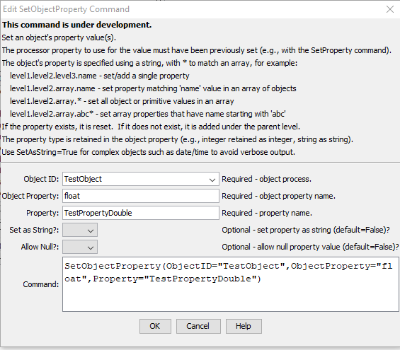

# TSTool / Command / SetObjectProperty #

*   [Overview](#overview)
*   [Command Editor](#command-editor)
*   [Command Syntax](#command-syntax)
*   [Examples](#examples)
    +   [Simple Root Level Object](#simple-root-level-object)
    +   [Array of Objects](#array-of-objects)
*   [Troubleshooting](#troubleshooting)
*   [See Also](#see-also)

-------------------------

## Overview ##

The `SetObjectProperty` command sets an object's property using a processor property,
which are listed in the TSTool ***Results / Properties*** tab.
This is useful when an initial JSON object is read and modified,
for example to change the publication date on a dataset metadata file.
After manipulation, the original JSON file can be written to a new file.
The JSON format of the output may be slightly different from the original,
for example indentation and use of spaces,
because of different software used to create the original input and the output.

See the [JSON specification](https://www.json.org/json-en.html).

See also the [`SetObjectPropertiesFromTable`](../SetObjectPropertiesFromTable/SetObjectPropertiesFromTable.md) command,
which sets an object's array properties from a table.

## Command Editor ##

The command is available in the following TSTool menu:

*   ***Commands / Object Processing***

The following dialog is used to edit the command and illustrates the command syntax.
See the examples below for an explanation of input.

**<p style="text-align: center;">

</p>**

**<p style="text-align: center;">
`SetObjectProperty` Command Editor (<a href="../SetObjectProperty.png">see also the full-size image</a>)
</p>**

## Command Syntax ##

The command syntax is as follows:

```text
SetObjectProperty(Parameter="Value",...)
```
**<p style="text-align: center;">
Command Parameters
</p>**

| **Parameter**&nbsp;&nbsp;&nbsp;&nbsp;&nbsp;&nbsp;&nbsp;&nbsp;&nbsp;&nbsp;&nbsp;&nbsp;&nbsp;&nbsp;&nbsp;&nbsp;&nbsp;&nbsp;&nbsp;&nbsp;&nbsp;&nbsp;&nbsp;&nbsp;&nbsp;&nbsp; | **Description** | **Default**&nbsp;&nbsp;&nbsp;&nbsp;&nbsp;&nbsp;&nbsp;&nbsp;&nbsp;&nbsp;&nbsp;&nbsp;&nbsp;&nbsp;&nbsp;&nbsp;&nbsp;&nbsp;&nbsp;&nbsp;&nbsp; |
| --------------|-----------------|----------------- |
|`ObjectID`<br>**required**|The object identifier for the object to be processed.  Can be specified using `${Property}`. For example, see the [`NewObject`](../NewObject/NewObject.md) command to create objects. |None - must be specified.|
|`TableID`<br>**required**|The identifier for the table that contains properties.|None – must be specified.|
|`ObjectProperty`| The name of the object property to set, using period-delimited notation to indicate property levels (e.g., `level1.level2.level3.name`).  A `*` wildcard pattern can be specified to match object names in an array. | None - must be specified. |
|`Property`| The name of the processor property to supply the property value. The property must have been set with [`SetProperty`](../SetProperty/SetProperty.md) or other command that sets properties.  See the TSTool ***Results / Properties*** tab for properties that are available after running commands. | None - must be specified. |
|`SetAsString` | Whether a property's value should be converted to a string before setting the value in the object (`True`) or use the original value (`False`).  This can be used to convert DateTime objects to a string; otherwise, all of the DateTime parts are output separately. | `False` |
|`AllowNull` | Whether a property should be allowed to have a null value (`True`) or not (`False`).  The default value helps to identify typos in property names. | `False` |

## Examples ##

See the [automated tests](https://github.com/OpenCDSS/cdss-app-tstool-test/tree/master/test/commands/SetObjectProperty).

### Simple Root Level Object ###

The following example illustrates a simple object at the root level,
which can be set using using a parameter like `ObjectProperty=string`.

```
{
  "float" : 1.234,
  "int" : 1234,
  "bool": true,
  "string" : "abcde",
  "date" : "2022-10",
  "datetime" : "2022-10-01 01:01:01",
  "nullString" : null
}
```

### Array of Objects ###

The following example illustrates an array of objects,
which can be set using a parameter like `ObjectProperty=array.string`.
There is currently no way to filter which array objects are modified,
although a `*` wildcard can be used to filter names in an array.

```
{
  "array" : [
    {
      "float" : 1.234,
      "int" : 1234,
      "bool": true,
      "string" : "abcde",
      "date" : "2022-10",
      "datetime" : "2022-10-01 01:01:01",
      "nullString" : null
    },
    {
      "float" : 1.234,
      "int" : 1234,
      "bool": true,
      "string" : "abcde",
      "date" : "2022-10",
      "datetime" : "2022-10-01 01:01:01",
      "nullString" : null
    },
    {
      "float" : 1.234,
      "int" : 1234,
      "bool": true,
      "string" : "abcde",
      "date" : "2022-10",
      "datetime" : "2022-10-01 01:01:01",
      "nullString" : null
    }
  ]
}
```

### Array of Primitive Values ###

The following example illustrates an array of primitive values,
which can be set using a parameter like `ObjectProperty=array.*`.
There is currently no way to filter which array primitives are modified,
or whether to delete or add a value.

```
{
  "array" : [
    "string1",
    "string2",
    "string3",
    "string4"
  ]
}
```

## Troubleshooting ##

Problems in JSON files can be checked by using online "JSON lint" websites.

See the main [TSTool Troubleshooting](../../troubleshooting/troubleshooting.md) documentation.

## See Also ##

*   [`NewObject`](../NewObject/NewObject.md) command
*   [`SetObjectPropertiesFromTable`](../SetObjectPropertiesFromTable/SetObjectPropertiesFromTable.md) command
*   [`WriteObjectToJSON`](../WriteObjectToJSON/WriteObjectToJSON.md) command
