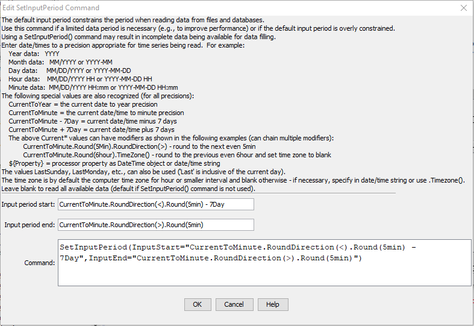

# TSTool / Command / SetOutputPeriod #

*   [Overview](#overview)
*   [Command Editor](#command-editor)
*   [Command Syntax](#command-syntax)
*   [Examples](#examples)
*   [Troubleshooting](#troubleshooting)
*   [See Also](#see-also)

-------------------------

## Overview ##

The `SetOutputPeriod` command sets the output period for time series.
See also the [`SetInputPeriod`](../SetInputPeriod/SetInputPeriod.md) command.
The period for a time series when read or created will be set to the maximum of the following periods,
in order to satisfy output and data filling requirements:

*   available data
*   output period (if specified)
*   input period (if specified)

Specifying the output period is necessary when creating model files or filling an extended period
(time series will not automatically be extended by fill commands).

## Command Editor ##

The command is available in the following TSTool menu:

*   ***Commands / Output Time Series***

The following dialog is used to edit this command and illustrates the syntax of the command.
Note that the output period should always use calendar month and year,
even if other than calendar year are used for output (see [`SetOutputYearType`](../SetOutputYearType/SetOutputYearType.md)).

**<p style="text-align: center;">

</p>**

**<p style="text-align: center;">
`SetOutputPeriod` Command Editor (<a href="../SetOutputPeriod.png">see full-size image</a>)
</p>**

## Command Syntax ##

The command syntax is as follows:

```text
SetOutputPeriod(Parameter="Value",...)
```
**<p style="text-align: center;">
Command Parameters
</p>**

| **Parameter**&nbsp;&nbsp;&nbsp;&nbsp;&nbsp;&nbsp;&nbsp;&nbsp;&nbsp;&nbsp;&nbsp;&nbsp;&nbsp;&nbsp;&nbsp;&nbsp; | **Description** | **Default**&nbsp;&nbsp;&nbsp;&nbsp;&nbsp;&nbsp;&nbsp;&nbsp;&nbsp;&nbsp;&nbsp;&nbsp;&nbsp;&nbsp;&nbsp; |
| --------------|-----------------|----------------- |
|`OutputStart`<br>**required**|The date/time for the output start, one of:<ul><li>A date/time string (see dialog above for examples).</li><li>The current date/time indicated for a precision:<ul><li>`CurrentToYear`</li><li>`CurrentToMonth`</li><li>`CurrentToDay`</li><li>`CurrentToHour`</li><li>`CurrentToMinute`</li></ul></li><li>A `Current*` value +- an interval, for example: `CurrentToMinute - 7Day`.  See modifiers in following table.</li><li>Last day, inclusive of the current day (optionally followed by math operation):<ul><li>`LastSunday`</li><li>`LastMonday`</li><li>`LastTuesday`</li><li>`LastWednesday`</li><li>`LastThursday`</li><li>`LastFriday`</li><li>`LastSaturday`</li></ul><li>A processor property indicated with `${Property}`</li></ul>|None – must be specified.|
|`OutputEnd`<br>**required**|The date/time to for the output end.  See the description for `OutputStart`.|None – must be specified.|

The `CurrentToYear` and other special date/time values can be followed by modifiers,
which can be chained together in any order.
For example, the following will adjust the current time rounded to 5 minutes into the future and set the time zone to blank:

```
CurrentToMinute.Round(5min).RoundDirection(>).TimeZone()
```

**<p style="text-align: center;">
`CurrentTo*` Modifiers
</p>**

| **Modifier**&nbsp;&nbsp;&nbsp;&nbsp;&nbsp;&nbsp;&nbsp;&nbsp;&nbsp;&nbsp;&nbsp;&nbsp;&nbsp;&nbsp;&nbsp;&nbsp;&nbsp;&nbsp;&nbsp;&nbsp;&nbsp;&nbsp;&nbsp;&nbsp;&nbsp;&nbsp;&nbsp;&nbsp;&nbsp;&nbsp;&nbsp; | **Description** |
|-----------------------|-----------------|
|`Round(interval)`|Round the current date/time to the specified interval (e.g., `5min`, `6hour`). No rounding occurs if the current date/time exactly matches the requested rounding interval. The default is to round back but see the `RoundDirection()` modifier.|
|`RoundToDayOfWeek(Day)`|Round the current date/time to the specified day of the week (`Monday`, `Tuesday`, `Wednesday`, `Thursday`, `Friday`, `Saturday`, or `Sunday`). The day is rounded and the month and year are adjusted accordingly. No rounding occurs if the current date/time matches the requested day of the week.  The default is to round back but see the `RoundDirection()` modifier.|
|`RoundDirection(<)`<br>`RoundDirection(>)`|Indicate which way the `Round()` modifier should round the date/time, one of:<ul><li>`<` - round to the nearest past even interval</li><li>`>` - round to the nearest future even interval</li></ul> |
|`TimeZone(tzToSet)`|Set the time zone for the date/time to the specified time zone string.  This does not shift the time value.  It simply assigns the time zone string.  Blank (no value) can be used to set the time zone to blank.  Note that other commands may handle time zone in a specific way, for example when reading and writing data.|

## Examples ##

See the [automated tests](https://github.com/OpenCDSS/cdss-app-tstool-test/tree/master/test/commands/SetOutputPeriod).

A sample command file example is as follows:

```
SetOutputPeriod(OutputStart="1950-01",OutputEnd="2002-12")
```

## Troubleshooting ##

See the main [TSTool Troubleshooting](../../troubleshooting/troubleshooting.md) documentation.

## See Also ##

*   [`SetInputPeriod`](../SetInputPeriod/SetInputPeriod.md) command
*   [`SetOutputYearType`](../SetOutputYearType/SetOutputYearType.md) command
