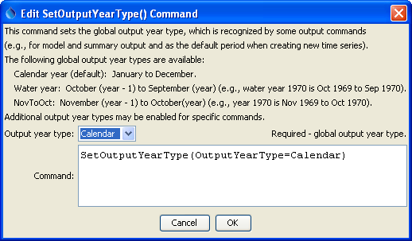

# TSTool / Command / SetOutputYearType #

* [Overview](#overview)
* [Command Editor](#command-editor)
* [Command Syntax](#command-syntax)
* [Examples](#examples)
* [Troubleshooting](#troubleshooting)
* [See Also](#see-also)

-------------------------

## Overview ##

The `SetOutputYearType` command sets the global output year type for output reports and files.
The default for most operations is calendar year (January through December);
however, alternate year definitions may be useful.
The global output year type is recognized by some common tools and commands that create output.
Many write commands also allow the year type to be specified for the command.
Internally, all data are managed using calendar years and are converted to different year types during output or display.
The [`ChangeInterval`](../ChangeInterval/ChangeInterval.md) command also allows
time series to be converted to annual values where the value corresponds to a year type.

The year type for output and analysis theoretically can be defined in many ways.
Internally, TSTool allows the start and end year to have offsets from the calendar year.
This allows the output year type to have a starting year previous to the calendar year or the same as the calendar year.
A convention that is being implemented over time is to prepend `Year` to the year types where
the start of the output year agrees with the calendar year number,
and append `Year` to the year types where the end of the output year agrees with the calendar year number.
For example, `YearMayToApr` would indicate that the output year is May of the calendar year to Apr of the next calendar year.

## Command Editor ##

The following dialog is used to edit this command and illustrates the syntax of the command.
Note that the output period should always use calendar month and year,
even if other than calendar year are used for output (see [`SetOutputYearType`](../SetOutputYearType/SetOutputYearType.md)).

**<p style="text-align: center;">

</p>**

**<p style="text-align: center;">
`SetOutputYearType` Command Editor (<a href="../SetOutputYearType.png">see also the full-size image</a>)
</p>**

## Command Syntax ##

The command syntax is as follows:

```text
SetOutputYearType(Parameter="Value",...)
```
**<p style="text-align: center;">
Command Parameters
</p>**

| **Parameter**&nbsp;&nbsp;&nbsp;&nbsp;&nbsp;&nbsp;&nbsp;&nbsp;&nbsp;&nbsp;&nbsp;&nbsp;&nbsp;&nbsp;&nbsp;&nbsp; | **Description** | **Default**&nbsp;&nbsp;&nbsp;&nbsp;&nbsp;&nbsp;&nbsp;&nbsp;&nbsp;&nbsp;&nbsp;&nbsp;&nbsp;&nbsp;&nbsp; |
| --------------|-----------------|----------------- |
|`OutputYearType`|The output year type, one of:<ul><li>`Calendar` – January through December.</li><li>`NovToOct` – November of the previous calendar year to October of the current calendar year.  For example, year 1970 spans Nov 1969 to Oct 1970.</li><li>`Water` – October of the previous calendar year through September of the current calendar year (and water year).  For example, water year 1970 spans Oct 1969 to Sep 1970.</li></ul><br>In the future, more generic types like NovToOct may be implemented.|If this command is not specified, Calendar is the default.|

## Examples ##

See the [automated tests](https://github.com/OpenCDSS/cdss-app-tstool-test/tree/master/test/regression/commands/general/SetOutputYearType).

A sample command file example is as follows:

```
SetOutputYearType(OutputYearType=Calendar)
```

## Troubleshooting ##

## See Also ##

* [`ChangeInterval`](../ChangeInterval/ChangeInterval.md) command
* [`SetInputPeriod`](../SetInputPeriod/SetInputPeriod.md) command
* [`SetOutputPeriod`](../SetOutputPeriod/SetOutputPeriod.md) command
