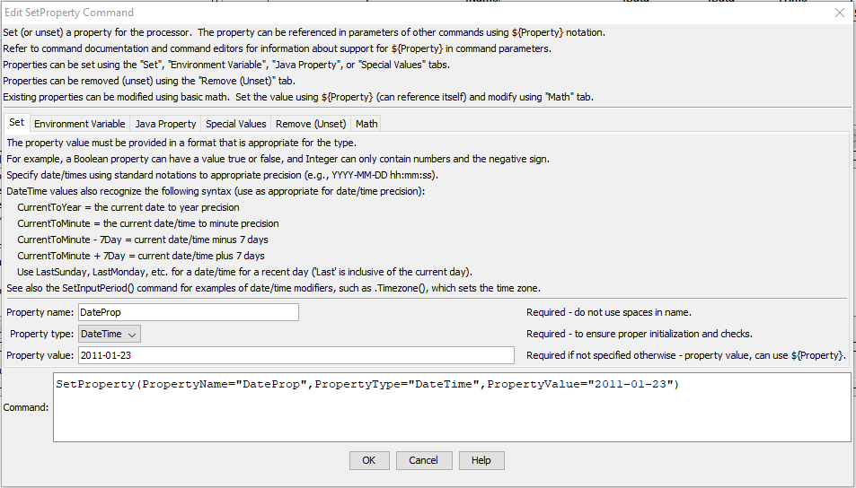

# TSTool / Command / SetProperty #

*   [Overview](#overview)
    +   [Properties in Discovery Phase](#properties-in-discovery-phase)
*   [Command Editor](#command-editor)
*   [Command Syntax](#command-syntax)
*   [Examples](#examples)
*   [Troubleshooting](#troubleshooting)
*   [See Also](#see-also)

-------------------------

## Overview ##

The `SetProperty` command sets the value of a property used by the time series processor.
Processor properties are similar to variables in programming languages and TSTool processor properties have
a name, type (e.g., integer, string), and value.
The property will be available to subsequent commands that support using `${Property}` notation in parameters,
for example to specify filenames more dynamically or use with [`If`](../If/If.md) commands.
The documentation for each command indicates which command parameters can be specified as a property.
This command should not be confused with the [`SetTimeSeriesProperty`](../SetTimeSeriesProperty/SetTimeSeriesProperty.md) command,
which sets a property on specific time series.  The following functionality is provided:

*   Set a property to a specified value, where the property can be a Boolean, String, DateTime, Double, or Integer type.
*   Set a property to a special value such as empty string or other special values.
*   Remove an existing property so that it is no longer available to the processor.
    Care should be taken to understand the implications of removing a property.
    For example, if the property is used in later commands, then removing will cause the processor to not find the property.
    It may be more appropriate, for example, to set a string property to an empty string rather than removing.
*   Set a property by modifying a previous processor property using basic math manipulations.
    In this case, specify the initial property value with `${Property}` and then use the ***Math*** tab parameters
    to manipulate the initial value.

After commands are run, the value of properties can be viewed in the TSTool ***Results / Properties*** tab,
for example as shown below.

**<p style="text-align: center;">

</p>**

**<p style="text-align: center;">
Properties in the TSTool Results (<a href="../SetProperty-results.png">see full-size image</a>)
</p>**

### Properties in Discovery Phase ###

TSTool executes commands in several phases:

+   the "initialization" phase performs basic command parsing and error checking
+   the "discovery" phase partially runs a command in order to set data that can be used in command editor
    and is executed after opening a command file or inserting and editing a command
+   the "run" phase fully runs a command and creates output
    and is executed when commands are run

When this command is run in discovery mode,
it sets the property name and value so that other commands can use if appropriate.
For example, setting a datastore name as a property allows
the [`ReadTableFromDataStore`](../ReadTableFromDataStore/ReadTableFromDataStore.md) command
to use the expanded property to access the datastore to populate command editor fields.

Because of the complexity of advanced features, only simple property assignments can be set in discovery mode.
More complex property definitions, such as manipulating the property using math operations,
can be executed when the commands are run.
This may limit how command editors can be used and require additional software enhancements.

## Command Editor ##

The command is available in the following TSTool menu:

*   ***Commands / General - Running and Properties***

The following dialog is used to edit the command and illustrates the command syntax for general parameters.

**<p style="text-align: center;">

</p>**

**<p style="text-align: center;">
`SetProperty` Command Editor for General Set Parameters (<a href="../SetProperty.png">see full-size image</a>)
</p>**

The following dialog is used to edit the command and illustrates the command syntax for environment variable parameters.

**<p style="text-align: center;">

</p>**

**<p style="text-align: center;">
`SetProperty` Command Editor for Environment Variable Parameters (<a href="../SetProperty_EnvVar.png">see full-size image</a>)
</p>**

The following dialog is used to edit the command and illustrates the command syntax for Java property parameters.

**<p style="text-align: center;">

</p>**

**<p style="text-align: center;">
`SetProperty` Command Editor for Java Property Parameters (<a href="../SetProperty_Java.png">see full-size image</a>)
</p>**

The following dialog is used to edit the command and illustrates the command syntax for special value parameters.

**<p style="text-align: center;">

</p>**

**<p style="text-align: center;">
`SetProperty` Command Editor for Special Value Parameters (<a href="../SetProperty_Special.png">see full-size image</a>)
</p>**

The following dialog is used to edit the command and illustrates the command syntax for removing a property.

**<p style="text-align: center;">

</p>**

**<p style="text-align: center;">
`SetProperty` Command Editor for Removing a Property (<a href="../SetProperty_Remove.png">see full-size image</a>)
</p>**

The following illustrates how to perform a math operation on a property.
In this case, a new property name can be assigned (or existing name reused) in the `PropertyName` parameter.
The `PropertyValue` parameter must specify the name of an existing property using `${Property}` notation.
This causes the old value to be retrieved and then the math operation is performed.
A common operation would be to increment a property’s value in a [`For`](../For/For.md) loop.

**<p style="text-align: center;">

</p>**

**<p style="text-align: center;">
`SetProperty` Command Editor for Performing Math with Main Property Parameters (<a href="../SetProperty_Math1.png">see full-size image</a>)
</p>**

The following illustrates the math input parameters.

**<p style="text-align: center;">

</p>**

**<p style="text-align: center;">
`SetProperty` Command Editor for Performing Math with Math Input (<a href="../SetProperty_Math2.png">see full-size image</a>)
</p>**

## Command Syntax ##

The command syntax is as follows:

```text
SetProperty(Parameter="Value",...)
```
**<p style="text-align: center;">
Command Parameters
</p>**

| **Tab** | **Parameter**&nbsp;&nbsp;&nbsp;&nbsp;&nbsp;&nbsp;&nbsp;&nbsp;&nbsp;&nbsp;&nbsp;&nbsp;&nbsp;&nbsp;&nbsp;&nbsp;&nbsp;&nbsp;&nbsp;&nbsp;&nbsp;&nbsp;&nbsp;&nbsp;&nbsp;&nbsp; | **Description** | **Default**&nbsp;&nbsp;&nbsp;&nbsp;&nbsp;&nbsp;&nbsp;&nbsp;&nbsp;&nbsp; |
| --------------|-----------------|----------------- | -- |
| ***Set*** | `PropertyName`<br>**required** | The property name. | None - must be specified. |
| ***Set*** | `PropertyType`| The property type, used for validation, one of:<br><ul><li>`Boolean` – a boolean</li><li>`DateTime` – a date/time</li><li>`Double` – a floating point number</li><li>`Integer` – an integer</li><li>`String` – a string</li></ul><br>DateTime objects can be specified with special syntax to use current time and modifiers on the DateTime.  See the [`SetInputPeriod`](../SetInputPeriod/SetInputPeriod.md) command for more information. | None – must be specified when setting a new property, although is not needed when setting to null or removing.|
| ***Set*** | `PropertyValue`|The value of the property, adhering to property type constraints.  Date/time properties should be specified using standard formats such as `YYYY-MM-DD hh:mm:ss`, to an appropriate precision.  Special date/time syntax is recognized, as shown in the above figure.  Global properties can be used with the `${Property}` syntax.|None – must be specified when setting a value.  The parameter is not needed when setting special values or removing the property. |
| ***Environment Variable*** | `EnvironmentVariable` | The name of the environment variable to provide the value.  The `PropertyName` will be used to store the value. | |
| ***Java Property*** | `JavaProperty` | The name of the Java property to provide the value.  The `PropertyName` will be used to store the value. | |
| ***Special Values*** | `SetEmpty`|If specified as `True`, the String property will be set to an empty string.|The `PropertyValue` parameter will be used.|
| ***Special Values*** | `SetNaN`|If specified as `True`, the Double property will be set to the special “not a number” (`NaN`) value.|The `PropertyValue` parameter will be used.|
| ***Special Values*** | `SetNull`|If specified as True, the property will be set to null (not specified).|The PropertyValue parameter will be used.|
| ***Remove (Unset)*** | `RemoveProperty`|If specified as `True`, the property will be removed and will be unavailable to the processor.  Only user-defined properties can be removed (not important internal properties).|The `PropertyValue` parameter will be used.|
| ***Math*** | `Add`|Value to add to the property value, can be specified using `${Property}`:<br><ul><li>Double or Integer property value will be incremented by `Add`.</li><li>String property value will have `Add` appended.</li><li>DateTime property value will be shifted forward in time by `Add` (e.g., `Add=1Day`).</li></ul>|No addition.|
| ***Math*** | `Subtract`|Value to subtract from the property value, can be specified using `${Property}`:<br><ul><li>Double or Integer property value will be decremented by `Subtract`.</li><li>String property value will have `Subtract` removed for all occurrences.</li><li>DateTime property value will be shifted back in time by `Subtract` (e.g., `Subtract=1Day`).</li></ul>|No subtraction.|
| ***Math*** | `Multiply`|Value to multiply the property value, can be specified using `${Property}`:<br><ul><li>Double or Integer property value will be multiplied by `Multiply.`</li></ul>|No multiplication.|
| ***Math*** | `Divide`|Value to divide the property value, can be specified using `${Property}`:<br><ul><li>Double or Integer property value will be divided by `Divide`.  Dividing by zero will set the result to `NaN` for Double and null for Integer.|No division.|

## Examples ##

See the [automated tests](https://github.com/OpenCDSS/cdss-app-tstool-test/tree/master/test/commands/SetProperty).

## Troubleshooting ##

See the main [TSTool Troubleshooting](../../troubleshooting/troubleshooting.md) documentation.

## See Also ##

*   [`For`](../For/For.md) command
*   [`If`](../If/If.md) command
*   [`SetPropertyFromTimeSeries`](../SetPropertyFromTimeSeries/SetPropertyFromTimeSeries.md) command
*   [`SetTimeSeriesProperty`](../SetTimeSeriesProperty/SetTimeSeriesProperty.md) command
*   [`WritePropertiesToFile`](../WritePropertiesToFile/WritePropertiesToFile.md) command
