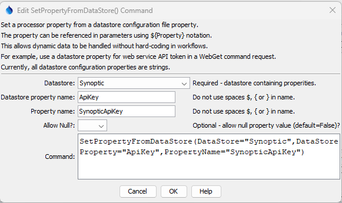

# TSTool / Command / SetPropertyFromDataStore #

*   [Overview](#overview)
*   [Command Editor](#command-editor)
*   [Command Syntax](#command-syntax)
*   [Examples](#examples)
*   [Troubleshooting](#troubleshooting)
*   [See Also](#see-also)

-------------------------

## Overview ##

The `SetPropertyFromDataStore` command sets the value of a property used by the command processor
by copying a property from datastore configuration.
Typical uses of the command are:

1.  Set a web service API key as a property so that it can be used with the
    [`WebGet`](../WebGet/WebGet.md) or other commands in web service requests.
    This ensures that the key is not hard-coded in command files.

Currently, properties are always of type string. 

## Command Editor ##

The command is available in the following TSTool menu:

*   ***Commands / Datastore Processing***

The following dialog is used to edit the command and illustrates the command syntax for general parameters.

**<p style="text-align: center;">

</p>**

**<p style="text-align: center;">
`SetPropertyFromDataStore` Command Editor (<a href="../SetPropertyFromDataStore.png">see full-size image</a>)
</p>**

## Command Syntax ##

The command syntax is as follows:

```text
SetPropertyFromObject(Parameter="Value",...)
```
**<p style="text-align: center;">
Command Parameters
</p>**

| **Parameter**&nbsp;&nbsp;&nbsp;&nbsp;&nbsp;&nbsp;&nbsp;&nbsp;&nbsp;&nbsp;&nbsp;&nbsp;&nbsp;&nbsp;&nbsp;&nbsp;&nbsp;&nbsp;&nbsp;&nbsp;&nbsp;&nbsp;&nbsp;&nbsp;&nbsp;&nbsp; | **Description** | **Default**&nbsp;&nbsp;&nbsp;&nbsp;&nbsp;&nbsp;&nbsp;&nbsp;&nbsp;&nbsp; |
| -----------------|----------------- | -- |
| `DataStore`<br>**required** | Datastore from which to copy the property. | None - must be specified. |
| `DataStoreProperty` <br>**required** | The datastore property name. | None - must be specified. |
| `PropertyName` <br>**required** | The name of the property to set. | None - must be specified. |
| `AllowNull`| Whether the property value is allowed to have a null value (`True`) or or not (`False`). | `False` |

## Examples ##

See the [automated tests](https://github.com/OpenCDSS/cdss-app-tstool-test/tree/master/test/commands/SetPropertyFromDataStore).

## Troubleshooting ##

See the main [TSTool Troubleshooting](../../troubleshooting/troubleshooting.md) documentation.

## See Also ##

*   [`SetProperty`](../SetProperty/SetProperty.md) command
*   [`SetPropertyFromObject`](../SetPropertyFromObject/SetPropertyFromObject.md) command
*   [`SetPropertyFromTable`](../SetPropertyFromTable/SetPropertyFromTable.md) command
*   [`SetPropertyFromTimeSeries`](../SetPropertyFromTimeSeries/SetPropertyFromTimeSeries.md) command
