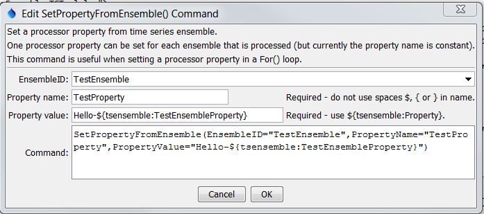

# Learn TSTool / Command / SetPropertyFromEnsemble #

* [Overview](#overview)
* [Command Editor](#command-editor)
* [Command Syntax](#command-syntax)
* [Examples](#examples)
* [Troubleshooting](#troubleshooting)
* [See Also](#see-also)

-------------------------

## Overview ##

The `SetPropertyFromEnsemble` command sets the value of a processor property,
using time series ensemble properties as input.
The property will be available to subsequent commands that support using `${Property}` notation in parameters,
for example to specify filenames more dynamically or use with [`If`](../If/If) commands.
This command should not be confused with the [`SetEnsembleProperty`](../SetEnsembleProperty/SetEnsembleProperty) command,
which sets a property on an ensemble.

## Command Editor ##

The following dialog is used to edit the command and illustrates the command syntax.
<a href="../SetPropertyFromEnsemble.png">See also the full-size image.</a>



**<p style="text-align: center;">
`SetPropertyFromEnsemble` Command Editor for General Set Parameters
</p>**

## Command Syntax ##

The command syntax is as follows:

```text
SetPropertyFromEnsemble(Parameter="Value",...)
```
**<p style="text-align: center;">
Command Parameters
</p>**

| **Parameter**&nbsp;&nbsp;&nbsp;&nbsp;&nbsp;&nbsp;&nbsp;&nbsp;&nbsp;&nbsp;&nbsp;&nbsp;&nbsp;&nbsp;&nbsp;&nbsp;&nbsp;&nbsp;&nbsp;&nbsp;&nbsp;&nbsp;&nbsp;&nbsp;&nbsp;&nbsp; | **Description** | **Default**&nbsp;&nbsp;&nbsp;&nbsp;&nbsp;&nbsp;&nbsp;&nbsp;&nbsp;&nbsp; |
| --------------|-----------------|----------------- |
|`EnsembleID`<br>**required**|The ensemble to be processed.  Can be specified using processor `${Property}.`  The `*` wildcard can be used to match an ensemble, useful for when one ensemble is being processed in a graph template command file.|None - must be specified.|
|`PropertyName`<br>**required**|The property name to set.|None – must be specified.|
|`PropertyValue`<br>**required**|The value of the property, set using a combination of text, the time series `%` specifiers, `${tsensemble:Property}` for custom time series ensemble properties, and `${Property}`.|None – must be specified.|

## Examples ##

See the [automated tests](https://github.com/OpenWaterFoundation/cdss-app-tstool-test/tree/master/test/regression/commands/general/SetPropertyFromEnsemble).

## Troubleshooting ##

## See Also ##

* [For](../For/For) command
* [If](../If/If) command
* [SetProperty](../SetProperty/SetProperty) command
* [SetPropertyFromTimeSeries](../SetPropertyFromTimeSeries/SetPropertyFromTimeSeries) command
* [SetTimeSeriesProperty](../SetTimeSeriesProperty/SetTimeSeriesProperty) command
* [WritePropertiesToFile](../WritePropertiesToFile/WritePropertiesToFile) command
