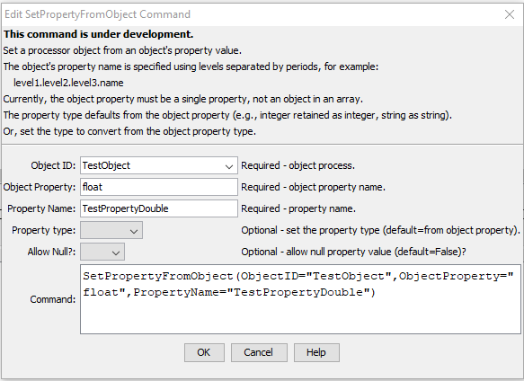

# TSTool / Command / SetPropertyFromObject #

*   [Overview](#overview)
*   [Command Editor](#command-editor)
*   [Command Syntax](#command-syntax)
*   [Examples](#examples)
*   [Troubleshooting](#troubleshooting)
*   [See Also](#see-also)

-------------------------

## Overview ##

The `SetPropertyFromObject` command sets the value of a property used by the time series processor
by copying a property from an object.
Typical uses of the command are:

1.  Use a JSON file to provide configuration properties to a workflow.
2.  Check whether an input JSON file contains expected properties.

## Command Editor ##

The command is available in the following TSTool menu:

*   ***Commands / Object Processing***

The following dialog is used to edit the command and illustrates the command syntax for general parameters.

**<p style="text-align: center;">

</p>**

**<p style="text-align: center;">
`SetPropertyFromObject` Command Editor (<a href="../SetPropertyFromObject.png">see also the full-size image</a>)
</p>**

The object property name (`ObjectProperty`) is specified using a period-delimited string,
with periods used to separate object levels.

Currently, properties can only be set from single object properties, not from a property in an array.
This functionality may be added in the future.

## Command Syntax ##

The command syntax is as follows:

```text
SetPropertyFromObject(Parameter="Value",...)
```
**<p style="text-align: center;">
Command Parameters
</p>**

| **Parameter**&nbsp;&nbsp;&nbsp;&nbsp;&nbsp;&nbsp;&nbsp;&nbsp;&nbsp;&nbsp;&nbsp;&nbsp;&nbsp;&nbsp;&nbsp;&nbsp;&nbsp;&nbsp;&nbsp;&nbsp;&nbsp;&nbsp;&nbsp;&nbsp;&nbsp;&nbsp; | **Description** | **Default**&nbsp;&nbsp;&nbsp;&nbsp;&nbsp;&nbsp;&nbsp;&nbsp;&nbsp;&nbsp; |
| -----------------|----------------- | -- |
| `ObjectID`<br>**required** | The identifier for the object containing the property to provide the value. | None - must be specified. |
| `ObjectProperty` <br>**required** | The object's property name, specified using periods for the delimiter between object levels. | None - must be specified. |
| `PropertyName` <br>**required** | The name of the property to set. | None - must be specified. |
| `PropertyType`| The property type to use for the property value, one of:<br><ul><li>`Boolean` – a boolean</li><li>`DateTime` – a date/time</li><li>`Double` – a floating point number</li><li>`Integer` – an integer</li><li>`String` – a string</li></ul> Compatible types (e.g., string to integer) will be converted. Null input (and conversion from empty strings) will result in null output if `AllowNull=True` or an error otherwise. Incompatible conversions will result in an error. | Use the type from the object's property. |
| `AllowNull`| Whether the property value is allowed to have a null value (`True`) or or not (`False`). | `False` |

## Examples ##

See the [automated tests](https://github.com/OpenCDSS/cdss-app-tstool-test/tree/master/test/commands/SetPropertyFromObject).

The following JSON file is consistent with the editor example above.
In this case, the object property is specified with `ObjectProperty=float`.

```
{
  "float" : 1.234,
  "int" : 1234,
  "bool": true,
  "string" : "abcde",
  "date" : "2022-10",
  "datetime" : "2022-10-01 01:01:01",
  "nullString" : null
}
```

## Troubleshooting ##

See the main [TSTool Troubleshooting](../../troubleshooting/troubleshooting.md) documentation.

## See Also ##

*   [`SetProperty`](../SetProperty/SetProperty.md) command
*   [`SetObjectProperty`](../SetObjectProperty/SetObjectProperty.md) command
