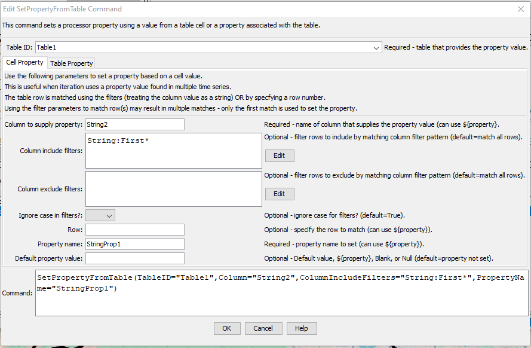

# TSTool / Command / SetPropertyFromTable #

*   [Overview](#overview)
    +   [Cell Embedded Properties](#cell-embedded-properties)
*   [Command Editor](#command-editor)
*   [Command Syntax](#command-syntax)
*   [Examples](#examples)
*   [Troubleshooting](#troubleshooting)
*   [See Also](#see-also)

-------------------------

## Overview ##

The `SetPropertyFromTable` command sets the value of a property used by the command processor, using table data:

*   **Table cell value:**
    +   Filters (or row number) are used to match one or more rows.
    +   The filters use simple string matching with `*` wildcard character.
    +   The first matched row is used to set the property.
    +   If no row is matched then the property is not set.
*   **Table cell string embedded property:**
    +   First match a cell as described above.
    +   Then decode and set embedded properties as per the [Cell Embedded Properties](#cell-embedded-properties) section.
    +   If `PropertyName` is provided, also set the property to the cell contents without the properties text
        (only supported for the `DoubleSlash` format).
*   **Table property:**
    +   **Number of rows:** Useful to check that a table size is as expected.
    +   **Number of columns:** Useful to check that a table size is as expected.

The properties will be available to subsequent commands that support using `${Property}` notation in parameters,
for example to dynamically specify time series identifiers or input to commands.
This command is useful in cases where iteration is processing data from a table using a
[`For`](../For/For.md) command, in which case the property can be used in other commands.

### Cell Embedded Properties ###

There are cases when one or more properties may be encoded in a cell's text,
for example, in database columns containing descriptive text.
The following syntax is supported 
using the `DecodeEmbeddedProperties=True` property and optionally `EmbeddedPropertyFormat`.
All of the named properties will be decoded and set as string properties.
Double or single quotes can be used for property values that contain spaces.
URLs with query parameters that use an equal sign will be ignored as properties if not quoted
and can be quoted to set as a value.

#### Example `EmbeddedPropertyFormat=DoubleSlash` cell contents: ####

```
Some text // random text PropertyName1=PropertyValue1 PropertyName2="Property value with spaces and double quotes"
Some text // random text PropertyName1 = PropertyValue1 PropertyName2 = "Property value with spaces and double quotes"
Some text // random text PropertyName1 = PropertyValue1 PropertyName2 = 'Property value with spaces and double quotes'
```

If the `PropertyName` parameter is also specified, the associated property will be set to the cell's text prior to the delimiter.
but only for the `DoubleSlash` format.

#### Example `EmbeddedPropertyFormat=PropertyValue` Cell contents: ####

```
Some text random text PropertyName1=PropertyValue1 PropertyName2="Property value with spaces and double quotes"
Some text random text PropertyName1 = PropertyValue1 PropertyName2 = "Property value with spaces and double quotes"
Some text random text PropertyName1 = PropertyValue1 PropertyName2 = 'Property value with spaces and double quotes'
```

## Command Editor ##

The command is available in the following TSTool menu:

*   ***Commands(Table) / Running and Properties***

The following dialog is used to edit the command and illustrates the command syntax.

**<p style="text-align: center;">

</p>**

**<p style="text-align: center;">
`SetPropertyFromTable` Command Editor for Cell Parameters (<a href="../SetPropertyFromTable_cell.png">see full-size image</a>)
</p>**

**<p style="text-align: center;">

</p>**

**<p style="text-align: center;">
`SetPropertyFromTable` Command Editor for Cell Embedded Property Parameters (<a href="../SetPropertyFromTable_cell_embedded.png">see full-size image</a>)
</p>**

**<p style="text-align: center;">

</p>**

**<p style="text-align: center;">
`SetPropertyFromTable` Command Editor for Table Row and Column Count Parameters (<a href="../SetPropertyFromTable_table.png">see full-size image</a>)
</p>**

## Command Syntax ##

The command syntax is as follows:

```text
SetPropertyFromTable(Parameter="Value",...)
```
**<p style="text-align: center;">
Command Parameters
</p>**

| **Tab** | **Parameter**&nbsp;&nbsp;&nbsp;&nbsp;&nbsp;&nbsp;&nbsp;&nbsp;&nbsp;&nbsp;&nbsp;&nbsp;&nbsp;&nbsp;&nbsp;&nbsp;&nbsp;&nbsp;&nbsp;&nbsp;&nbsp;&nbsp;&nbsp;&nbsp;&nbsp;&nbsp; | **Description** | **Default**&nbsp;&nbsp;&nbsp;&nbsp;&nbsp;&nbsp;&nbsp;&nbsp;&nbsp;&nbsp; |
| --| --------------|-----------------|----------------- |
|***All*** | `TableID`|The identifier for the table.  Can be specified using `${Property}`.|None – must be specified.|
|***Cell Property*** | `Column`|The name of the column containing the value that will be used to set the processor property.   Can be specified using `${Property}`.|None – must be specified.|
||`ColumnIncludeFilters`|Filters that include rows being matched, by matching column values:<br>`ColumnIncludeFilter1:FilterPattern1,ColumnIncludeFilter2:FilterPattern2`<br>Patterns can use `*` to indicate wildcards for matches.  Values are treated as strings for checks.  All patterns must be matched to include the row.  Can be specified using `${Property}`.|All rows are matched.|
||`ColumnExcludeFilters`|Filters that exclude rows being copied, by matching column values:<br>`ColumnExcludeFilter1:FilterPattern1,ColumnExcludeFilter2:FilterPattern2`<br>Patterns can use `*` to indicate wildcards for matches.  Values are treated as strings for checks.  All patterns must be matched to exclude the row.  Can be specified using `${Property}`.|All rows are matched.|
||`IgnoreCase`|Whether the filter comparisons should ignore case (`True`) or consider case (`False`). | `True` |
||`Row`|The row number (1+) to match or `last` to match the last row in the table. | If not specified, use the column filters to match rows. |
||`PropertyName`|The property name to be set.  Can be specified using `${Property}`.  If `DecodedEmbeddedProperties=True`, property will be set to all text except the embedded property text. |None – must be specified.|
||`DefaultValue`|The default value to use if no table cell is matched:<br><ul><li>`Blank` – to use a blank string</li><li>`Null` – to use a null value</li><li>Specified value to set to a string value.</li></ul><br>Can be specified using `${Property}`.|Property is set to null.|
|***Cell Embedded Properties***|`DecodeEmbedded`<br>`Properties`| Whether to set properties from [Cell Embedded Properties](#cell-embedded-properties):<ul><li>`False` - do not decode embedded properties</li><li>`True` - decode embedded properties.</li></ul> | `False` |
| | `EmbeddedProperty`<br>`Format` | The format of embedded properties used if `DecodeEmbeddedProperties=True`: <ul><li>`DoubleSlash` - double slashes (`//`) at the end of the cell text followed by properties</li><li>`PropertyValue` - `Property=Value` strings anywhere in the text</li></ul> See the [Cell Embedded Properties](#cell-embedded-properties) documentation. | `DoubleSlash`|
|***Table Property***|`RowCountProperty`| The name of the property to set to the complete table row count. | |
| |`ColumnCountProperty`| The name of the property to set to the complete table column count. | |

## Examples ##

See the [automated tests](https://github.com/OpenCDSS/cdss-app-tstool-test/tree/master/test/commands/SetPropertyFromTable).

The command shown in the editor dialog, used with the following table, will set `StringProp1=“Abba”`

**<p style="text-align: center;">

</p>**

**<p style="text-align: center;">
`SetPropertyFromTable` Example Table (<a href="../SetPropertyFromTable_example.png">see full-size image</a>)
</p>**

## Troubleshooting ##

See the main [TSTool Troubleshooting](../../troubleshooting/troubleshooting.md) documentation.

## See Also ##

*   [`For`](../For/For.md) command
*   [`If`](../If/If.md) command
*   [`SetPropertyFromTimeSeries`](../SetPropertyFromTimeSeries/SetPropertyFromTimeSeries.md) command
*   [`SetTimeSeriesProperty`](../SetTimeSeriesProperty/SetTimeSeriesProperty.md) command
*   [`WritePropertiesToFile`](../WritePropertiesToFile/WritePropertiesToFile.md) command
