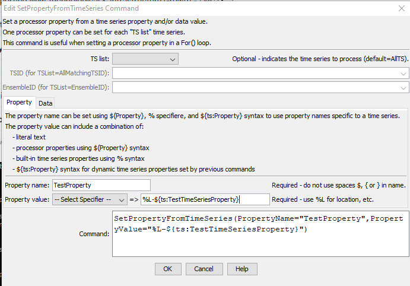

# TSTool / Command / SetPropertyFromTimeSeries #

*   [Overview](#overview)
*   [Command Editor](#command-editor)
*   [Command Syntax](#command-syntax)
*   [Examples](#examples)
*   [Troubleshooting](#troubleshooting)
*   [See Also](#see-also)

-------------------------

## Overview ##

The `SetPropertyFromTimeSeries` command sets the value of a processor property,
using time series properties as input.
The property will be available to subsequent commands that support using `${Property}` notation in parameters,
for example to specify filenames more dynamically or use with [`If`](../If/If.md) commands.
This command should not be confused with the [`SetTimeSeriesProperty`](../SetTimeSeriesProperty/SetTimeSeriesProperty.md) command,
which sets a property on specific time series.
Parameters are provided to select the time series; however, currently,
the property name cannot be dynamically changed (for example by using `${Property}` for the property name).

## Command Editor ##

The command is available in the following TSTool menu:

*   ***Commands / General - Running and Properties***

The following dialog is used to edit the command and illustrates the command syntax.

**<p style="text-align: center;">

</p>**

**<p style="text-align: center;">
`SetPropertyFromTimeSeries` Command Editor (<a href="../SetPropertyFromTimeSeries.png">see also the full-size image</a>)
</p>**

## Command Syntax ##

The command syntax is as follows:

```text
SetPropertyFromTimeSeries(Parameter="Value",...)
```
**<p style="text-align: center;">
Command Parameters
</p>**

| **Parameter**&nbsp;&nbsp;&nbsp;&nbsp;&nbsp;&nbsp;&nbsp;&nbsp;&nbsp;&nbsp; | **Description** | **Default**&nbsp;&nbsp;&nbsp;&nbsp;&nbsp;&nbsp;&nbsp;&nbsp;&nbsp;&nbsp;&nbsp;&nbsp;&nbsp;&nbsp;&nbsp;&nbsp;&nbsp;&nbsp;&nbsp;&nbsp;&nbsp;&nbsp;&nbsp;&nbsp;&nbsp;&nbsp;&nbsp;&nbsp;&nbsp;&nbsp;&nbsp;&nbsp;&nbsp;&nbsp;&nbsp;&nbsp;&nbsp;&nbsp;&nbsp;&nbsp;&nbsp;&nbsp;&nbsp;&nbsp;&nbsp; |
| -----------------------|--------------------------------------------------------|-------------------------- |
|`TSList`|Indicates the list of time series to be processed, one of:<br><br><ul><li>`AllMatchingTSID` – all time series that match the TSID (single TSID or TSID with wildcards) will be modified.</li><li>`AllTS` – all time series before the command.</li><li>`EnsembleID` – all time series in the ensemble will be modified.</li><li>`FirstMatchingTSID` – the first time series that matches the TSID (single TSID or TSID with wildcards) will be modified.</li><li>`LastMatchingTSID` – the last time series that matches the TSID (single TSID or TSID with wildcards) will be modified.</li><li>`SelectedTS` – the time series are those selected with the [`SelectTimeSeries`](../SelectTimeSeries/SelectTimeSeries.md) command.</li></ul>|`AllTS`|
|`TSID`|The time series identifier or alias for the time series to process, using the `*` wildcard character to match multiple time series.  Can be specified using processor `${Property}.`|Required if `TSList=*TSID`| 
|`EnsembleID`|The ensemble to be modified, if processing an ensemble.  Can be specified using processor `${Property}`.|Required if<br>`TSList= EnsembleID`|
|`PropertyName`<br>**required**|The property name.|None – must be specified.|
|`PropertyValue`<br>**required**|The value of the property, set using a combination of text, the time series `%` specifiers, `${ts:Property}` for custom time series properties, and `${Property}`.|None – must be specified.|

## Examples ##

See the [automated tests](https://github.com/OpenCDSS/cdss-app-tstool-test/tree/master/test/commands/SetPropertyFromTimeSeries).

## Troubleshooting ##

See the main [TSTool Troubleshooting](../../troubleshooting/troubleshooting.md) documentation.

## See Also ##

*   [`SelectTimeSeries`](../SelectTimeSeries/SelectTimeSeries.md) command
*   [`SetProperty`](../SetProperty/SetProperty.md) command
*   [`SetTimeSeriesProperty`](../SetTimeSeriesProperty/SetTimeSeriesProperty.md) command
