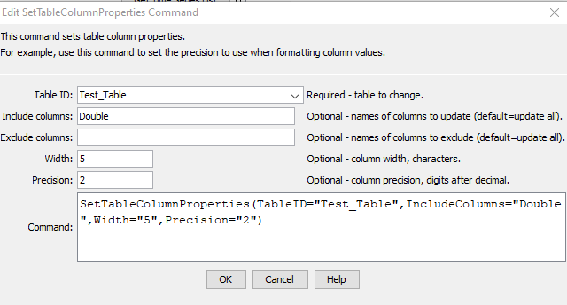

# TSTool / Command / SetTableColumnProperties #

*   [Overview](#overview)
*   [Command Editor](#command-editor)
*   [Command Syntax](#command-syntax)
*   [Examples](#examples)
*   [Troubleshooting](#troubleshooting)
*   [See Also](#see-also)

-------------------------

## Overview ##

The `SetTableColumnProperties` command sets properties for table columns.
This is useful when the table read from a generic format such as comma-separated-value results
in inappropriate column width and precision, which is used to format output.

## Command Editor ##

The command is available in the following TSTool menu:

*   ***Commands(Table) / Manipulate Table Values***

The following dialog is used to edit the command and illustrates the syntax of the command.

**<p style="text-align: center;">

</p>**

**<p style="text-align: center;">
`SetTableColumnProperties` Command Editor (<a href="../SetTableColumnProperties.png">see full-size image</a>)
</p>**

## Command Syntax ##

The command syntax is as follows:

```text
SetTableColumnProperties(Parameter="Value",...)
```
**<p style="text-align: center;">
Command Parameters
</p>**

| **Parameter**&nbsp;&nbsp;&nbsp;&nbsp;&nbsp;&nbsp;&nbsp;&nbsp;&nbsp;&nbsp;&nbsp;&nbsp;&nbsp;&nbsp;&nbsp;&nbsp;&nbsp;&nbsp;&nbsp;&nbsp;&nbsp;&nbsp;&nbsp;&nbsp;&nbsp;&nbsp; | **Description** | **Default**&nbsp;&nbsp;&nbsp;&nbsp;&nbsp;&nbsp;&nbsp;&nbsp;&nbsp;&nbsp; |
| --------------|-----------------|----------------- |
|`TableID`<br>**required**|The identifier for the table being modified.  Can be specified using `${Property}` notation.|None – must be specified.|
|`IncludeColumns`|The names of columns to write, separated by commas.|Write all of the columns.|
|`ExcludeColumns`|The names of columns to **not** write, separated by commas.|Write all of the included columns.|
|`Width`|The column width, number of characters, used to format output.  Can be specified using `${Property}`. Set to `-1` to indicate defaults. |  |
|`Precision`|The number of digits after decimal point for floating point numbers, used to format output. Can be specified using `${Property}`.  The original precision is typically set based on original data, data units, or other criteria. Set to `-1` to indicate defaults. | |

## Examples ##

See the [automated tests](https://github.com/OpenCDSS/cdss-app-tstool-test/tree/master/test/commands/SetTableColumnProperties).

## Troubleshooting ##

See the main [TSTool Troubleshooting](../../troubleshooting/troubleshooting.md) documentation.

## See Also ##
