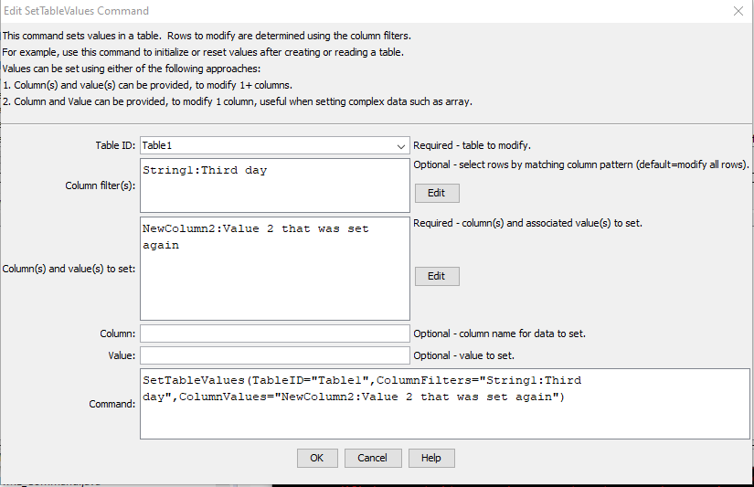

# TSTool / Command / SetTableValues #

* [Overview](#overview)
* [Command Editor](#command-editor)
* [Command Syntax](#command-syntax)
* [Examples](#examples)
* [Troubleshooting](#troubleshooting)
* [See Also](#see-also)

-------------------------

## Overview ##

The `SetTableValues` command sets values in a table.
It does so by first optionally matching rows by filtering on column values (see `ColumnFilters` parameter),
and then setting values in specified columns (see `ColumnValues` parameter).
For example, this command can be used to set or override table values that were not included in the original data.
See also the [`FormatTableString`](../FormatTableString/FormatTableString.md) and
[`ManipulateTableString`](../ManipulateTableString/ManipulateTableString.md) commands.

## Command Editor ##

The following dialog is used to edit the command and illustrates the syntax of the command
(in this case illustrating how values in a column named `LocationID` are copied to a new table).  



**<p style="text-align: center;">
`SetTableValues` Command Editor (<a href="../SetTableValues.png">see also the full-size image</a>)
</p>**

## Command Syntax ##

The command syntax is as follows:

```text
SetTableValues(Parameter="Value",...)
```
**<p style="text-align: center;">
Command Parameters
</p>**

| **Parameter**&nbsp;&nbsp;&nbsp;&nbsp;&nbsp;&nbsp;&nbsp;&nbsp;&nbsp;&nbsp;&nbsp;&nbsp;&nbsp;&nbsp;&nbsp;&nbsp;&nbsp;&nbsp;&nbsp;&nbsp;&nbsp;&nbsp;&nbsp;&nbsp;&nbsp;&nbsp; | **Description** | **Default**&nbsp;&nbsp;&nbsp;&nbsp;&nbsp;&nbsp;&nbsp;&nbsp;&nbsp;&nbsp; |
| --------------|-----------------|----------------- |
|`TableID`<br>**required**|The identifier for the table being modified.  Can be specified using `${Property}` notation.|None – must be specified.|
|`ColumnFilters`|Filters that limit the number of rows being modified, using the syntax:<br>`FilterColumn1:FilterPattern1, FilterColumn2:FilterPattern2`<br>Patterns can use `*` to indicate wildcards for matches.  Only string values can be checked (other data types are converted to strings for comparison).  Comparisons are case-independent.  All patterns must be matched in order to match the row.  The parameter can be specified using `${Property}` notation.|Process all rows in the table.|
|`ColumnValues`<br>**required**|The column names and corresponding values to set using syntax:<br>`ColumnName1:Value1, ColumnName2:Value2`<br>The column name and value parts can be specified using `${Property}` notation.|None – must be specified.|

## Examples ##

See the [automated tests](https://github.com/OpenCDSS/cdss-app-tstool-test/tree/master/test/regression/commands/general/SetTableValues).

## Troubleshooting ##

## See Also ##

* [`FormatTableString`](../FormatTableString/FormatTableString.md) command
* [`ManipulateTableString`](../ManipulateTableString/ManipulateTableString.md) command
