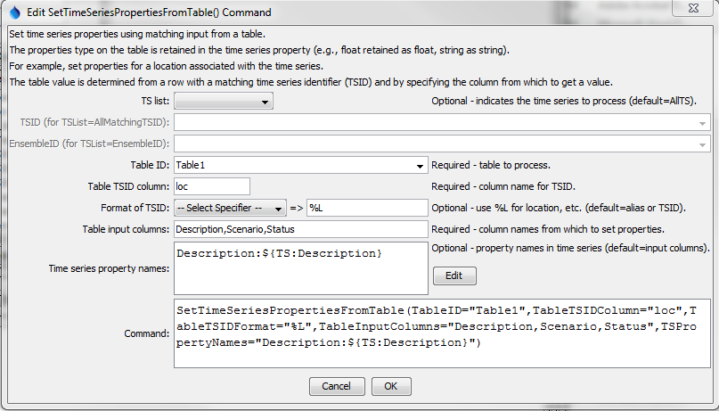

# TSTool / Command / SetTimeSeriesPropertiesFromTable #

*   [Overview](#overview)
*   [Command Editor](#command-editor)
*   [Command Syntax](#command-syntax)
*   [Examples](#examples)
*   [Troubleshooting](#troubleshooting)
*   [See Also](#see-also)

-------------------------

## Overview ##

The `SetTimeSeriesPropertiesFromTable` command sets time series properties using values in a table.
This is useful, for example, when additional attributes are available for locations associated with time series.
The time series can then be selected for processing by matching properties with the
[`SelectTimeSeries`](../SelectTimeSeries/SelectTimeSeries.md) command.

## Command Editor ##

The command is available in the following TSTool menu:

*   ***Commands(Table) / Table, Time Series Processing***

The following dialog is used to edit the command and illustrates the command syntax
(in this case the location part of the time series identifier is used to
match the contents of the “loc” column in the table).

**<p style="text-align: center;">

</p>**

**<p style="text-align: center;">
`SetTimeSeriesPropertiesFromTable` Command Editor (<a href="../SetTimeSeriesPropertiesFromTable.png">see full-size image</a>)
</p>**

## Command Syntax ##

The command syntax is as follows:

```text
SetTimeSeriesPropertiesFromTable(Parameter="Value",...)
```
**<p style="text-align: center;">
Command Parameters
</p>**

| **Parameter**&nbsp;&nbsp;&nbsp;&nbsp;&nbsp;&nbsp;&nbsp;&nbsp;&nbsp;&nbsp;&nbsp;&nbsp;&nbsp;&nbsp;&nbsp;&nbsp;&nbsp;&nbsp;&nbsp;&nbsp;&nbsp;&nbsp;&nbsp;&nbsp;&nbsp;&nbsp; | **Description** | **Default**&nbsp;&nbsp;&nbsp;&nbsp;&nbsp;&nbsp;&nbsp;&nbsp;&nbsp;&nbsp;&nbsp;&nbsp;&nbsp;&nbsp;&nbsp;&nbsp;&nbsp;&nbsp;&nbsp;&nbsp;&nbsp; |
| --------------|-----------------|----------------- |
| `TSList`|Indicates the list of time series to be processed, one of:<br><ul><li>`AllMatchingTSID` – all time series that match the TSID (single TSID or TSID with wildcards) will be processed.</li><li>`AllTS` – all time series before the command.</li><li>`EnsembleID` – all time series in the ensemble will be processed (see the EnsembleID parameter).</li><li>`FirstMatchingTSID` – the first time series that matches the TSID (single TSID or TSID with wildcards) will be processed.</li><li>`LastMatchingTSID` – the last time series that matches the TSID (single TSID or TSID with wildcards) will be processed.</li><li>`SelectedTS` – the time series are those selected with the [`SelectTimeSeries`](../SelectTimeSeries/SelectTimeSeries.md) command.</li></ul> | `AllTS` |
| `TSID`|The time series identifier or alias for the time series to be processed, using the `*` wildcard character to match multiple time series.  Can be specified using `${Property}`.|Required if `TSList=*TSID`|
| `EnsembleID`|The ensemble to be processed, if processing an ensemble. Can be specified using `${Property}`.|Required if `TSList=*EnsembleID`|
|`TableID`<br>**required**|The identifier for the table that contains properties.  Can be specified using `${Property}`. |None – must be specified.|
|`TableTSIDColumn`<br>**required**|Table column name that is used to match the time series identifier for processing.  Can be specified using `${Property}`. |None – must be specified.|
|`TableTSIDFormat`|The specification to format the time series identifier to match the `TSID` column.  Use the format choices and other characters to define a unique identifier.|Time series alias if available, or otherwise the time series identifier.|
|`TableInputColumns`<br>**required**|The name(s) of the column(s) to supply properties for the matching time series.  Separate column names with commas.  Can be specified using `${Property}`. |None – must be specified.|
|`TSPropertyNames`|Indicate property names that should be renamed from table column names using syntax:<br>`ColumnName1:TableProperty1,`<br>`ColumnName2:TableProperty2`<br>The special property name `${ts:Description}` will set the time series description to that of the column value.  Can be specified using `${Property}`. |Same as `TableInputColumns`|

## Examples ##

See the [automated tests](https://github.com/OpenCDSS/cdss-app-tstool-test/tree/master/test/commands/SetTimeSeriesPropertiesFromTable).

## Troubleshooting ##

See the main [TSTool Troubleshooting](../../troubleshooting/troubleshooting.md) documentation.

## See Also ##

*   [`SelectTimeSeries`](../SelectTimeSeries/SelectTimeSeries.md) command
*   [`SetTimeSeriesProperty`](../SetTimeSeriesProperty/SetTimeSeriesProperty.md) command
