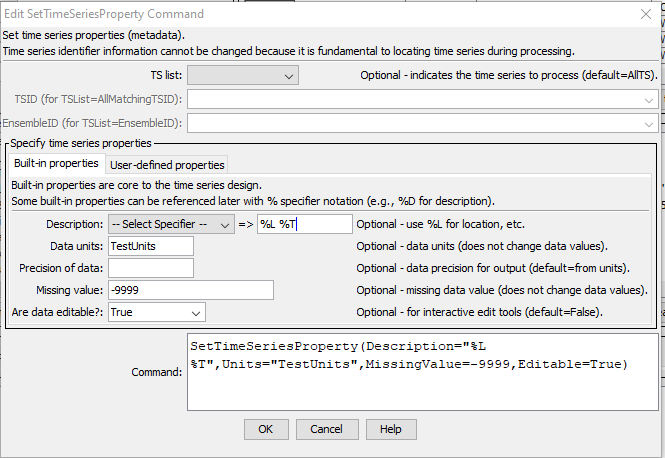

# TSTool / Command / SetTimeSeriesProperty #

* [Overview](#overview)
* [Command Editor](#command-editor)
* [Command Syntax](#command-syntax)
* [Examples](#examples)
* [Troubleshooting](#troubleshooting)
* [See Also](#see-also)

-------------------------

## Overview ##

The `SetTimeSeriesProperty` command sets the value of one or more time series properties.
Properties that are used to uniquely identify the time series (location identifier, data source, data type, interval, scenario)
cannot be set because other commands
need to rely on this information to reference the time series.

Built-in properties are those that are part of the internal time series data object (units, precision, description, etc.)
and can be referenced using `%` format specifiers in some commands.

User-defined properties are handled as a list of properties and can be referenced by other commands using the `${ts:Property}` notation.
See also the [`SetTimeSeriesPropertiesFromTable`](../SetTimeSeriesPropertiesFromTable/SetTimeSeriesPropertiesFromTable.md) and
[`SelectTimeSeries`](../SelectTimeSeries/SelectTimeSeries.md) commands.
Property names are case-specific.

## Command Editor ##

The following dialog is used to edit the command and illustrates the command syntax for built-in properties.

**<p style="text-align: center;">

</p>**

**<p style="text-align: center;">
`SetTimeSeriesProperty` Command Editor for Built-in Properties (<a href="../SetTimeSeriesProperty.png">see also the full-size image</a>)
</p>**

The following dialog is used to edit the command and illustrates the command syntax for user-defined properties.

**<p style="text-align: center;">

</p>**

**<p style="text-align: center;">
`SetTimeSeriesProperty` Command Editor for User-defined Properties (<a href="../SetTimeSeriesProperty_User.png">see also the full-size image</a>)
</p>**

## Command Syntax ##

The command syntax is as follows:

```text
SetTimeSeriesProperty(Parameter="Value",...)
```
**<p style="text-align: center;">
Command Parameters
</p>**

| **Scope** | **Parameter**&nbsp;&nbsp;&nbsp;&nbsp;&nbsp;&nbsp;&nbsp;&nbsp;&nbsp;&nbsp;&nbsp;&nbsp; | **Description** | **Default**&nbsp;&nbsp;&nbsp;&nbsp;&nbsp;&nbsp;&nbsp;&nbsp;&nbsp;&nbsp;&nbsp;&nbsp;&nbsp;&nbsp;&nbsp;&nbsp;&nbsp;&nbsp;&nbsp;&nbsp;&nbsp;&nbsp;&nbsp;&nbsp; |
| -----------|---|-----------------|----------------- |
| **All** |`TSList`|Indicates the list of time series to be processed, one of:<br><br><ul><li>`AllMatchingTSID` – all time series that match the TSID (single TSID or TSID with wildcards) will be modified.</li><li>`AllTS`– all time series before the command.</li><li>`EnsembleID` – all time series in the ensemble will be modified.</li><li>`FirstMatchingTSID` – the first time series that matches the TSID (single TSID or TSID with wildcards) will be modified.</li><li>`LastMatchingTSID` – the last time series that matches the TSID (single TSID or TSID with wildcards) will be modified.</li><li>`SelectedTS` – the time series are those selected with the [`SelectTimeSeries`](../SelectTimeSeries/SelectTimeSeries.md) command.|`AllTS`|
| |`TSID`|The time series identifier or alias for the time series to be modified, using the `*` wildcard character to match multiple time series.  Can be specified using `${Property}` syntax.|Required if `TSList=*TSID`|
| |`EnsembleID`|The ensemble to be modified, if processing an ensemble.  Can be specified using `${Property}` syntax.|Required if `TSList=EnsembleID`|
| **Built-in** | `Description`|The description to assign to the time series.  Can be specified using `${Property}` syntax.|None.|
| |`Units`|The data units to assign to the time series.  The units should agree with the time series data values.  Can be specified using `${Property}` syntax.|None.|
| |`Precision`| Number of digits after the decimal point when formatting data for output. Can be specified using `${Property}`.| Commands and visualization tools may determine the precision from the data units or default for a software feature. |
| |`Editable`|If set to `True`, then graphing the time series will enable interactive editing features, including the ability to save the edited time series if the data management system supports this functionality.|`False`|
| **User-defined** | `PropertyName`|Name of user-defined property.||
| |`PropertyType`|Property type, to ensure proper initialization and data check. | Required if `PropertyName` is specified. |
| |`PropertyValue`|Value for property as a string but adhering to the property type requirements (e.g., date as a string must match format that can be parsed).  Specify `%` formatter to access a built-in time series property, `${ts:Property}` to access a user-defined time series property, and `${Property}` to access a processor property.|Required if `PropertyName` is specified.|

## Examples ##

See the [automated tests](https://github.com/OpenCDSS/cdss-app-tstool-test/tree/master/test/commands/SetTimeSeriesProperty).

## Troubleshooting ##

## See Also ##

* [`SelectTimeSeries`](../SelectTimeSeries/SelectTimeSeries.md) command.
* [`SetPropertyFromTimeSeries`](../SetPropertyFromTimeSeries/SetPropertyFromTimeSeries.md) command.
