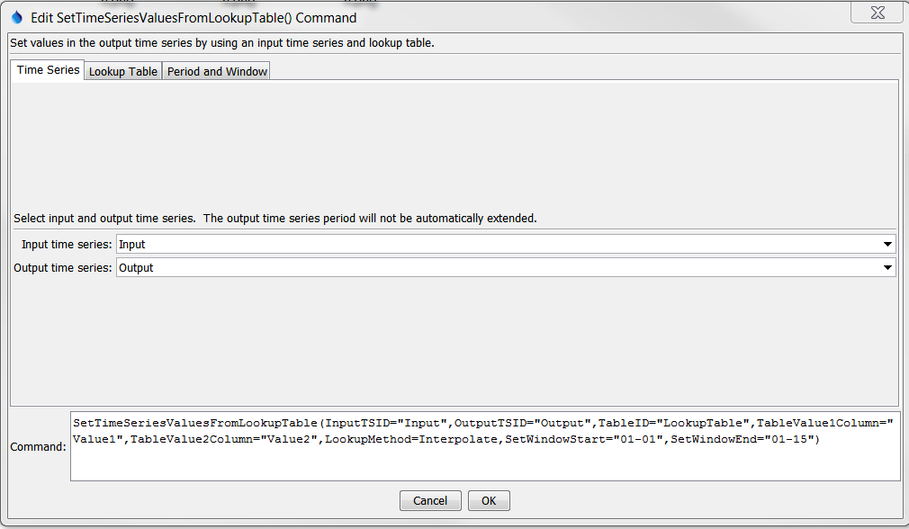
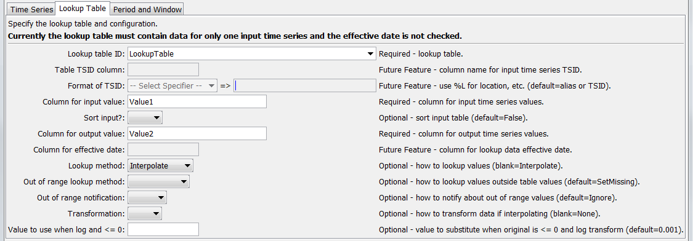
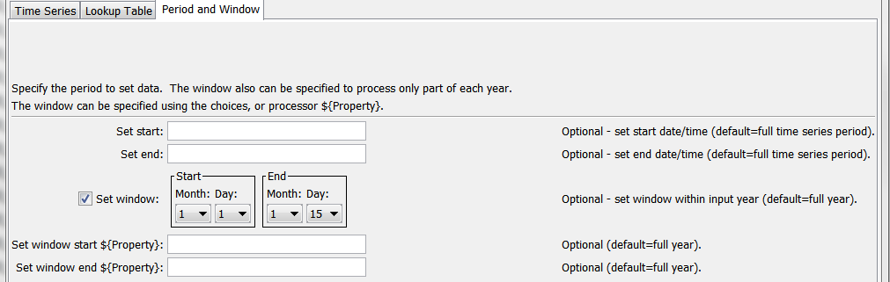

# TSTool / Command / SetTimeSeriesValuesFromLookupTable #

* [Overview](#overview)
* [Command Editor](#command-editor)
* [Command Syntax](#command-syntax)
* [Examples](#examples)
* [Troubleshooting](#troubleshooting)
* [See Also](#see-also)

-------------------------

## Overview ##

The `SetTimeSeriesValuesFromLookupTable` command uses an input time series and lookup
table to set values in the output time series.  Examples of using this command include:
	
* Converting reservoir elevation to storage, surface area, seepage, or other values
* Converting river stage to discharge
* Converting a time series to category values
* Lookup up values from a distribution

In many cases the lookup table will apply throughout the analysis period.
The values in the table should be sorted in ascending order prior to lookup.
**This command currently does not handle rating table shifts;
however, this capability may be added in the future.**
Missing (null) and NaN values in the lookup table are removed before
processing so that lookups are performed only on rows with input and output values.

## Command Editor ##

The following dialog is used to edit the command and illustrates the syntax of the command for time series parameters.
<a href="../SetTimeSeriesValuesFromLookupTable.png">See also the full-size image.</a>



**<p style="text-align: center;">
`SetTimeSeriesValuesFromLookupTable` Command Editor for Time Series Parameters
</p>**

The following dialog is used to edit the command and illustrates the syntax of the command for lookup parameters.
<a href="../SetTimeSeriesValuesFromLookupTable_Lookup.png">See also the full-size image.</a>



**<p style="text-align: center;">
`SetTimeSeriesValuesFromLookupTable` Command Editor for Time Series Parameters
</p>**

The following dialog is used to edit the command and illustrates the syntax of the command for time-related parameters.
<a href="../SetTimeSeriesValuesFromLookupTable_Time.png">See also the full-size image.</a>



**<p style="text-align: center;">
`SetTimeSeriesValuesFromLookupTable` Command Editor for Time-related Parameters
</p>**

## Command Syntax ##

The command syntax is as follows:

```text
SetTimeSeriesValuesFromLookupTable(Parameter="Value",...)
```
**<p style="text-align: center;">
Command Parameters
</p>**

|**Parameter**&nbsp;&nbsp;&nbsp;&nbsp;&nbsp;&nbsp;&nbsp;&nbsp;&nbsp;&nbsp;&nbsp;&nbsp;&nbsp;&nbsp;&nbsp;&nbsp;&nbsp;&nbsp;&nbsp;&nbsp;&nbsp;&nbsp;&nbsp;&nbsp;&nbsp;&nbsp;&nbsp;&nbsp;&nbsp;&nbsp;&nbsp;|**Description**|**Default**&nbsp;&nbsp;&nbsp;&nbsp;&nbsp;&nbsp;&nbsp;&nbsp;&nbsp;&nbsp;&nbsp;&nbsp;&nbsp;&nbsp;&nbsp;&nbsp;&nbsp;&nbsp;&nbsp;&nbsp;&nbsp;&nbsp;&nbsp;&nbsp;&nbsp;&nbsp;&nbsp;|
|--------------|-----------------|-----------------|
|`InputTSID`<br>**required**|The time series identifier or alias for the time series used as input.  Can be specified with `${Property}` notation.|None – must be specified.|
|`OutputTSID`<br>**required**|The time series identifier for the time series being modified.  Use the Edit button to edit the time series identifier parts.  Can be specified with `${Property}` notation.|None – must be specified.|
|`TableID`<br>**required**|The lookup table identifier.  Can be specified with `${Property}` notation.|None – must be specified.|
|`TableInputTSID`<br>**required**|The time series identifier or alias for the time series used as input.  Can be specified with `${Property}` notation.|None – must be specified.|
|`OutputTSID`<br>**required**|The time series identifier for the time series being modified.  Use the Edit button to edit the time series identifier parts.  Can be specified with `${Property}` notation.|None – must be specified.|
|`TableID`<br>**required**|The lookup table identifier.  Can be specified with `${Property}` notation.|None – must be specified.|
|`TableTSIDColumn`|Table column name that is used to match the time series identifier for processing.  **This parameter currently is not supported but will be enabled in the future.**|If not specified, it is assumed that the entire lookup table applies.|
|`TableTSIDFormat`|The specification to format the time series identifier to match the `TableTSIDColumn` column.  **This parameter currently is not supported but will be enabled in the future.**|Time series alias if available, or otherwise the time series identifier.|
|`TableValue1Column`<br>**required**|Table column name for data values that correspond to the input time series (`InputTSID`).  Can be specified with `${Property}` notation.|None – must be specified.|
|`SortInput`|Whether to sort the lookup table.  The order is checked to ensure the data are sorted but forcing the sort when not needed is a performance hit.|Rely on table being sorted.|
|`TableValue2Column`<br>**required**|Table column name for data values that correspond to the output time series identifier (`OutputTSID`).  Can be specified with `${Property}` notation.|None – must be specified.|
|`EffectiveDateColumn`|Table column name for the effective date.  **This parameter currently is not supported but will be enabled in the future.**|The lookup data apply to the entire period.|
|`LookupMethod`|Indicate how to select the value to use for output:<ul><li>`Interpolate` – interpolate between points if input values do not exactly align with table values; if `Transformation=Log`, then interpolation will use the transformed values</li><li>`PreviousValue` – pick the previous (smaller) value in the table (exact matches use the lookup table value)</li><li>`NextValue` – pick the next (largest) value in the table (exact matches use the lookup table value)</li></ul>|`Interpolate`|
|`OutOfRangeLookupMethod`|Indicate the value to use when estimating values that are outside the range of the rating table:<ul><li>`Extrapolate` – use the two known values at the end of the table to extrapolate; if `Transformation=Log`, then extrapolation will use the transformed values</li><li>`SetMissing` – set output to missing</li><li>`UseEndValue` – use the data value on the end</li></ul>|`SetMissing`|
|`OutOfRangeNotification`|Indicate the notification to generate when a value is outside the range of the lookup table:</ul><li>`Ignore` – do not generate warning or failure message</li><li>`Warn` – generate a warning message</li><li>`Fail` – generate a failure message</li></ul>|`Ignore`|
|`Transformation`|Indicates how to transform the data before interpolation, used when `LookupMethod=Interpolate` and `OutOfRangeMethod=Extrapolate`).  Specify as `None` to compare raw values or `Log` (for log10) to transform values before interpolation and extrapolation.  If the `Log` option is used, zero and negative values are replaced with the value specified by the `LEZeroLogValue` parameter value for analysis (missing data values are ignored in the analysis).|None (no transformation).|
|`LEZeroLogValue`|Value to use for data values less than or equal to zero when using a log transformation.|`.0010|`
|`SetStart`|The date/time to start setting values.  Can be specified with `${Property}` notation.|Set the full period.|
|`SetEnd`|The date/time to end setting values.  Can be specified with `${Property}` notation.|Set the full period.|
|`SetWindowStart`|The calendar date/time for the set start within each year.  Specify using the format `MM`, `MM-DD`, `MM-DD hh`, or `MM-DD hh:mm`, consistent with the time series interval precision.  A year of `2000` will be used internally to parse the date/time.  Use this parameter to limit data processing within the year, for example to output only a single month or a season.  A processor `${Property}` can be specified using the text field under the window date editor.|Lookup values for the full year.|
|`SetWindowEnd`|Specify date/time for the output end within each year.  See `SetWindowStart` for details.  A processor `${Property}` can be specified using the text field under the window date editor.|Lookup values for the full year.|

## Examples ##

See the [automated tests](https://github.com/OpenWaterFoundation/cdss-app-tstool-test/tree/master/test/regression/commands/general/SetTimeSeriesValuesFromLookupTable).

## Troubleshooting ##

## See Also ##

* [`SetTimeSeriesValuesFromTable`](../SetTimeSeriesValuesFromTable/SetTimeSeriesValuesFromTable) command
