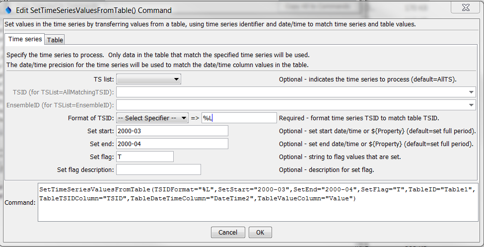
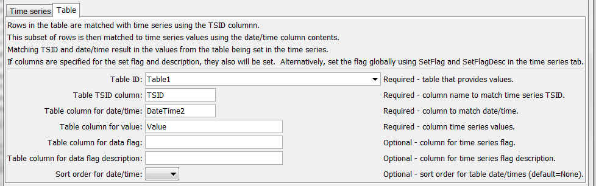

# TSTool / Command / SetTimeSeriesValuesFromTable #

* [Overview](#overview)
* [Command Editor](#command-editor)
* [Command Syntax](#command-syntax)
* [Examples](#examples)
* [Troubleshooting](#troubleshooting)
* [See Also](#see-also)

-------------------------

## Overview ##

The `SetTimeSeriesValuesFromTable` command sets values in time series by matching the TSID and date/time in a table.  Examples of use are:

* Provide data values from a table to override missing values in the time series
* Set a stream of values from a table into time series

## Command Editor ##

The following dialog is used to edit the command and illustrates the syntax of the command showing time series parameters.



**<p style="text-align: center;">
`SetTimeSeriesValuesFromTable` Command Editor Showing Time Series Parameters (<a href="../SetTimeSeriesValuesFromTable.png">see also the full-size image</a>)
</p>**

The following dialog is used to edit the command and illustrates the syntax of the command showing table parameters.



**<p style="text-align: center;">
`SetTimeSeriesValuesFromTable` Command Editor Showing Table Parameters (<a href="../SetTimeSeriesValuesFromTable_Table.png">see also the full-size image</a>)
</p>**

## Command Syntax ##

The command syntax is as follows:

```text
SetTimeSeriesValuesFromTable(Parameter="Value",...)
```
**<p style="text-align: center;">
Command Parameters
</p>**

|**Parameter**&nbsp;&nbsp;&nbsp;&nbsp;&nbsp;&nbsp;&nbsp;&nbsp;&nbsp;&nbsp;&nbsp;&nbsp;&nbsp;&nbsp;&nbsp;&nbsp;&nbsp;&nbsp;&nbsp;&nbsp;&nbsp;&nbsp;&nbsp;&nbsp;&nbsp;&nbsp;&nbsp;&nbsp;&nbsp;|**Description**|**Default**&nbsp;&nbsp;&nbsp;&nbsp;&nbsp;&nbsp;&nbsp;&nbsp;&nbsp;&nbsp;&nbsp;&nbsp;&nbsp;&nbsp;&nbsp;&nbsp;&nbsp;&nbsp;&nbsp;&nbsp;&nbsp;&nbsp;&nbsp;&nbsp;&nbsp;&nbsp;&nbsp;|
|--------------|-----------------|-----------------|
|`TSList`|Indicates the list of time series to be processed, one of:<br><ul><li>`AllMatchingTSID` – all time series that match the TSID (single TSID or TSID with wildcards) will be processed.</li><li>`AllTS` – all time series before the command.</li><li>`EnsembleID` – all time series in the ensemble will be processed (see the EnsembleID parameter).</li><li>`FirstMatchingTSID` – the first time series that matches the TSID (single TSID or TSID with wildcards) will be processed.</li><li>`LastMatchingTSID` – the last time series that matches the TSID (single TSID or TSID with wildcards) will be processed.</li><li>`SelectedTS` – the time series are those selected with the [`SelectTimeSeries`](../SelectTimeSeries/SelectTimeSeries.md) command.</li></ul> | `AllTS` |
|`TSID`|The time series identifier or alias for the time series to be processed, using the `*` wildcard character to match multiple time series.  Can be specified using `${Property}`.|Required if `TSList=*TSID`|
|`EnsembleID`|The ensemble to be processed, if processing an ensemble. Can be specified using `${Property}`.|Required if `TSList=*EnsembleID`|
|`TSIDFormat`|The specification to format the time series identifier to match the TableTSIDColumn column.  None – must be specified.|
|`SetStart`|The date/time to start setting values, or processor `${Property}`.|Set the full period.|
|`SetEnd`|The date/time to end setting values, or processor `${Property}`.|Set the full period.|
|`SetFlag`|String to flag values that are set, used for all time series.|No flag.|
|`SetFlagDesc`|Description for `SetFlag`.|Default.|
|`TableID`|The lookup table identifier.  Can specify using processor `${Property}`.|None – must be specified.|
|`TableTSIDColumn`|Table column name that is used to match the time series identifier for processing.|None – must be specified.|
|`TableDateTimeColumn`|Table column name that is used to match the date/time for processing time series values.|None – must be specified.|
|`TableValueColumn`|Table column name for data values to be set in the time series.|None – must be specified.|
|`TableSetFlagColumn`|Table column name for data flags to be set in the time series, will override `SetFlag`.|No flags will be set.|
|`TableSetFlagDescColumn`|Table column name for data flag descriptions for TableSetFlag, will override `SetFlagDesc`.|No flags will be set.|
|`SortOrder`|Indicate whether to sort the table rows by date/time.  After sorting, the first matched date/time will be set in the time series.|Currently sorting is not implemented – only one value per TSID-date/time combination should be present in the table.|

## Examples ##

See the [automated tests](https://github.com/OpenCDSS/cdss-app-tstool-test/tree/master/test/regression/commands/general/SetTimeSeriesValuesFromTable).

## Troubleshooting ##

## See Also ##

* [`SelectTimeSeries`](../SelectTimeSeries/SelectTimeSeries.md) command
* [`SetTimeSeriesValuesFromLookupTable`](../SetTimeSeriesValuesFromLookupTable/SetTimeSeriesValuesFromLookupTable.md) command
