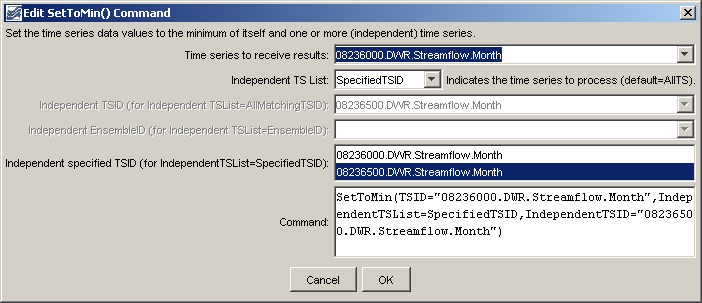

# TSTool / Command / SetToMin #

* [Overview](#overview)
* [Command Editor](#command-editor)
* [Command Syntax](#command-syntax)
* [Examples](#examples)
* [Troubleshooting](#troubleshooting)
* [See Also](#see-also)

-------------------------

## Overview ##

The `SetToMin` command sets a time series to contain, for each time step,
the minimum of its own values and those of one or more additional (independent) time series.
See also the [`SetToMax`](../SetToMax/SetToMax) command.

## Command Editor ##

The following dialog is used to edit the command and illustrates the syntax of the command.
<a href="../SetToMin.png">See also the full-size image.</a>



**<p style="text-align: center;">
`SetToMin` Command Editor
</p>**

## Command Syntax ##

The command syntax is as follows:

```text
SetToMin(Parameter="Value",...)
```
**<p style="text-align: center;">
Command Parameters
</p>**

|**Parameter**&nbsp;&nbsp;&nbsp;&nbsp;&nbsp;&nbsp;&nbsp;&nbsp;&nbsp;&nbsp;&nbsp;&nbsp;&nbsp;&nbsp;&nbsp;&nbsp;&nbsp;&nbsp;&nbsp;&nbsp;&nbsp;&nbsp;&nbsp;&nbsp;&nbsp;&nbsp;&nbsp;&nbsp;|**Description**|**Default**&nbsp;&nbsp;&nbsp;&nbsp;&nbsp;&nbsp;&nbsp;&nbsp;&nbsp;&nbsp;&nbsp;&nbsp;&nbsp;&nbsp;&nbsp;&nbsp;&nbsp;&nbsp;&nbsp;&nbsp;&nbsp;&nbsp;&nbsp;&nbsp;&nbsp;&nbsp;&nbsp;|
|--------------|-----------------|-----------------|
|`TSID`<br>**required**|The time series identifier or alias for the time series to be modified.|None – must be specified.|
|`IndependentTSList`|Indicates the list of time series to be processed, one of:<br><ul><li>`AllMatchingTSID` – all time series that match the TSID (single TSID or TSID with wildcards) will be processed.</li><li>`AllTS` – all time series before the command.</li><li>`EnsembleID` – all time series in the ensemble will be processed (see the EnsembleID parameter).</li><li>`FirstMatchingTSID` – the first time series that matches the TSID (single TSID or TSID with wildcards) will be processed.</li><li>`LastMatchingTSID` – the last time series that matches the TSID (single TSID or TSID with wildcards) will be processed.</li><li>`SelectedTS` – the time series are those selected with the [`SelectTimeSeries`](../SelectTimeSeries/SelectTimeSeries) command.</li><li>`SpecifiedTSID` – the specified list of time series given by the `IndependentTSID` parameter</li></ul>|`AllTS` (the time series receiving the result will not be included)|
|`IndependentTSID`|The time series identifier or alias for the time series to be processed, using the `*` wildcard character to match multiple time series.  Can be specified using `${Property}`.|Required if `IndependentTSList=*TSID`|
|`IndependentEnsembleID`|The ensemble to be processed, if processing an ensemble. Can be specified using `${Property}`.|Required if `IndependentTSList=*EnsembleID`|

## Examples ##

See the [automated tests](https://github.com/OpenWaterFoundation/cdss-app-tstool-test/tree/master/test/regression/commands/general/SetToMin).

A sample command file to process data from the [State of Colorado’s HydroBase database](../../datastore-ref/CO-HydroBase/CO-HydroBase)
is as follows:

```text
# 08236000 - ALAMOSA RIVER ABOVE TERRACE RESERVOIR
08236000.DWR.Streamflow.Month~HydroBase
# 08236500 - ALAMOSA RIVER BELOW TERRACE RESERVOIR
08236500.DWR.Streamflow.Month~HydroBase
SetToMin(TSID="08236000.DWR.Streamflow.Month",IndependentTSList=SpecifiedTSID,IndependentTSID="08236500.DWR.Streamflow.Month")
```

## Troubleshooting ##

## See Also ##

* [`SetToMax`](../SetToMax/SetToMax) command
