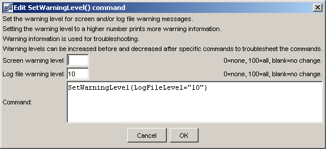

# TSTool / Command / SetWarningLevel #

*   [Overview](#overview)
*   [Command Editor](#command-editor)
*   [Command Syntax](#command-syntax)
*   [Examples](#examples)
*   [Troubleshooting](#troubleshooting)
*   [See Also](#see-also)

-------------------------

## Overview ##

The `SetWarningLevel` command sets the warning levels for the screen and log file.
Higher warning levels are useful for troubleshooting commands.
The higher the level, the more messages will be generated.
This command can be used multiple times, for example to isolate a problem.
Currently the warning level applies to all components.
In the future logging control may be grouped by component.
Levels are not completely consistent but the following guidelines can be followed:

*   `0` = no messages
*   `1` = important messages generated in applications
*   `2` = important messages generated in commands
*   `3+` = messages generated in commands that may explain other problems
*   `10+` = messages in processing code that may still be useful to end users
*   `30+` = low-level messages, for example generated while reading from files or databases

## Command Editor ##

The command is available in the following TSTool menu:

*   ***Commands / General - Logging and Messaging***

The following dialog is used to edit the command and illustrates the command syntax.

**<p style="text-align: center;">

</p>**

**<p style="text-align: center;">
`SetWarningLevel` Command Editor Showing Conditions Test (<a href="../SetWarningLevel.png">see also the full-size image</a>)
</p>**

## Command Syntax ##

The command syntax is as follows:

```text
SetWarningLevel(Parameter="Value",...)
```
**<p style="text-align: center;">
Command Parameters
</p>**

| **Parameter**&nbsp;&nbsp;&nbsp;&nbsp;&nbsp;&nbsp;&nbsp;&nbsp;&nbsp;&nbsp;&nbsp;&nbsp;&nbsp;&nbsp;&nbsp;&nbsp;&nbsp;&nbsp;&nbsp;&nbsp;&nbsp;&nbsp;&nbsp;&nbsp;&nbsp;&nbsp; | **Description** | **Default**&nbsp;&nbsp;&nbsp;&nbsp;&nbsp;&nbsp;&nbsp;&nbsp;&nbsp;&nbsp; |
| --------------|-----------------|----------------- |
|`ScreenLevel`|The warning level for the screen (0+).|Keep previous setting.|
|`LogFileLevel`|The warning level for the log file (0+).|Keep previous setting.|

## Examples ##

See the [automated tests](https://github.com/OpenCDSS/cdss-app-tstool-test/tree/master/test/commands/SetWarningLevel).

## Troubleshooting ##

See the main [TSTool Troubleshooting](../../troubleshooting/troubleshooting.md) documentation.

## See Also ##

*   [`SetDebugLevel`](../SetDebugLevel/SetDebugLevel.md) command
*   [`StartLog`](../StartLog/StartLog.md) command
