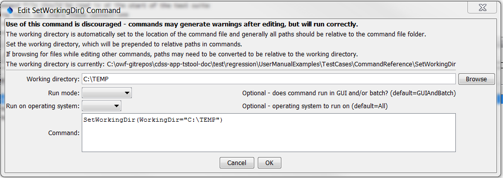

# TSTool / Command / SetWorkingDir #

*   [Overview](#overview)
*   [Command Editor](#command-editor)
*   [Command Syntax](#command-syntax)
*   [Examples](#examples)
*   [Troubleshooting](#troubleshooting)
*   [See Also](#see-also)

-------------------------

## Overview ##

The `SetWorkingDir` command sets the working directory for following commands.
The working directory is normally set in one of the following ways,
with the current setting being defined by the most recent action that has occurred:

1.  The startup directory for the TSTool program,
2.  The directory containing the most recently opened or saved command file.
3.  The directory specified by a `SetWorkingDir` command,
4.  The directory specified by ***File / Set Working Directory*** menu in TSTool.

**In most cases, a `SetWorkingDir` command is not needed and should be avoided because it may complicate commands and troubleshooting.**
However, for complicated command files that process data in multiple directories,
it may be useful to change the working directory during processing.
Setting the working directory to an absolute path causes all relative paths for
input and output files to be appended to the working directory.
Relative paths that use `../` can be specified to move up and down a directory tree.
The current working directory during processing is reset to the initial working directory
(the location of the command file) each time that the commands are run.

In any case, it is recommended that paths used in command parameters are specified
using relative paths (relative to the command file) so that command files
and associated data files can be easily moved from one computer to another.

## Command Editor ##

The command is available in the following TSTool menu:

*   ***Commands / Running and Properties***

The following dialog is used to edit the command and illustrates the command syntax.

**<p style="text-align: center;">

</p>**

**<p style="text-align: center;">
`SetWorkingDir` Command Editor (<a href="../SetWorkingDir.png">see also the full-size image</a>)
</p>**

## Command Syntax ##

The command syntax is as follows:

```text
SetWorkingDir(Parameter="Value",...)
```
**<p style="text-align: center;">
Command Parameters
</p>**

|**Parameter**&nbsp;&nbsp;&nbsp;&nbsp; | **Description** | **Default**&nbsp;&nbsp;&nbsp;&nbsp;&nbsp;&nbsp;&nbsp;&nbsp;&nbsp;&nbsp;&nbsp;&nbsp;&nbsp;&nbsp;&nbsp;&nbsp; |
| --------------|-----------------|----------------- |
|`WorkingDir`<br>**required**|The working directory that should be used.  Specify a relative path (e.g., `..`) to adjust the current working directory.  Can be specified using `{Property}`.|None – must be specified.|
|`RunMode`|Indicate the run mode in which the command should be applied, one of:<ul><li>`GUIOnly` – the command applies only to interactive runs</li><li>`GUIAndBatch` – the command applies to interactive and batch runs</li><li>`BatchOnly` – the command applies to batch runs only</li></ul>|`GUIAndBatch`|

## Examples ##

See the [automated tests](https://github.com/OpenCDSS/cdss-app-tstool-test/tree/master/test/commands/SetWorkingDir).

## Troubleshooting ##

## See Also ##

*   [`Message`](../Message/Message.md) command - can be used to output the working directory
