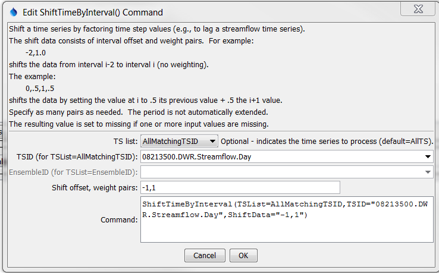
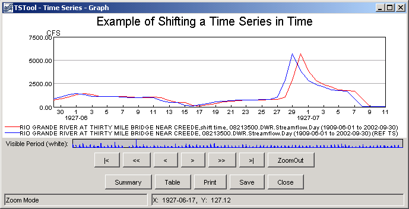

# TSTool / Command / ShiftTimeByInterval #

* [Overview](#overview)
* [Command Editor](#command-editor)
* [Command Syntax](#command-syntax)
* [Examples](#examples)
* [Troubleshooting](#troubleshooting)
* [See Also](#see-also)

-------------------------

## Overview ##

The `ShiftTimeByInterval` command shifts a time series in time.
This command can be used to perform a simple shift (e.g., to shift hourly data because the
[`Disaggregate`](../Disaggregate/Disaggregate.md) command did not
result in data being set at the desired hours) and to perform simple routing.

## Command Editor ##

The following dialog is used to edit the command and illustrates the syntax of the command.

**<p style="text-align: center;">

</p>**

**<p style="text-align: center;">
`ShiftTimeByInterval` Command Editor (<a href="../ShiftTimeByInterval.png">see also the full-size image</a>)
</p>**

## Command Syntax ##

The command syntax is as follows:

```text
ShiftTimeByInterval(Parameter="Value",...)
```
**<p style="text-align: center;">
Command Parameters
</p>**

|**Parameter**&nbsp;&nbsp;&nbsp;&nbsp;&nbsp;&nbsp;&nbsp;&nbsp;&nbsp;&nbsp;&nbsp;|**Description**|**Default**&nbsp;&nbsp;&nbsp;&nbsp;&nbsp;&nbsp;&nbsp;&nbsp;&nbsp;&nbsp;&nbsp;&nbsp;&nbsp;&nbsp;&nbsp;&nbsp;&nbsp;&nbsp;&nbsp;&nbsp;&nbsp;&nbsp;&nbsp;&nbsp;&nbsp;&nbsp;&nbsp;|
|--------------|-----------------|-----------------|
|`TSList`|Indicates the list of time series to be processed, one of:<br><ul><li>`AllMatchingTSID` – all time series that match the TSID (single TSID or TSID with wildcards) will be processed.</li><li>`AllTS` – all time series before the command.</li><li>`EnsembleID` – all time series in the ensemble will be processed (see the EnsembleID parameter).</li><li>`FirstMatchingTSID` – the first time series that matches the TSID (single TSID or TSID with wildcards) will be processed.</li><li>`LastMatchingTSID` – the last time series that matches the TSID (single TSID or TSID with wildcards) will be processed.</li><li>`SelectedTS` – the time series are those selected with the [`SelectTimeSeries`](../SelectTimeSeries/SelectTimeSeries.md) command.</li></ul> | `AllTS` |
|`TSID`|The time series identifier or alias for the time series to be processed, using the `*` wildcard character to match multiple time series.  Can be specified using `${Property}`.|Required if `TSList=*TSID`|
|`EnsembleID`|The ensemble to be processed, if processing an ensemble. Can be specified using `${Property}`.|Required if `TSList=*EnsembleID`|
|`ShiftData`|Interval,multiplier tuples to apply to the data to perform the shift.  All values should be separated by commas.  An interval of `-1` indicates that the previous time step should be shifted to the current time step.  If the interval is `–1` and the multiplier is `1`, the previous time step is shifted to the current and multiplied by `1`, effectively shifting the time series by one interval.|None – at least 1 `value,multiplier` tuple must be specified.}

## Examples ##

See the [automated tests](https://github.com/OpenCDSS/cdss-app-tstool-test/tree/master/test/regression/commands/general/ShiftTimeByInterval).

A sample command file to shift a time series from the [State of Colorado’s HydroBase database](../../datastore-ref/CO-HydroBase/CO-HydroBase.md)
is as follows:

```text
# 08213500 - RIO GRANDE RIVER AT THIRTY MILE BRIDGE NEAR CREEDE
08213500.DWR.Streamflow.Day~HydroBase
ShiftTimeByInterval(TSList=AllMatchingTSID,TSID="08213500.DWR.Streamflow.Day",ShiftData="-1,1")
08213500.DWR.Streamflow.Day~HydroBase
```
The following is the result.

**<p style="text-align: center;">

</p>**

**<p style="text-align: center;">
Results from `ShiftTimeByInterval` Command (<a href="../ShiftTimeByInterval_Graph.png">see also the full-size image</a>)
</p>**

## Troubleshooting ##

## See Also ##

* [`Disaggregate`](../Disaggregate/Disaggregate.md) command
* [`SelectTimeSeries`](../SelectTimeSeries/SelectTimeSeries.md) command
