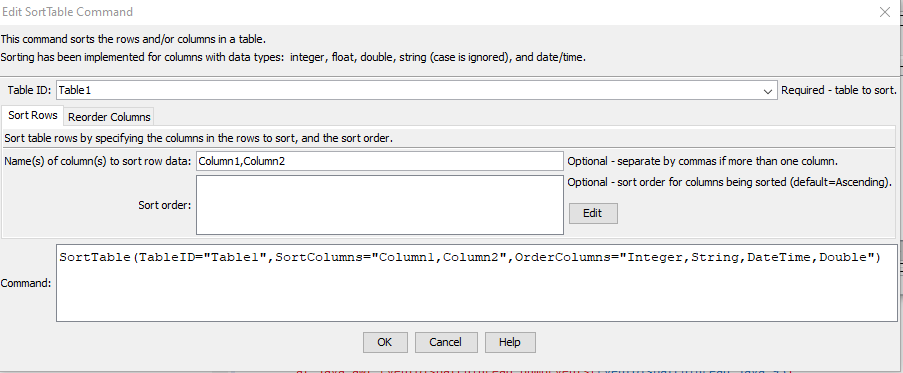
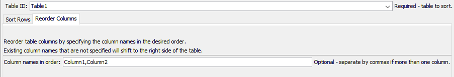

# TSTool / Command / SortTable #

*   [Overview](#overview)
*   [Command Editor](#command-editor)
*   [Command Syntax](#command-syntax)
*   [Examples](#examples)
*   [Troubleshooting](#troubleshooting)
*   [See Also](#see-also)

-------------------------

## Overview ##

The `SortTable` command sorts rows and/or columns in a table:

*   sort rows:
    +   specify one or more columns
    +   the column(s) to be sorted can be of type string, integer, double, float, or date/time.
    +   strings are sorted by ignoring case
*   sort columns:
    +   specify one or more columns
    +   columns that are not sorted are shifted to the right side of the table

## Command Editor ##

The command is available in the following TSTool menu:

*   ***Commands(Table) / Manipulate Table Values***

The following dialog is used to edit the command and illustrates the command syntax.

**<p style="text-align: center;">

</p>**

**<p style="text-align: center;">
`SortTable` Command Editor for Row Sort Parameters (<a href="../SortTable-rows.png">see full-size image</a>)
</p>**

**<p style="text-align: center;">

</p>**

**<p style="text-align: center;">
`SortTable` Command Editor for Column Reorder Parameters (<a href="../SortTable-columns.png">see full-size image</a>)
</p>**

## Command Syntax ##

The command syntax is as follows:

```text
SortTable(Parameter="Value",...)
```
**<p style="text-align: center;">
Command Parameters
</p>**

| **Parameter**&nbsp;&nbsp;&nbsp;&nbsp;&nbsp;&nbsp;&nbsp;&nbsp;&nbsp;&nbsp;&nbsp;&nbsp; | **Description** | **Default**&nbsp;&nbsp;&nbsp;&nbsp;&nbsp;&nbsp;&nbsp;&nbsp;&nbsp;&nbsp; |
| --------------|-----------------|----------------- |
|`TableID`|The identifier for the table.  Can be specified using processor `${Property}`.|  |
|`SortColumns`| When sorting rows, specify the names of columns to sort, separated by commas. | None – must be specified.|
|`SortOrder`|The sort order for columns specified by `SortColumns`, using the syntax:<br>`SortColumn1:Ascending,SortColumn2:Descending`<br>As indicated in the above example, the sort order must be specified as one of the following:<ul><li>`Ascending`</li><li>`Descending`</li></ul>|`Ascending`|
|`OrderColumns`| When reordering columns, specify the names of columns in the desired order, separated by commas.  | |

## Examples ##

See the [automated tests](https://github.com/OpenCDSS/cdss-app-tstool-test/tree/master/test/commands/SortTable).

## Troubleshooting ##

See the main [TSTool Troubleshooting](../../troubleshooting/troubleshooting.md) documentation.

## See Also ##

*   [`NewTable`](../NewTable/NewTable.md) command
