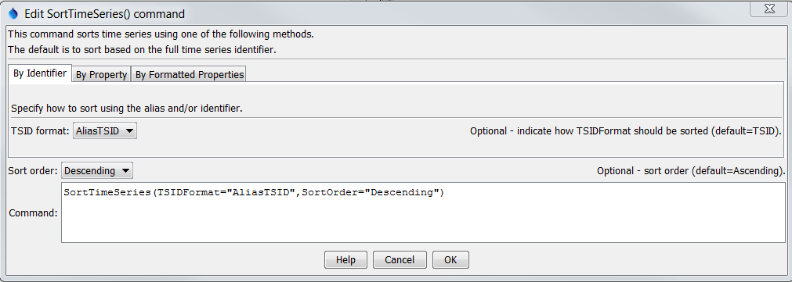
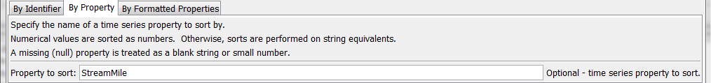
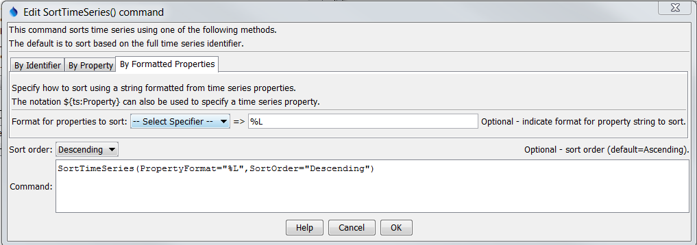

# TSTool / Command / SortTimeSeries #

*   [Overview](#overview)
*   [Command Editor](#command-editor)
*   [Command Syntax](#command-syntax)
*   [Examples](#examples)
*   [Troubleshooting](#troubleshooting)
*   [See Also](#see-also)

-------------------------

## Overview ##

The `SortTimeSeries` command sorts time series based on the specified criteria:

*   the time series identifier or alias
*   a time series property
*   a string formatted from time series properties

This command is useful for ordering time series before writing output or visualization.

## Command Editor ##

The command is available in the following TSTool menu:

*   ***Commands / Select, Free, Sort Time Series***

The following dialog is used to edit the command and illustrates the syntax of the command.

**<p style="text-align: center;">

</p>**

**<p style="text-align: center;">
`SortTimeSeries` Command Editor to Sort by TSID or Alias (<a href="../SortTimeSeries.png">see also the full-size image</a>)
</p>**

The following dialog is used to edit the command and illustrates the syntax of the command when sorting by a property.

**<p style="text-align: center;">

</p>**

**<p style="text-align: center;">
`SortTimeSeries` Command Editor to Sort by a Time Series Property (<a href="../SortTimeSeries_Property.png">see also the full-size image</a>)
</p>**

The following dialog is used to edit the command and illustrates the syntax of the command for property formatting.

**<p style="text-align: center;">

</p>**

**<p style="text-align: center;">
`SortTimeSeries` Command Editor to Sort by a Time Series Formatted Property (<a href="../SortTimeSeries_PropertyFormat.png">see also the full-size image</a>)
</p>**

## Command Syntax ##

The command syntax is as follows:

```text
SortTimeSeries(Parameter="Value",...)
```
**<p style="text-align: center;">
Command Parameters
</p>**

| **Parameter**&nbsp;&nbsp;&nbsp;&nbsp;&nbsp;&nbsp;&nbsp;&nbsp;&nbsp;&nbsp;&nbsp;&nbsp;&nbsp; | **Description** | **Default**&nbsp;&nbsp;&nbsp;&nbsp;&nbsp;&nbsp;&nbsp;&nbsp;&nbsp;&nbsp;&nbsp;&nbsp;&nbsp;&nbsp;&nbsp;&nbsp;&nbsp;&nbsp;&nbsp;&nbsp;&nbsp;&nbsp;&nbsp;&nbsp;&nbsp;&nbsp;&nbsp; |
| --------------|-----------------|----------------- |
|`TSIDFormat`|Sort by alias or TSID, determining the identifier for each time series as per the parameter value:<ul><li>`AliasTSID` – use the alias if available, and if not use the TSID</li><li>`TSID` – Use the TSID only (regardless of whether the alias is available)|`TSID`|
|`Property`|Sort using the values of the specified time series property.  Nulls are treated as blanks if strings and very small number for integers and floating point numbers.||
|`PropertyFormat`|Sort using a string that formats one or more time series properties, indicated with:<ul><li>`%`-specifiers (e.g., `%L` for location ID)</li><li>`${ts:property}` notation||
|`SortOrder`|Sort order, either `Ascending` or `Descending`.|`Ascending`|

## Examples ##

See the [automated tests](https://github.com/OpenCDSS/cdss-app-tstool-test/tree/master/test/commands/SortTimeSeries).

A sample command file using data from the [State of Colorado’s HydroBase database](../../datastore-ref/CO-HydroBase/CO-HydroBase.md) is as follows:

```
06756500.USGS.Streamflow.Month~HydroBase
# 06758300 - KIOWA CREEK AT BENNETT, CO.
06758300.USGS.Streamflow.Month~HydroBase
# 06758000 - KIOWA CREEK AT ELBERT, CO.
06758000.USGS.Streamflow.Month~HydroBase
# 06757600 - KIOWA CREEK AT K-79 RES, NEAR EASTONVILLE, CO.
06757600.DWR.Streamflow.Month~HydroBase
# 06758200 - KIOWA CREEK AT KIOWA, CO.
06758200.USGS.Streamflow.Month~HydroBase
# 06753400 - LONETREE CREEK AT CARR, CO.
06753400.USGS.Streamflow.Month~HydroBase
# 06753990 - LONETREE CREEK NEAR GREELEY, CO.
06753990.USGS.Streamflow.Month~HydroBase
# 06753500 - LONETREE CREEK NEAR NUNN, CO.
06753500.USGS.Streamflow.Month~HydroBase
# 06759910 - SOUTH PLATTE RIVER AT COOPER BRIDGE NEAR BALZAC
06759910.DWR.Streamflow.Month~HydroBase
# 06759500 - SOUTH PLATTE RIVER AT FORT MORGAN
06759500.USGS.Streamflow.Month~HydroBase
# 06756995 - SOUTH PLATTE RIVER AT MASTERS, CO.
06756995.USGS.Streamflow.Month~HydroBase
# 06757000 - SOUTH PLATTE RIVER AT SUBLETTE, CO.
06757000.USGS.Streamflow.Month~HydroBase
# 06754000 - SOUTH PLATTE RIVER NEAR KERSEY
06754000.DWR.Streamflow.Month~HydroBase
# 06758500 - SOUTH PLATTE RIVER NEAR WELDONA
06758500.DWR.Streamflow.Month~HydroBase
# 06758100 - WEST KIOWA CREEK AT ELBERT, CO.
06758100.USGS.Streamflow.Month~HydroBase
SortTimeSeries()
```

## Troubleshooting ##

See the main [TSTool Troubleshooting](../../troubleshooting/troubleshooting.md) documentation.

## See Also ##
