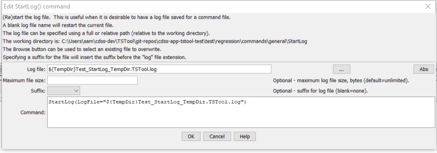

# Learn TSTool / Command / StartLog #

* [Overview](#overview)
* [Command Editor](#command-editor)
* [Command Syntax](#command-syntax)
* [Examples](#examples)
* [Troubleshooting](#troubleshooting)
* [See Also](#see-also)

-------------------------

## Overview ##

The `StartLog` command (re)starts the log file. It is useful to insert this command as the first
command in a command file, in order to persistently record the results of processing. A useful standard is
to name the log file the same as the command file, with an additional `.log` extension, and this convention
is enforced by default.  A date or date/time can optionally be added to the log file name.

## Command Editor ##

The following dialog is used to edit the command and illustrates the command syntax.
<a href="../StartLog.png">See also the full-size image.</a>



**<p style="text-align: center;">
`StartLog` Command Editor
</p>**

## Command Syntax ##

The command syntax is as follows:

```text
StartLog(Parameter="Value",...)
```
**<p style="text-align: center;">
Command Parameters
</p>**

| **Parameter**&nbsp;&nbsp;&nbsp;&nbsp;&nbsp;&nbsp;&nbsp;&nbsp;&nbsp;&nbsp;&nbsp;&nbsp;&nbsp;&nbsp;&nbsp;&nbsp;&nbsp;&nbsp;&nbsp;&nbsp;&nbsp;&nbsp;&nbsp;&nbsp;&nbsp;&nbsp; | **Description** | **Default**&nbsp;&nbsp;&nbsp;&nbsp;&nbsp;&nbsp;&nbsp;&nbsp;&nbsp;&nbsp; |
| --------------|-----------------|----------------- |
| `LogFile`<br>**required** | The name of the file to write.  The extension of `.log` will automatically be added, if not specified.  Can be specified using `${Property}`. | None - must be specified. |
| `Suffix` | Indicates that a suffix will be added before the `.log` extension, one of:<br><br><ul><li>`Date` – add a date suffix of the form `YYYYMMDD`.</li><li>`DateTime` – add a date/time suffix of the form `YYYYMMDD_HHMMSS`.</li></ul><br><br>This is useful for automatically archiving logs corresponding to commands files, to allow checking the output at a later time.  However, generating date/time stamped log files can increase the amount of disk space that is used. |

## Examples ##

See the [automated tests](https://github.com/OpenWaterFoundation/cdss-app-tstool-test/tree/master/test/regression/commands/general/StartLog).

A sample command file to process State of Colorado HydroBase data is as follows
(the [`Add`](../Add/Add) command will generate an error because the units of the time series are incompatible):

```
StartLog(LogFile="Example_StartLog.log")
# 06753400 - LONETREE CREEK AT CARR, CO.
06753400.USGS.Streamflow.Month~HydroBase
# 1179 - BYERS 5 ENE
1179.NOAA.Precip.Month~HydroBase
Add(TSID="06753400.USGS.Streamflow.Month",AddTSList=AllTS,HandleMissingHow="IgnoreMissing")
```

## Troubleshooting ##

## See Also ##

* [`Message`](../Message/Message) command - can be used to write messages to the log file
