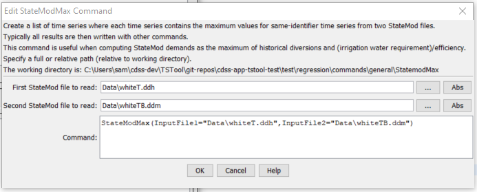

# TSTool / Command / StateModMax #

*   [Overview](#overview)
*   [Command Editor](#command-editor)
*   [Command Syntax](#command-syntax)
*   [Examples](#examples)
*   [Troubleshooting](#troubleshooting)
*   [See Also](#see-also)

-------------------------

## Overview ##

The `StateModMax` command performs the following actions:

1.  Read all time series from one StateMod time series file,
2.  Read all time series from a second StateMod time series file,
3.  Generate a list of time series that contains the maximum values comparing
    matching time series (using the location identifier).
    The first list is updated and the second list is discarded.

This command is useful, for example, when creating a demand time series file that
is to be the maximum of historical diversions and irrigation water
requirement divided by an average efficiency.
It is assumed that the specified time series have matching identifiers (the
first file is used as the master list) and have consistent units and data intervals.
After the time series have been processed, they can be viewed or written out as a new StateMod file (see the
[`WriteStateMod`](../WriteStateMod/WriteStateMod.md) command).

**This legacy command is very specific and a more general version may be implemented in the future.**

## Command Editor ##

The command is available in the following TSTool menu:

*   ***Commands / Read Time Series***

The following dialog is used to edit the command and illustrates the syntax of the command.

**<p style="text-align: center;">

</p>**

**<p style="text-align: center;">
`StateModMax` Command Editor (<a href="../StateModMax.png">see also the full-size image</a>)
</p>**

## Command Syntax ##

The command syntax is as follows:

```text
StateModMax(Parameter="Value",...)
```
**<p style="text-align: center;">
Command Parameters
</p>**

|**Parameter**&nbsp;&nbsp;&nbsp;&nbsp;&nbsp;&nbsp;&nbsp;&nbsp;&nbsp;&nbsp;&nbsp;|**Description**|**Default**&nbsp;&nbsp;&nbsp;&nbsp;&nbsp;&nbsp;&nbsp;&nbsp;&nbsp;&nbsp;&nbsp;&nbsp;&nbsp;&nbsp;&nbsp;&nbsp;&nbsp;&nbsp;&nbsp;&nbsp;&nbsp;&nbsp;&nbsp;&nbsp;&nbsp;&nbsp;&nbsp;|
|--------------|-----------------|-----------------|
|`InputFile1`|The name of the first StateMod time series file to read, surrounded by double quotes.  The path to the file can be absolute or relative to the working directory.|None – must be specified.|
|`InputFile2`|The name of the second StateMod time series file to read, which must have the same data interval and units as the first file.|None – must be specified.|

## Examples ##

See the [automated tests](https://github.com/OpenCDSS/cdss-app-tstool-test/tree/master/test/commands/StateModMax).

A sample command file is as follows:

```text
StateModMax("rgTW.ddh","rgTWC_prelim.ddm")
WriteStateMod(OutputFile="rgTW.ddm")
```

## Troubleshooting ##

See the main [TSTool Troubleshooting](../../troubleshooting/troubleshooting.md) documentation.

## See Also ##

*   [`WriteStateMod`](../WriteStateMod/WriteStateMod.md) command
