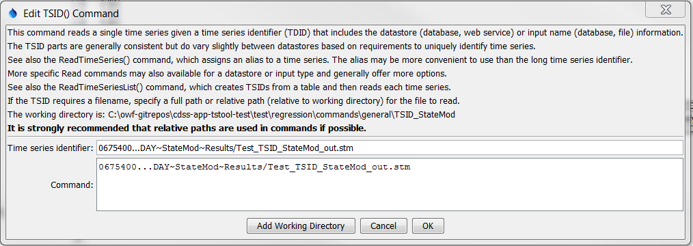
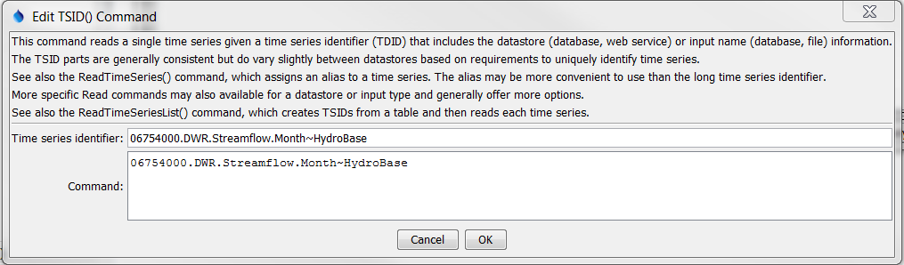

# TSTool / Command / TSID #

*   [Overview](#overview)
*   [Command Editor](#command-editor)
*   [Command Syntax](#command-syntax)
*   [Examples](#examples)
*   [Troubleshooting](#troubleshooting)
*   [See Also](#see-also)

-------------------------

## Overview ##

A time series identifier (TSID) command reads a single time series.
This is one of the few TSTool commands that does not follow the `Command(ParameterName=ParameterValue,...)` syntax.
Time series are read using one of the following commands:

*   `TSID` - implicitly reads time series consistent with the datastore or data type specified by the `~datastore`
    at the end of the TSID.
*   [`ReadTimeSeries`](../ReadTimeSeries/ReadTimeSeries.md) command,
    which provides general parameters to control the read, such as alias to assign.
*   [`ReadTimeSeriesList`](../ReadTimeSeriesList/ReadTimeSeriesList.md) command,
    which reads multiple time series given a list of time series in a table.
*   Specific `Read....` command consistent with the TSID, in order to provide controlling parameters
    specific to the datastore.
    For example, the [`ReadColoradoHydroBaseRest`](../ReadColoradoHydroBaseRest/ReadColoradoHydroBaseRest.md) command
    provides parameters to control filling additional missing values with zeros.

In order to read the time series from a persistent format (database, file, or web site),
the TSID must contain the datastore name (or input type), and if necessary, the input name.
For example, a TSID command for the
[State of Colorado’s StateMod model file format](../../datastore-ref/StateMod/StateMod.md) is of the form:

```
LocationID…Month~StateMod~Filename
```

Refer to the documentation for the datastore or input type to understand the format of the TSID.
The TSTool main interface can be used to interactively format TSIDs in many cases.

After executing the command, the time series will have the identifier as originally requested,
with no alias being assigned.
Use [`ReadTimeSeries`](../ReadTimeSeries/ReadTimeSeries.md)
command to assign an alias to the time series, or use one of the specific read commands.

## Command Editor ##

The command is available in the following TSTool menu:

*   ***Commands / Create Time Series***

The following dialog is used to edit the command and illustrates the syntax of the command.
Limited checks are done while editing the command (e.g., verify that a valid data interval is used).
Once the command is saved, TSTool will attempt to read the time series metadata and
will issue a warning if unable to read the data.
Time series identifiers that include filenames should typically be adjusted to a
relative path to allow the files to be moved to another location and run without errors.

**<p style="text-align: center;">

</p>**

**<p style="text-align: center;">
`TSID` Command Editor for a Time Series Read from a StateMod File (<a href="../TSID-StateMod.png">see full-size image</a>)
</p>**

The following example is for a TSID for the
[State of Colorado’s HydroBase database](../../datastore-ref/CO-HydroBase/CO-HydroBase.md).
In this case the datastore name is specified at the end of the TSID.

**<p style="text-align: center;">

</p>**

**<p style="text-align: center;">
`TSID` Command Editor for a Time Series Read from a HydroBase Database (<a href="../TSID-HydroBase.png">see full-size image</a>)
</p>**

## Command Syntax ##

The command syntax is as follows with the details varying based on the data source:

```text
[LocationType:]Location.Source.DataType.Interval.Scenario[SequenceID]
```

## Examples ##

See the [automated tests](https://github.com/OpenCDSS/cdss-app-tstool-test/tree/master/test/commands)
for various datastores and input types (see `TSID` in folder names).

A sample command file to read a time series from the [State of Colorado’s StateMod](../../datastore-ref/StateMod/StateMod.md) is as follows.
In this case the absolute paths have been adjusted to relative paths using the command editor dialog.
Note also that the data source and data type are not required in this example because this information is not stored in the StateMod file.

```
09303000...MONTH~StateMod~whiteT.rih
09303400...MONTH~StateMod~whiteT.rih
```

A sample command file to read time series from the [State of Colorado’s HydroBase database](../../datastore-ref/CO-HydroBase/CO-HydroBase.md) is as follows:

```
# 06754000 - SOUTH PLATTE RIVER NEAR KERSEY
06754000.DWR.Streamflow.Month~HydroBase
# 06758500 - SOUTH PLATTE RIVER NEAR WELDONA
06758500.DWR.Streamflow.Month~HydroBase
```

## Troubleshooting ##

See the main [TSTool Troubleshooting](../../troubleshooting/troubleshooting.md) documentation.

## See Also ##

*   [`ReadTimeSeries`](../ReadTimeSeries/ReadTimeSeries.md) command
*   [`ReadTimeSeriesList`](../ReadTimeSeriesList/ReadTimeSeriesList.md) command
