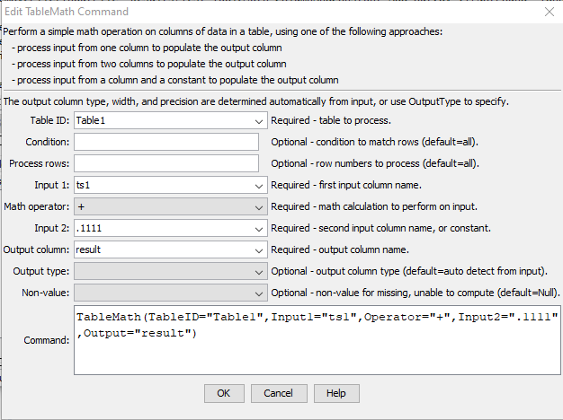

# TSTool / Command / TableMath #

*   [Overview](#overview)
    +   [Input](#input)
    +   [Output](#output)
*   [Command Editor](#command-editor)
*   [Command Syntax](#command-syntax)
    +   [Supported Operators and Input](#supported-operators-and-input)
*   [Examples](#examples)
*   [Troubleshooting](#troubleshooting)
*   [See Also](#see-also)

-------------------------

## Overview ##

The `TableMath` command performs a simple math operation on columns in a table.
This command and related table commands are not an attempt to replace full-feature spreadsheet
programs but are intended to help automate common data processing tasks.
Additional table processing commands are available to manipulate table data that can be input
to this command or further process this command's output.
It is often helpful to perform operations that create new table columns in order
to understand data processing workflow.

### Input ###

The input is specified by a table column name (`Input1`) and one of the following (`Input2`),
depending on the operator:

*   no second input, for example for `ToInteger` operation
*   second input column, for example to add values of each column
*   constant input value, for example to add a constant to all values in a column
*   inputs can generally be any combination of double precision and integer values

The second input value (`Input2`) can be a column name or a constant value,
with the result being placed in the output column (`Output`).

### Output ###

The table output column values are computed as follows.

*   output that cannot be computed is set to the `NonValue` value
*   inputs can generally be any combination of double precision and integer values
    and output will result from an automatic conversion:
    +   if a floating point number is in input (even if other input is an integer),
        the output will be floating point
    +   the width and precision for column properties will be set to the maximum
        of the input column properties

## Command Editor ##

The command is available in the following TSTool menu:

*   ***Commands(Table) / Manipulate Table Values***

The following dialog is used to edit the command and illustrates the syntax of the
command (in this case illustrating how values in a column named `ts1` are added to the number `.1111.`

**<p style="text-align: center;">

</p>**

**<p style="text-align: center;">
`TableMath` Command Editor (<a href="../TableMath.png">see full-size image</a>)
</p>**

## Command Syntax ##

The command syntax is as follows:

```text
TableMath(Parameter="Value",...)
```
**<p style="text-align: center;">
Command Parameters
</p>**

| **Parameter**&nbsp;&nbsp;&nbsp;&nbsp;&nbsp;&nbsp;&nbsp;&nbsp;&nbsp;&nbsp;&nbsp;&nbsp;&nbsp;&nbsp;&nbsp;&nbsp;&nbsp;&nbsp;&nbsp;&nbsp;&nbsp;&nbsp;&nbsp;&nbsp;&nbsp;&nbsp; | **Description** | **Default**&nbsp;&nbsp;&nbsp;&nbsp;&nbsp;&nbsp;&nbsp;&nbsp;&nbsp;&nbsp; |
| --------------|-----------------|----------------- |
|`TableID`<br>**required**|The identifier for the table to process, can be specified with `${Property}`.|None – must be specified.|
|`Condition`|A condition to match rows to be deleted. Can use `${Property}` to specify row number.  See additional information in the [Tables appendix](../../processing/tables/tables.md#condition-evaluation-for-rows).|Condition or row number must be specified.|
|`DeleteRowNumbers`|The row number(s) to process as comma-separated list of row numbers, currently limited to:</li><li>`first` - process the first row in the table</li><li>`last` - process the last row in the table</li></ul><br> Can use `${Property}`.| Process all rows.|
|`Input1`<br>**required**|First input column name, can be specified with `${Property}`.|None – must be specified.|
|`Operator`<br>**required**|The operator to be applied as follows:<br>`Input1 Operator Input2 = Output`<br>For example: `Input1 * Input2 = Output`|None – must be specified.|
|`Input2`|Second input column name, or a constant value to use as input, can be specified with `${Property}`.|Required for some operators.  Not required for `ToInteger`.|
|`Output`<br>**required**|Output column name.  If the column is not found it will be added to the table using the same data type as the input column and will contain the results of processing, can be specified with `${Property}`.  The output column name can be the same as input to overwrite input. |None – must be specified.|
|`NonValue`|The value to use in cases where an output result could not be computed (missing input, division by zero).  Null will result in blanks in output whereas NaN may be shown in some output products, depending on the specifications for the format.|Null|

### Supported Operators and Input ###

The following operators can be specified for the `Operator` parameter.

**<p style="text-align: center;">
Supported Operators and Input
</p>**

| **Operator** | **`Input1`** | **`Input2`** | **Output Description** |
| --------------|-----------------|----------------- | -- |
| `=` | Table column name. | | Assign a value from the input column to the output column. |
| `+` | Table column name. | Table column name or a constant value. | Add the input values and set in the output column. |
| `-` | Table column name. | Table column name or a constant value. | Subtract the second input from the first and set in the output column. |
| `*` | Table column name. | Table column name or a constant value. | Multiply the input values and set in the output column. |
| `/` | Table column name. | Table column name or a constant value. | Divide the first input value by the second and set in the output column. |
| `Cumulate` | Table column name. | | Cumulate the input values into the output column. The initial value (prior to the first row) is zero and therefore the first cumulative value will be the first row's input value.  Missing values in the input will result in no cumulative value being computed and the cumulation will begin at the next non-missing value. If necessary, use other commands such as `TableMath` `=` operator to assign a different initial value. |
| `Delta` | Table column name. | | Compute a difference (delta) by subtracting the input column's previous row value from the current row value. The initial value is is zero and therefore the first cumulative value will be the first row's input value.  Missing values in the input will result in no delta value being computed. If necessary, use other commands such as `TableMath` `=` operator to assign a different initial value. |
| `Max` | Table column name. | Table column name or a constant value. | Set the output to the maximum of the input values.  Missing values in the input will result in no output value being computed. |
| `Min` | Table column name. | Table column name or a constant value. | Set the output to the minimum of the input values.  Missing values in the input will result in no output value being computed. |
| `ToInteger` | Table column name. | | Convert the input to an integer and set in the output column. |

## Examples ##

See the [automated tests](https://github.com/OpenCDSS/cdss-app-tstool-test/tree/master/test/commands/TableMath).

## Troubleshooting ##

See the main [TSTool Troubleshooting](../../troubleshooting/troubleshooting.md) documentation.

## See Also ##

*   [`CalculateTimeSeriesStatistic`](../CalculateTimeSeriesStatistic/CalculateTimeSeriesStatistic.md) command
*   [`FormatTableDateTime`](../FormatTableDateTime/FormatTableDateTime.md) command
*   [`FormatTableString`](../FormatTableString/FormatTableString.md) command
*   [`ManipulateTableString`](../ManipulateTableString/ManipulateTableString.md) command
