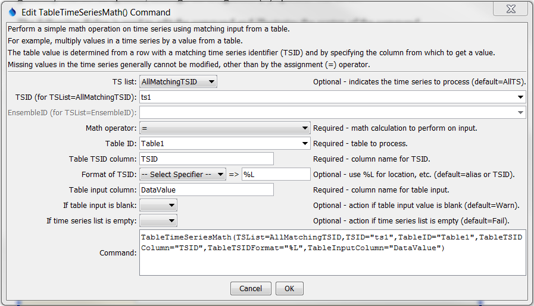

# TSTool / Command / TableTimeSeriesMath #

*   [Overview](#overview)
*   [Command Editor](#command-editor)
*   [Command Syntax](#command-syntax)
*   [Examples](#examples)
*   [Troubleshooting](#troubleshooting)
*   [See Also](#see-also)

-------------------------

## Overview ##

The `TableTimeSeriesMath` command performs a simple math operation on time series using values from a table.
For example, a table that is populated by the
[`CalculateTimeSeriesStatistic`](../CalculateTimeSeriesStatistic/CalculateTimeSeriesStatistic.md) command or
[`ReadTableFromDelimitedFile`](../ReadTableFromDelimitedFile/ReadTableFromDelimitedFile.md)
could be used to modify time series data.
See also the [`TableMath`](../TableMath/TableMath.md) command, which performs math on a table.

The table value is determined by matching the time series identifier
(formatted according to the `TableTSIDFormat` parameter) with the `TSID`
value in the table column specified by the `TableTSIDColumn` parameter.
If necessary, use the [`ManipulateTableString`](../ManipulateTableString/ManipulateTableString.md)
command to generate an identifier column in the table that allows that match.
Missing values in the time series generally will not be updated, although the assignment (`=`) operator will do so.

## Command Editor ##

The command is available in the following TSTool menu:

*   ***Commands(Table) / Manipulate Table Values***

The following dialog is used to edit the command and illustrates the syntax of the command.

**<p style="text-align: center;">

</p>**

**<p style="text-align: center;">
`TableTimeSeriesMath` Command Editor (<a href="../TableTimeSeriesMath.png">see full-size image</a>)
</p>**

## Command Syntax ##

The command syntax is as follows:

```text
TableTimeSeriesMath(Parameter="Value",...)
```
**<p style="text-align: center;">
Command Parameters
</p>**

| **Parameter**&nbsp;&nbsp;&nbsp;&nbsp;&nbsp;&nbsp;&nbsp;&nbsp;&nbsp;&nbsp;&nbsp;&nbsp;&nbsp;&nbsp;&nbsp;&nbsp;&nbsp;&nbsp;&nbsp;&nbsp;&nbsp;&nbsp;&nbsp; | **Description** | **Default**&nbsp;&nbsp;&nbsp;&nbsp;&nbsp;&nbsp;&nbsp;&nbsp;&nbsp;&nbsp;&nbsp;&nbsp;&nbsp; |
| --------------|-----------------|----------------- |
| `TSList`|Indicates the list of time series to be processed, one of:<br><ul><li>`AllMatchingTSID` – all time series that match the TSID (single TSID or TSID with wildcards) will be processed.</li><li>`AllTS` – all time series before the command.</li><li>`EnsembleID` – all time series in the ensemble will be processed (see the EnsembleID parameter).</li><li>`FirstMatchingTSID` – the first time series that matches the TSID (single TSID or TSID with wildcards) will be processed.</li><li>`LastMatchingTSID` – the last time series that matches the TSID (single TSID or TSID with wildcards) will be processed.</li><li>`SelectedTS` – the time series are those selected with the [`SelectTimeSeries`](../SelectTimeSeries/SelectTimeSeries.md) command.</li></ul> | `AllTS` |
| `TSID`|The time series identifier or alias for the time series to be processed, using the `*` wildcard character to match multiple time series.  Can be specified using `${Property}`.|Required if `TSList=*TSID`|
| `EnsembleID`|The ensemble to be processed, if processing an ensemble. Can be specified using `${Property}`.|Required if `TSList=*EnsembleID`|
|`Operator`|The operator to be applied to the time series and table input.|None – must be specified.|
|`TableID`|Identifier for table that provides input.  Can be specified using `${Property}`.|None – must be specified.|
|`TableTSIDColumn`|Table column name that is used to match the time series identifier for processing.  Can be specified using `${Property}`.|None – must be specified.|
|`TableTSIDFormat`|The specification to format the time series identifier to match the `TSID` column.  Use the format choices and other characters to define a unique identifier.|Time series alias if available, or otherwise the time series identifier.|
|`TableInputColumn`|Table column name to retrieve the table value.  Can be specified using `${Property}`.|None – must be specified.|
|`IfTableInputIsBlank`|Action if time table input is blank during processing (no value to operate on).|Warn|
|`IfTSListIsEmpty`|Action if time series list is empty.|Fail|

## Examples ##

See the [automated tests](https://github.com/OpenCDSS/cdss-app-tstool-test/tree/master/test/commands/TableTimeSeriesMath).

The delimited file corresponding to that used in the above dialog example is shown below.
In this example, the time series identifiers have location parts with values `ts1` and `ts2`.

```
# Simple test data
"TSID","DataValue"
ts1,2
ts2,3
```

## Troubleshooting ##

See the main [TSTool Troubleshooting](../../troubleshooting/troubleshooting.md) documentation.

## See Also ##

*   [`CalculateTimeSeriesStatistic`](../CalculateTimeSeriesStatistic/CalculateTimeSeriesStatistic.md) command
*   [`FormatTableDateTime`](../FormatTableDateTime/FormatTableDateTime.md) command
*   [`FormatTableString`](../FormatTableString/FormatTableString.md) command
*   [`ManipulateTableString`](../ManipulateTableString/ManipulateTableString.md) command
*   [`ReadTableFromDelimitedFile`](../ReadTableFromDelimitedFile/ReadTableFromDelimitedFile.md) command
*   [`TablesMath`](../TableMath/TableMath.md) command
