# TSTool / Command / TableToTimeSeries #

*   [Overview](#overview)
*   [Command Editor](#command-editor)
*   [Command Syntax](#command-syntax)
*   [Examples](#examples)
*   [Troubleshooting](#troubleshooting)
*   [See Also](#see-also)

-------------------------

## Overview ##

The `TableToTimeSeries` command creates one or more time series from a table.
This command can be used when a command to read time series from a specific file format
or datastore has not been implemented or parsing the table is easier.
The table is typically read using one of the following commands or another command:

*   [`ReadTableFromDataStore`](../ReadTableFromDataStore/ReadTableFromDataStore.md) – for example,
    define a database connection and query time series using an SQL statement.
*   [`ReadTableFromDelimitedFile`](../ReadTableFromDelimitedFile/ReadTableFromDelimitedFile.md) – for example,
    read time series from a comma-separated-value (CSV) file.
*   [`ReadTableFromExcel`](../ReadTableFromExcel/ReadTableFromExcel.md) – for example, read time series from an Excel worksheet in a workbook

TSTool internally represents tables as a collection of columns,
where a column contains values of a consistent data type (e.g., integer, string, double).
A time series table requires at a minimum a date/time column (or separate date and time columns),
at least one data value column, and optionally one or more columns for data flags.
Data represented in three table designs are handled by this command:

*   Data for multiple locations/series stored in a single column
    (common in a database or stream of data from a data logger) – specify
    the `LocationColumn` command parameter – referred to as single column format in this command.
*   Data for multiple locations/series stored in multiple columns
    (common in spreadsheets and CSV files) – do not specify the `LocationColumn` command parameter
    but instead specify the `ValueColumn` and optionally `LocationID` parameters – referred to as multiple column format in this command.
*   Data for one or multiple stations represented in a block of data with time on
    both axes (e.g., year in first column and months in other columns) – this is referred to as block format and is under development.

The command provides flexibility to specify time series metadata (e.g., data source, units)
as command parameters, or read from the file.
However, this flexibility is limited by practical considerations in supporting likely data formats.
One current limitation of the command is that TSTool does not determine
table column names during discovery mode (discover mode is a partial command run
that allows data such as time series and table identifiers to be provided to later commands for editing).
Consequently, although this command will create time series when run,
it does not produce time series information in discovery mode and the
time series will not be listed in later command editors.
This limitation may be addressed in future TSTool updates.

Care must be taken when processing very large tables because TSTool may run out of memory.
A solution is to process smaller tables and also use the
[`FreeTable`](../FreeTable/FreeTable.md) command.
Other commands that do not require the intermediate table can also be used.

The data values can be taken from a column of type integer, double, or string.
Data needed to form the time series identifier is stripped of periods (`.`)
because periods interfere with the TSID convention.

## Command Editor ##

The command is available in the following TSTool menu:

*   ***Commands(Table) / Table, Time Series Processing***

### Example 1: Single Column for Time Series Values with Time Series Identifier Information Specified by Command Parameters ###

An example of a table with single data value column with flags is shown in the following figure.
Note that a column is used for the location identifier
and that the location is different for the first and last records,
which will result in two time series being created.
All data values are in the `Value` column.

**<p style="text-align: center;">
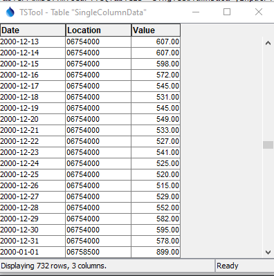
</p>**

**<p style="text-align: center;">
Simple Table with Data Values in a Single Column (<a href="../TableToTimeSeries_Single_DataTable.png">see full-size image</a>)
</p>**

In the above example, the list of unique time series is determined by examining the location column contents.
Other time series metadata such as data source and units can be read from columns or can be
assigned as constants using the `DataSource`, `Units`, and similar parameters.

The following dialog is used to edit the command and illustrates the command syntax
when processing single-column data from the above example.
Note that time series metadata are specified with command parameters (see Example 1 below).

**<p style="text-align: center;">
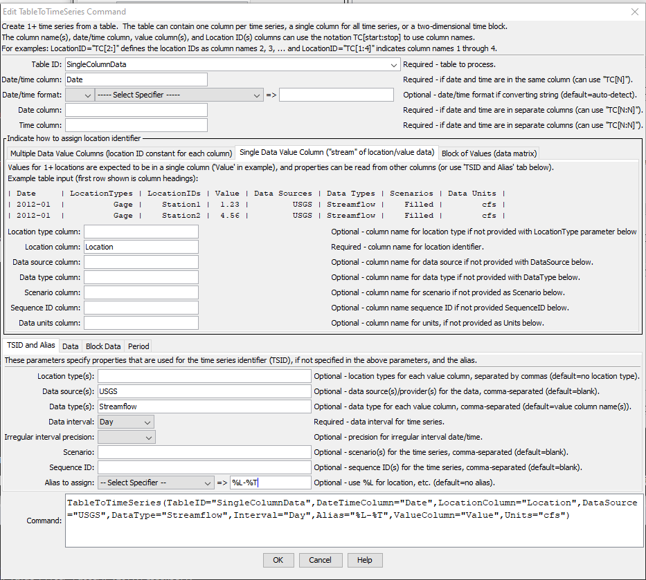
</p>**

**<p style="text-align: center;">
`TableToTimeSeries` Command Editor for Table with Data in a Single Column (<a href="../TableToTimeSeries_Single.png">see full-size image</a>)
</p>**

The following dialog is used to edit the command and illustrates the command syntax for data parameters.

**<p style="text-align: center;">
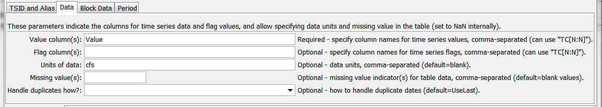
</p>**

**<p style="text-align: center;">
`TableToTimeSeries` Command Editor for Data Parameters (<a href="../TableToTimeSeries_Single_Data.png">see full-size image</a>)
</p>**

### Example 2: Single Column for Time Series Values with Time Series Identifier Information Specified in Table ###

The following example is also treated as single-column because a single column of data values is present.
However, metadata are taken from other columns.
This data format is consistent with a database query where several tables have been joined together.
Although not efficient because time series metadata is repeated for every row,
the format is convenient for data translation.
Use the `DataSourceColumn`, `UnitsColumn` and similar parameters to specify metadata.
The unique list of time series will be determined from the combinations of location identifier and other metadata.

**<p style="text-align: center;">
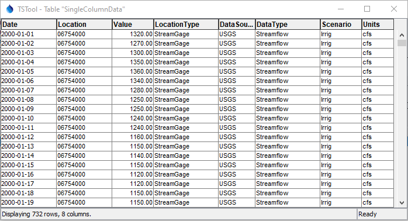
</p>**

**<p style="text-align: center;">
Table with Data Values in a Single Column and Metadata Provided in Other Columns (<a href="../TableToTimeSeries_SingleMeta_DataTable.png">see full-size image</a>)
</p>**

The following dialog is used to edit the command and illustrates syntax when
processing single-column data from the above example.
Time series metadata are specified with command parameters.
The ***ValueColumn*** parameter in the ***Data*** tab is specified as “Value”.

**<p style="text-align: center;">
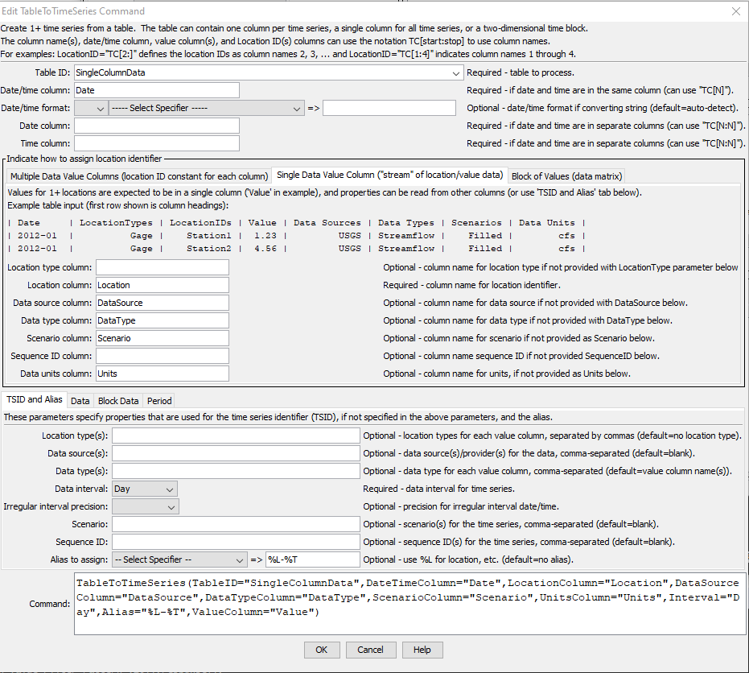
</p>**

**<p style="text-align: center;">
`TableToTimeSeries` Command Editor for Table with Single Data Column and Metadata Columns (<a href="../TableToTimeSeries_SingleMeta.png">see full-size image</a>)
</p>**

### Example 3: Multiple Columns for Time Series Values with Time Series Identifier Information Specified in Command Parameters ###

An example of multi-column data with flags for each time series is shown in the following figure:

**<p style="text-align: center;">
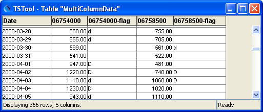
</p>**

**<p style="text-align: center;">
Table with Data Values in Multiple Data Columns (<a href="../TableToTimeSeries_Multiple_DataTable.png">see full-size image</a>)
</p>**

The following dialog is used to edit the command and illustrates
the syntax for the command when processing multi-column data from the above table.

**<p style="text-align: center;">
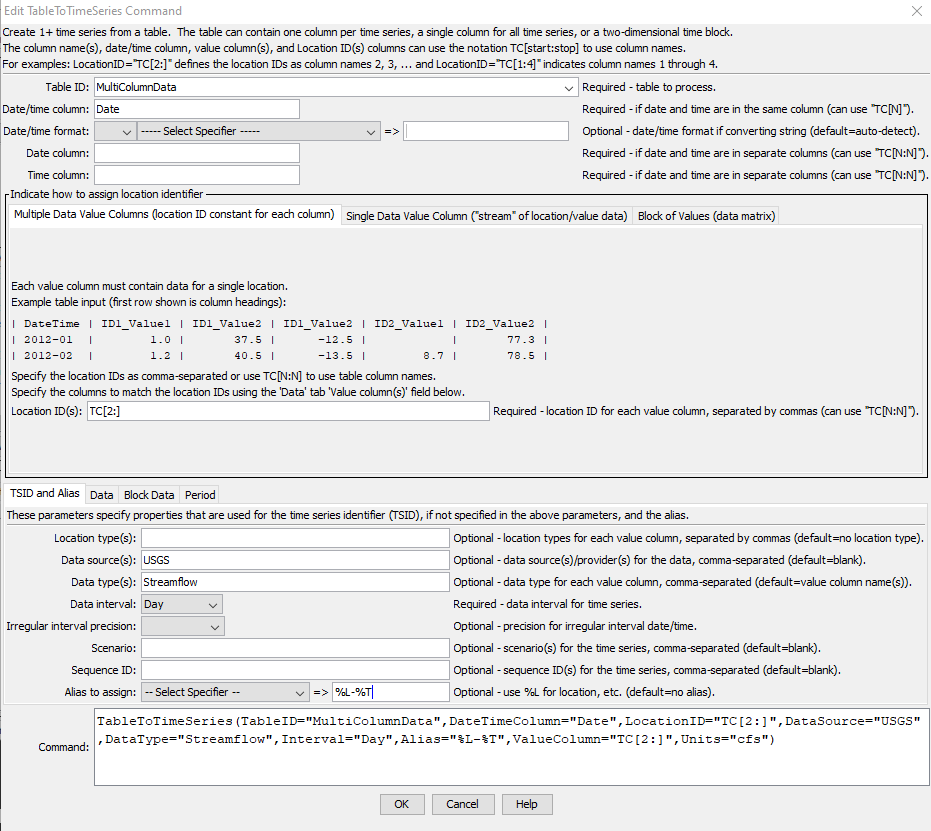
</p>**

**<p style="text-align: center;">
`TableToTimeSeries` Command Editor for Table with Data in Multiple Columns (<a href="../TableToTimeSeries_Multiple.png">see full-size image</a>)
</p>**

The following figure illustrates editing the corresponding data parameters.

**<p style="text-align: center;">
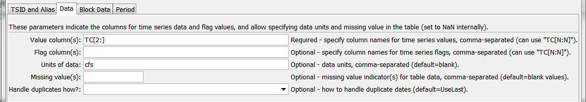
</p>**

**<p style="text-align: center;">
`TableToTimeSeries` Command Editor for Table with Data in Multiple Columns, Data Tab (<a href="../TableToTimeSeries_Multiple_Data.png">see full-size image</a>)
</p>**

### Example 4: Time Series Values Specified in a Block ###

The following data example illustrates monthly time series values specified in a block.

**<p style="text-align: center;">
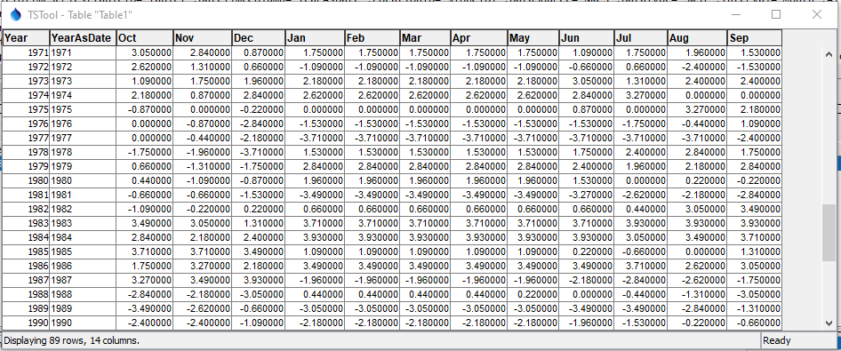
</p>**

**<p style="text-align: center;">
Table with Block Data Format (<a href="../TableToTimeSeries_Block_DataTable.png">see full-size image</a>)
</p>**

The ***Block of Values (data matrix)*** tab provides information about using the other tabs.

**<p style="text-align: center;">
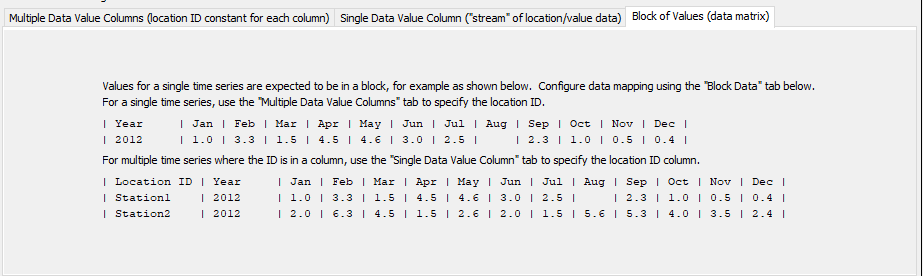
</p>**

**<p style="text-align: center;">
`TableToTimeSeries` Command Editor for Table with Data in Block Format (<a href="../TableToTimeSeries_Block0.png">see full-size image</a>)
</p>**

The following dialog is used to edit the command and illustrates the
syntax for the command when processing block data from the above table.

**<p style="text-align: center;">
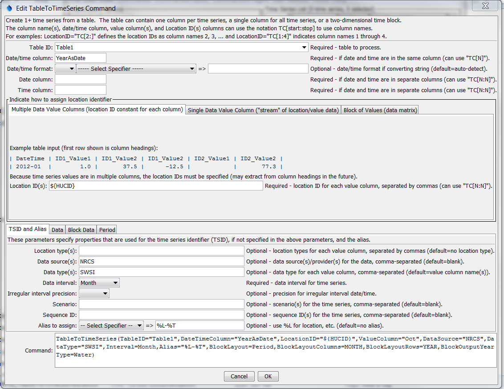
</p>**

**<p style="text-align: center;">
`TableToTimeSeries` Command Editor for Table with Multiple Time Series in Block Format (<a href="../TableToTimeSeries_Block.png">see full-size image</a>)
</p>**

The following dialog is used to edit the command and illustrates the
syntax for block format, `LocationID` parameter.

**<p style="text-align: center;">
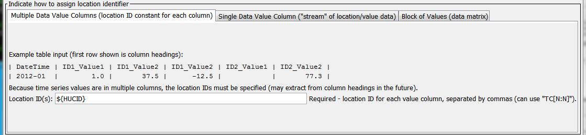
</p>**

**<p style="text-align: center;">
`TableToTimeSeries` Command Editor for Table with Data in Block Format, LocationID Parameter (<a href="../TableToTimeSeries_Block_Location.png">see full-size image</a>)
</p>**

The following dialog is used to edit the command and illustrates the
syntax for block format, data parameter.

**<p style="text-align: center;">
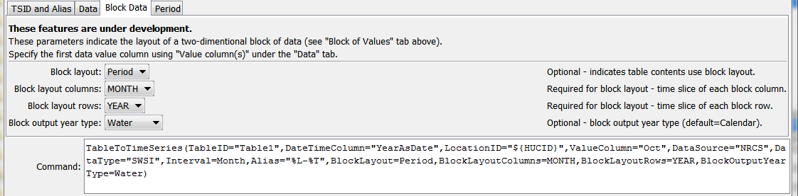
</p>**

**<p style="text-align: center;">
`TableToTimeSeries` Command Editor for Table with Data in Block Format, Block Parameters (<a href="../TableToTimeSeries_Block_Block.png">see full-size image</a>)
</p>**

## Command Syntax ##

The command syntax is as follows:

```text
TableToTimeSeries(Parameter="Value",...)
```

**<p style="text-align: center;">
Command Parameters
</p>**

|**Tab**|**Parameter**&nbsp;&nbsp;&nbsp;&nbsp;&nbsp;&nbsp;&nbsp;&nbsp;&nbsp;&nbsp;&nbsp;&nbsp;&nbsp;&nbsp;&nbsp;&nbsp;&nbsp;&nbsp;&nbsp;&nbsp;&nbsp;&nbsp;&nbsp;&nbsp;&nbsp;&nbsp;&nbsp;&nbsp;&nbsp;&nbsp;&nbsp;&nbsp;&nbsp;&nbsp;&nbsp;&nbsp;&nbsp;&nbsp;|**Description**|**Default**&nbsp;&nbsp;&nbsp;&nbsp;&nbsp;&nbsp;&nbsp;&nbsp;&nbsp;&nbsp;&nbsp;&nbsp;&nbsp;&nbsp;&nbsp;&nbsp;&nbsp;&nbsp;&nbsp;&nbsp;&nbsp;&nbsp;&nbsp;&nbsp;&nbsp;&nbsp;&nbsp;|
|-------|-------|-----------------|-----------------|
||`TableID`|The identifier for the table to read.  Can be specified using processor `${Property}`.|None – must be specified.|
||`DateTimeColumn`|The column for date/time, when date and time are in one column.  If the table was read in a way that the column type is “date/time”, then the values are used directly.  If the table was read in a way that the column type is “string”, then the string is parsed using default logic or the `DateTimeFormat` parameter if specified.  Can be specified using processor `${Property}`.|Required if `DateColumn` is not specified.|
||`DateTimeFormat`|The format for date/time strings in the date/time column, if strings are being parsed.  If blank, common formats such as `YYYY-MM-DD hh:mm` and `MM/DD/YYYY` will automatically be detected.  However, it may be necessary to specify the format to ensure proper parsing.  This format will be used to parse date/times from the `DateTimeColumn` or the merged string from the `DateColumn` and `TimeColumn` (if specified).  The format string will depend on the formatter type.  Currently, only the `C` formatter is available, which uses C programming language specifiers. The resulting format includes the formatter and specifiers (e.g., `C:%m%d%y`).|Will automatically be determined by examining date/time strings.|
||`DateColumn`|The name of column that includes the date, used when date and time are in separate columns.  Can be specified using processor `${Property}`.|Required if `DateTimeColumn` is not specified.|
||`TimeColumn`|The name of column that includes the time, used when date and time are in separate columns.  If both `DateColumn` and `TimeColumn` are specified, their contents are merged with a joining colon character and are then treated as if `DateTimeColumn` had been specified.  Can be specified using processor `${Property}`.|Required if `DateColumn` is specified and the interval requires time.|
|***Multiple Data Value Columns***|`LocationID`|Used with multiple data column table.  The location identifier(s) to assign to time series, separated by columns if more than one column is read from the table. Column names can be specified as literal strings or using `TC` notation as explained in the table below.  Can be specified using processor `${Property}`.|None – must be specified for multiple column data tables.|
|***Single Data Value Column***|`LocationTypeColumn`|Used with single data column table. The name of the column containing the location type.|Do not assign a location type.|
||`LocationColumn`|Used with single data column table. The name of the column containing the location identifier.|None – must be specified for single column data tables.|
||`DataSourceColumn`|Used with single data column table. The name of the column containing the data source.|Use the `DataSource` parameter, which can be blank.|
||`DataTypeColumn`|Used with single data column table. The name of the column containing the data type.  Use the `DataType` parameter, which can be blank.|
||`ScenarioColumn`|Used with single data column table. The name of the column containing the scenario.  Use the `Scenario` parameter, which can be blank.|
||`ScenarioColumn`|Used with single data column table. The name of the column containing the sequence identifier, which is used with ensembles to uniquely identify trace time series in the ensemble.|Use the `SequenceID` parameter, which can be blank.|
||`UnitsColumn`|Used with single data column table. The name of the column containing the data units.|Use the `Units` parameter, which can be blank.|
|***TSID and Alias***|`LocationType`|The location type(s) to assign to time series for each of the value columns (or specify one value to apply to all columns).|No location type will be assigned.|
||`DataSource`|The data source (provider) identifier to assign to time series for each of the value columns (or specify one value to apply to all columns).|No data source will be assigned.|
||`DataType`|The data type to assign to time series for each of the value columns (or specify one value to apply to all columns).  Can be specified using processor `${Property}`.|Use the value column names for the data types.|
||`Interval`|The interval for the time series.   Only one interval is recognized for all the time series in the table.  Interval choices are provided when editing the command.<br><br>If the date/times are not evenly spaced, then use the `IRREGULAR` (`Irregular`) interval and optionally specify `IrregularIntervalPrecision`.  Multiple columns must all use the same irregular date/time, or use blanks (or save irregular data in separate files).|None – must be specified.|
||`IrregularIntervalPrecision`|The precision for date/times used in irregular time series.  In the future, the `Interval` parameter may accept interval `IrregSecond` and similar so that two parameters are not needed. |Depends on precision of parsed date/times.|
||`Scenario`|The scenario to assign to time series for each of the value columns (or specify one value to apply to all columns).|No scenario will be assigned.|
||`SequenceID`|The sequence ID to assign to time series for each of the value columns (or specify one value to apply to all columns).|No sequence ID will be assigned.|
||`Alias`|The alias to assign to time series, as a literal string or using the special formatting characters listed by the command editor.  The alias is a short identifier used by other commands to locate time series for processing.  Can be specified using processor `${Property}`.|No alias will be assigned.|
|***Data***|`ValueColumn`|The name(s) of column(s) containing data values.  Separate column names with commas.  The `TC` explained in the table below can be used.  Only one column should be specified for single data column table.|None – must be specified.|
||`FlagColumn`|The name(s) of column(s) containing the data flag.  Separate column names with commas.  The `TC` notation explained in the table below can be used.  If specified, the number of columns must match the `ValueColumn` parameter, although specifying blank column names is allowed to indicate that a value column does not have a corresponding flag column.|Flags are not read.|
||`Units`|The data units to assign to time series for each of the value columns (or specify one value to apply to all columns).|No units will be assigned.|
||`Missing`|Strings that indicate missing data in the table (e.g., `m`), separated by commas.|Interpret empty column values as missing data.|
||`HandleDuplicatesHow`|Indicate how to handle duplicate date/time values in the table:<ul><li>`Add` – add the duplicate values (missing values are ignored)</li><li>`UseFirstNonmissing` – set the output to the first non-missing value</li><li>`UseLast` – set the output to the last value processed, even if missing</li><li>`UseLastNonmissing` – set the output to the last non-missing value processed</li></ul>|`UseLast`|
|***Block Data***|`BlockLayout`|Indicates how data are laid out when in block format:<ul><li>`Period` – a single block is used for the entire period</li></ul>|`Block` layout is not used.|
||`BlockLayoutColumns`|Indicates the time slice for values in columns:<ul><li>`Month` – each column includes a month</li></ul>||
||`BlockLayoutRows`|Indicates the time slice for values in rows:<ul><li>`Year` – each row includes a year</li></ul>||
||`BlockOutputYearType`|Indicates the year type for the data block.  For example, if columns are in rows and the output year type is `Water`, then the first value column is `October`:<ul><li>`Calendar` – January to December</li><li>`NovToOct` – November to October</li><li>`Water` – October to September</li></ul>|`Calendar`|
|***Period***|`InputStart`|The date/time to start reading data.  Can be specified using processor `${Property}`.|All data or global input start.|
||`InputEnd`|The date/time to end reading data.  Can be specified using processor `${Property}`.|All data or global input end.|

Parameters that specify column names can use the notation `TC[start:stop]` to read the column names for corresponding parameter values,
as explained in the following table.  `TC` is shorthand for "Table Column".

**<p style="text-align: center;">
`TC` Notation Explanation
</p>**

|**Example**|**Description**|
|-------|-------|
| `TC[start:stop]` | `start` and `stop` column numbers, where each value can be 1+ or as explained below.. |
| `TC[1:5]` | Use columns 1, 2, 3, 4, and 5. |
| `TC[2:]` | Use columns 2 through the last column, inclusive. |
| `TC[2:-2]` | Use columns 2 and following columns but ignore the last 2 columns. |

## Examples ##

See the [automated tests](https://github.com/OpenCDSS/cdss-app-tstool-test/tree/master/test/commands/TableToTimeSeries).

Examples were also shown in the [Command Editor section above](#command-editor)

## Troubleshooting ##

See the main [TSTool Troubleshooting](../../troubleshooting/troubleshooting.md) documentation.

## See Also ##

*   [`FreeTable`](../FreeTable/FreeTable.md) command
*   [`ReadTableFromDataStore`](../ReadTableFromDataStore/ReadTableFromDataStore.md) command
*   [`ReadTableFromDelimitedFile`](../ReadTableFromDelimitedFile/ReadTableFromDelimitedFile.md) command
*   [`ReadTableFromExcel`](../ReadTableFromExcel/ReadTableFromExcel.md) command
