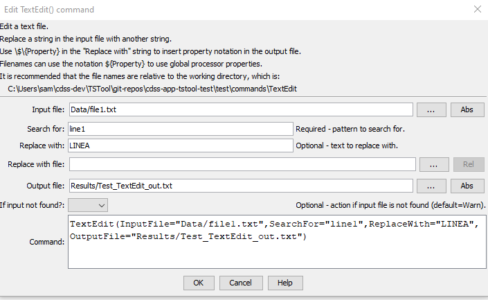

# TSTool / Command / TextEdit #

* [Overview](#overview)
* [Command Editor](#command-editor)
* [Command Syntax](#command-syntax)
* [Examples](#examples)
* [Troubleshooting](#troubleshooting)
* [See Also](#see-also)

-------------------------

## Overview ##

The `TextEdit` command edits a text file,
currently providing simple search and replace for literal strings.

In the future this command may be enhanced to add the following features:

* edit an in-memory property value containing text
* allow multiple operations in one command

The search and replace functionality is implemented using Java pattern matching and regular expressions
(see [`Pattern`](https://docs.oracle.com/javase/8/docs/api/java/util/regex/Pattern.html) class documentation).
It can be complicated to deal with special characters and patterns as they are processed
through TSTool commands and underlying Java code.
For example, some patterns pass through to the underlying code without changes whereas others
need to be transformed or "escaped" to protect from manipulation by TSTool.
The following examples illustrate how to perform common search and replace tasks.

**<p style="text-align: center;">
Search and Replace Examples
</p>**

| **`SearchFor`**&nbsp;&nbsp;&nbsp;&nbsp;&nbsp;&nbsp;&nbsp;&nbsp;&nbsp;&nbsp;&nbsp;&nbsp;&nbsp;&nbsp;&nbsp;&nbsp;&nbsp;&nbsp;&nbsp;&nbsp;&nbsp;&nbsp;&nbsp;&nbsp;&nbsp;&nbsp;&nbsp;&nbsp;&nbsp;&nbsp;&nbsp;&nbsp;&nbsp;&nbsp;&nbsp;&nbsp;&nbsp;&nbsp; | **`ReplaceWith`**&nbsp;&nbsp;&nbsp;&nbsp;&nbsp;&nbsp;&nbsp;&nbsp;&nbsp;&nbsp;&nbsp;&nbsp;&nbsp;&nbsp;&nbsp;&nbsp;&nbsp;&nbsp;&nbsp;&nbsp;&nbsp;&nbsp;&nbsp;&nbsp;&nbsp;&nbsp;&nbsp;&nbsp;&nbsp;&nbsp;&nbsp;&nbsp;&nbsp;&nbsp;&nbsp;&nbsp;&nbsp;&nbsp;&nbsp;&nbsp; | **Description** |
| -- | -- | -- |
| `\r\n` | `\n` | Replace Windows end of line with Linux end of line. | 
| `\n` | `\r\n` | Replace Linux end of line Windows end of line with Linux end of line. | 
| `StationId` | `\$\{StationId}` | Replace the static string `StationId` with a property `${StationId}`.  The dollar sign has special meaning to the pattern matcher (end of line) and braces also have meaning.  Additionally, using `${` directly causes TSTool to try to replace with a property value.  Using backslashes in front of the first two characters in the `ReplaceWith` parameter allows the string to pass through TSTool and pattern matcher without interpretation. |
| `Some.*Text` | `SomeNewText` | The `*` typically cannot be used alone and therefore `.*` indicates "any character followed by one or more characters".  The example shows how intervening characters in the original string can be replaced with new text. |
| `SomeFile\..*\.ext` | `SomeFile\.ABC\.ext` | Similar to previous example except escape the period from interpretation by pattern matcher and treat literally, needed when handling filenames with extensions. |

## Command Editor ##

The following dialog is used to edit the command and illustrates the command syntax.

**<p style="text-align: center;">

</p>**

**<p style="text-align: center;">
`TextEdit` Command Editor (<a href="../TextEdit.png">see also the full-size image</a>)
</p>**

## Command Syntax ##

The command syntax is as follows:

```text
TextEdit(Parameter="Value",...)
```
**<p style="text-align: center;">
Command Parameters
</p>**

| **Parameter**&nbsp;&nbsp;&nbsp;&nbsp;&nbsp;&nbsp;&nbsp;&nbsp;&nbsp;&nbsp;&nbsp;&nbsp;&nbsp;&nbsp;&nbsp;&nbsp;&nbsp;&nbsp;&nbsp;&nbsp;&nbsp; | **Description** | **Default**&nbsp;&nbsp;&nbsp;&nbsp;&nbsp;&nbsp;&nbsp;&nbsp;&nbsp;&nbsp; |
| --------------|-----------------|----------------- |
| `InputFile`<br>**required** | The name of the input file.  Can be specified using `${Property}`. | None - must be specified. |
| `SearchFor`<br>**required** | The literal string to search for in the input file.  Can be specified using `${Property}`. | None - must be specified. |
| `ReplaceWith`<br>**required** | The literal string to use for the replacement string in the output file.  Can be specified using `${Property}`.<br>Use the syntax `\$\{Property}` to insert property notation in the output file. | None - must be specified. |
| `OutputFile`<br>**required** | The name of the output file.  Can be specified using `${Property}`. | None - must be specified. |
| `IfInputNotFound` | Indicate an action if the source file is not found:  `Ignore` (ignore the missing file and do not warn), `Warn` (generate a warning message), `Fail` (generate a failure message) | `Warn` |

## Examples ##

See the [automated tests](https://github.com/OpenCDSS/cdss-app-tstool-test/tree/master/test/commands/TextEdit).

## Troubleshooting ##

## See Also ##

* [`AppendFile`](../AppendFile/AppendFile.md) command
* [`CopyFile`](../CopyFile/CopyFile.md) command
* [`RemoveFile`](../RemoveFile/RemoveFile.md) command
