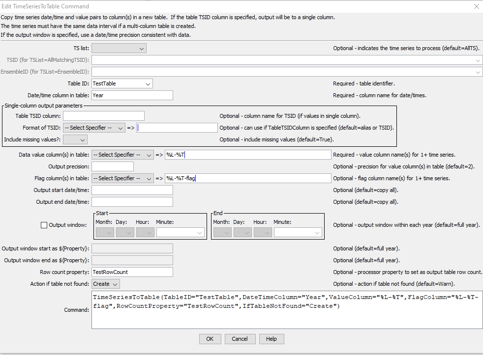
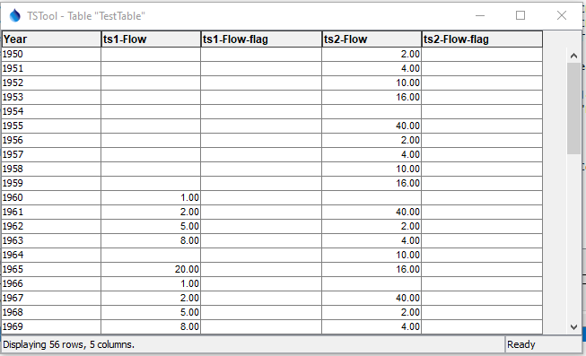
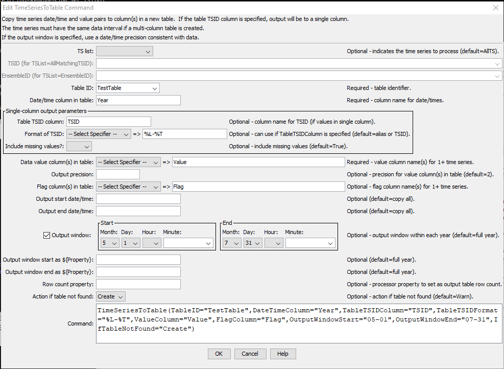

# TSTool / Command / TimeSeriesToTable #

*   [Overview](#overview)
*   [Command Editor](#command-editor)
*   [Command Syntax](#command-syntax)
*   [Examples](#examples)
*   [Troubleshooting](#troubleshooting)
*   [See Also](#see-also)

-------------------------

## Overview ##

The `TimeSeriesToTable` command copies one or more time series into a table.
This command is useful when performing table analysis processing and
outputting table formats (e.g., with the
[`WriteTableToDelimitedFile`](../WriteTableToDelimitedFile/WriteTableToDelimitedFile.md) or
[`WriteTableToHTML`](../WriteTableToHTML/WriteTableToHTML.md) commands).
The command can be configured to output one of two table forms:

*   Each time series in a separate column, with shared date/time column:
    +   The time series must be regular interval (no irregular interval time series)
        and the intervals must match in order to allow alignment of the date/times.
    +   Do not specify the `TableTSIDColumn` or `TableTSIDFormat` parameters.
*   All time series values in a single column (useful for converting time series
        to a stream of data for loading into a database)
    +   Any interval is allowed although mixing time series of varying precision is discouraged.
    +   Specify the `TableTSIDColumn` and optionally `TableTSIDFormat` parameters.
    +   See also the [`WriteTimeSeriesToDataStream`](../WriteTimeSeriesToDataStream/WriteTimeSeriesToDataStream.md) command.

Time series can be appended to an existing table.
If time series are being appended in multi-column mode (one time series per column),
the following checks are done to align the time series into the existing table:

1.  If the output start and output end are specified, the specified period is used to write.
    If not specified, an overlapping period of the time series being written is determined.
    The first date/time in this period is matched with an existing date/time in the date/time column.
    If the time series being written do not overlap, new records are added to fill out the time sequence.
    Once the starting row is established, the time series are written as a “block” within the existing table.
2.  The date/time values must be sequential.
    For example, using a [`SortTable`](../SortTable/SortTable.md) command prior
    to this command that results in date/time column values being reordered is not supported
    because it would be a major performance penalty to search the
    date/time column when setting each time series data value.
    A warning will be generated if the date/time column is determined to be out of order. 
3.  As an additional check, when adding time series to an existing table if the
    date/time column value does not equal the time series date/time, a warning will be generated.

## Command Editor ##

The command is available in the following TSTool menu:

*   ***Commands(Table) / Table, Time Series Processing***

The following dialog is used to edit the command and illustrates the syntax
of the command when writing a multi-column data table while also outputting data flags.
Note that the value columns can be specified using time series properties.

**<p style="text-align: center;">

</p>**

**<p style="text-align: center;">
`TimeSeriesToTable` Command Editor to Create Multi-Column Data Table (<a href="../TimeSeriesToTable.png">see also the full-size image</a>)
</p>**

## Command Syntax ##

The command syntax is as follows:

```text
TimeSeriesToTable(Parameter="Value",...)
```
**<p style="text-align: center;">
Command Parameters
</p>**

|**Parameter**&nbsp;&nbsp;&nbsp;&nbsp;&nbsp;&nbsp;&nbsp;&nbsp;&nbsp;&nbsp;&nbsp;&nbsp;&nbsp;&nbsp;&nbsp;&nbsp;&nbsp;&nbsp;&nbsp;&nbsp;&nbsp;&nbsp;&nbsp;&nbsp;&nbsp;&nbsp;|**Description**|**Default**&nbsp;&nbsp;&nbsp;&nbsp;&nbsp;&nbsp;&nbsp;&nbsp;&nbsp;&nbsp;&nbsp;&nbsp;&nbsp;&nbsp;&nbsp;&nbsp;&nbsp;&nbsp;&nbsp;&nbsp;&nbsp;&nbsp;&nbsp;&nbsp;&nbsp;&nbsp;&nbsp;|
|--------------|-----------------|-----------------|
|`TSList`|Indicates the list of time series to be processed, one of:<br><ul><li>`AllMatchingTSID` – all time series that match the TSID (single TSID or TSID with wildcards) will be processed.</li><li>`AllTS` – all time series before the command.</li><li>`EnsembleID` – all time series in the ensemble will be processed (see the EnsembleID parameter).</li><li>`FirstMatchingTSID` – the first time series that matches the TSID (single TSID or TSID with wildcards) will be processed.</li><li>`LastMatchingTSID` – the last time series that matches the TSID (single TSID or TSID with wildcards) will be processed.</li><li>`SelectedTS` – the time series are those selected with the [`SelectTimeSeries`](../SelectTimeSeries/SelectTimeSeries.md) command.</li></ul> | `AllTS` |
|`TSID`|The time series identifier or alias for the time series to be processed, using the `*` wildcard character to match multiple time series.  Can be specified using `${Property}`.|Required if `TSList=*TSID`|
|`EnsembleID`|The ensemble to be processed, if processing an ensemble. Can be specified using `${Property}`.|Required if `TSList=*EnsembleID`|
|`TableID`<br>**required**|The identifier for the table to copy data into (or the identifier for the new table to create if `IfTableNotFound=Create`).  Can be specified using processor `${Property}`.|None – must be specified.|
|`DateTimeColumn`<br>**required**|The table column name to receive date/time information.  Can be specified using processor `${Property}`.|None – must be specified.|
|`TableTSIDColumn`|For single-column output, the name of the column in the table for time series identifier information.  The format of the identifier can be specified using the `TableTSIDFormat` parameter.  Can be specified using processor `${Property}`.|Optional – if specified will indicate single-column output.|
|`TableTSIDFormat`|For single-column output, indicates how to format the time series identifier that is inserted in the column specified by the `TableTSIDColumn` parameter.  Can be specified using processor `${Property}`.|Optional – if not specified the alias or full TSID will be used.|
|`IncludeMissingValues`|For single-column output, indicates whether missing values should be transferred to the table.  This is useful to screen out missing values from sparse time series.|`True`|
|`ValueColumn`|The data value column name(s) to receive time series data, specified as follows:<br><ul><li>Multiple names separated by a comma.</li><li>Time series property format specifiers, available in a list of choices.  These specifiers are consistent with other commands and the legend formatter in the graphing tool.</li><li>If a literal string is specified with multi-column output, names for columns 2+ will be generated by adding a sequential number to `ValueColumn`.</li></ul><br>Can be specified using processor `${Property}`.|None – must be specified.|
|`OutputPrecision`|The number of digits after the decimal to use for data values in the output table.|`2` (in the future may auto-detect from units)|
|`FlagColumn`|The data flag column name(s) to receive time series flags, specified using the same syntax as `ValueColumn`.  A blank in the list will result in no transfer of flags for the specific time series.  Can be specified using processor `${Property}`.|Do not output flags to the table.|
|`OutputStart`|The starting date/time for the copy.  Can be specified using processor `${Property}`.|Available period.|
|`OutputEnd`|The ending date/time for the copy.  Can be specified using processor $`{Property}`.|Available period.|
|`OutputWindowStart`|The calendar date/time for the output start within each year.  Specify using the format `MM`, `MM-DD`, `MM-DD hh`, or `MM-DD hh:mm`, consistent with the time series interval precision.  A year of 2000 will be used internally to parse the date/time.  Use this parameter to limit data processing within the year, for example to output only a single month or a season.  Can be specified using processor `${Property}` by using the text field below the date editor.|Output the full year.|
|`OutputWindowEnd`|Specify date/time for the output end within each year.  See `OutputWindowStart` for details.  Can be specified using processor `${Property}`.|Output the full year.|
|`IfTableNotFound`|Indicate action if the table identifier is not matched, one of:<br><ul><li>`Create` – create a new table</li><li>`Warn` – warn that the table was not matched</li></ul>|`Warn`|

## Examples ##

See the [automated tests](https://github.com/OpenCDSS/cdss-app-tstool-test/tree/master/test/commands/TimeSeriesToTable).

### Example for Multi-Column Output Data Table ###

A sample command file is as follows:

```text
# Test copying annual time series to a table, and also create the table
StartLog(LogFile="Results/Test_TimeSeriesToTable_Year_Create.TSTool.log")
NewPatternTimeSeries(Alias=”ts1”,NewTSID="ts1..Flow.Year",SetStart="1960",SetEnd="2000",Units="ACFT",PatternValues="1,2,5,8,,20")
NewPatternTimeSeries(Alias=”ts2”,NewTSID="ts2..Flow.Year",SetStart="1950",SetEnd="2005",Units="ACFT",PatternValues="2,4,10,16,,40")
TimeSeriesToTable(TableID=TestTable,DateTimeColumn=Year,ValueColumn=%L-%T,FlagColumn=”%L-%T-flag”,IfTableNotFound="Create")
# Generate the results.
WriteTableToDelimitedFile(TableID="TestTable",OutputFile="Results\Test_TimeSeriesToTable_Year_Create_out.csv")

```

The resulting table will be listed in the Tables area of the TSTool interface and clicking on
the TestTable identifier will display the table similar to the following:

**<p style="text-align: center;">

</p>**

**<p style="text-align: center;">
`TimeSeriesToTable` Multi-Column Data Table (<a href="../TimeSeriesToTable2.png">see also the full-size image</a>)
</p>**

### Example for Single Column Output Data Table ###

The following example illustrates how to create a single data column table.
Because a single column is being used for data,
the data value and corresponding data flag column names are specified literally (not as time series properties).
The column and format for the TSID also must be specified.

**<p style="text-align: center;">

</p>**

**<p style="text-align: center;">
`TimeSeriesToTable` Command Editor to Create Single Data Column Table (<a href="../TimeSeriesToTable_Single.png">see also the full-size image</a>)
</p>**

The resulting table is as shown in the following figure

**<p style="text-align: center;">

</p>**

**<p style="text-align: center;">
Single Data Column Table (<a href="../TimeSeriesToTable_Single2.png">see also the full-size image</a>)
</p>**

## Troubleshooting ##

## See Also ##

*   [`SortTable`](../SortTable/SortTable.md) command
*   [`TableToTimeSeries`](../TableToTimeSeries/TableToTimeSeries.md) command
*   [`WriteTableToDelimitedFile`](../WriteTableToDelimitedFile/WriteTableToDelimitedFile.md) command
*   [`WriteTimeSeriesToDataStream`](../WriteTimeSeriesToDataStream/WriteTimeSeriesToDataStream.md) command
*   [`WriteTableToHTML`](../WriteTableToHTML/WriteTableToHTML.md) command
